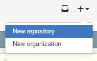
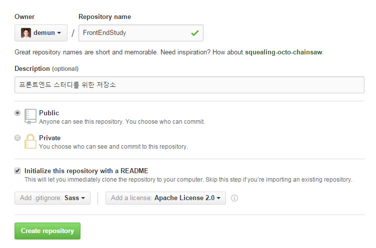

# 04_저장소 만들기
1. 원격저장소에서 `+` 아이콘을 클릭해서 New repository를 클릭해서 새로운 저장소를 만듭니다.

2. 이름과 설명을 적어줍니다.

3. `README` 파일과 `.gitignore` 와 `license` 파일도 만듭니다. 이건 옵션으로써 만들어도되고 안만들어도 됩니다.

4. 다음 `Create repository` 를 클릭해서 저장소 옵션을 마무리하고 저장소를 만듭니다.

5. 저장소가 만들어진 모습입니다

