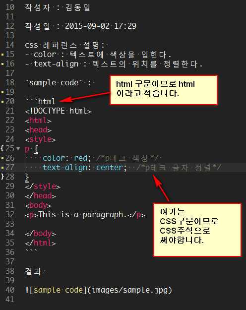

# 문서 작성 방법

문서작성방법은 프론트엔드스터디 저장소에서 작성하는 문서작성방법을 말합니다.


### 모든 문서는 document 폴더 안에 만든다.

document 폴더는 문서의 최상위폴더로 문서와 이미지등이 존재합니다.
모든 문서는 마크다운형식으로 만들고 사용방법은 아래 링크를 참고

* [Markdown-Basics](../Sublimetext/docs/101_Markdown-Basics.md)
* [GitHub-Flavored-Markdown](../Sublimetext/docs/102_Github-Flavored-Markdown.md)
* [Writing-on-Github](../Sublimetext/docs/103_Writing-on-Github.md)
* [Mastering-Markdown](../Sublimetext/docs/104_Mastering-Markdown.md)


### 해당언어의 문서는 해당언어의 폴더안에 docs 폴더안에 만든다.

여기서 해당언어는 배우고자 하는 기술이나 언어를 말합니다. 예: Github, Javascript, Jquery .... 등등


### 해당언어의 첫페이지인 README 파일을 만든다.

README.md 파일에는 모든 문서의 링크가 있어야 한다.


### 모든 문서하단에는 다른 문서로 갈수 있는 링크가 있어야 한다.

문서하단에 바로가기 링크를 반드시 표시하여 다음문서의 링크나 최상위로 갈수 있는 링크를 만든다.


### 문서의 이름은 공백없이 `-`로 연결되어 있어야 한다.

주소표시줄에 공백은 다른문자로 표시되기때문에 단어와 단어의 사이는 공백이 아닌 `-` 로 연결해서 만든다.

이렇게 만든 파일명은 링크로 작동되어 이동하기 편하고, 해쉬태크 `#` 로 문서제목을 만들면 해당 글제목으로 바로 이동이 가능하다.


### 이미지는 해당언어 폴더안에 images 폴더안에 만든다.

해당언어폴더 안에는 각각의 images 폴더가 존재한다. 파일명은 아이디-000.jpg 형식으로 한다.


### 문서구조

```sh
├─해당언어
│  │  README.md
│  ├─docs
│  │      01-문서.md
│  │      02-문서.md
│  └─images
│          이미지
│          이미지
```

아래는 폴더와 파일의 구조 예제

```sh
├─Github
│  │  README.md
│  ├─docs
│  │      01-git-설치.md
│  │      02-github-회원가입.md
│  └─images
│          demun-001.jpg
│          demun-002.jpg
├─Javascript
│  │  README.md
│  ├─docs
│  └─images
└─Sublimetext
   │  README.md
   │  Sublime Text 3.zip
   ├─docs
   │      01-프로그램-설치.md
   │      02-플러그인-설치.md
   └─images
           demun-024.jpg
           demun-025.jpg
```


## 추가작성방법

마크다운으로 글을 작성시 잘못되는 부분이 있어 첨부합니다.
필요하지 않은 공백은 사용하지 마세요.

`html` 구문을 사용할때는 `html` 이라고 적습니다. 
콘솔 명령어는 `sh` , `javascript` 는 `javascript`, `css` 는 `css` 라고 적습니다.




<br>
---

* [Home](../../../../)