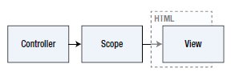
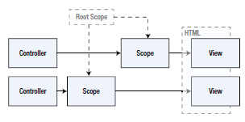
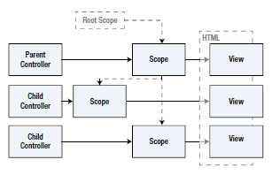
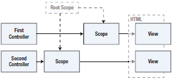

# angularJS 13장 

작성자 : 김동일

작성일 : 2016-02-08

## 컨트롤러 및 스코프 활용

- 컨트롤러와 스코프의 관계 및 활용법
- 아래 소스를 바탕으로 컨트롤러 및 스코프 활용법을 스터디

```
<!DOCTYPE html>
<html ng-app="exampleApp">
<head>
<title>Controllers</title>
<script src="angular.js"></script>
<link href="bootstrap.css" rel="stylesheet" />
<link href="bootstrap-theme.css" rel="stylesheet" />
<script>
	angular.module("exampleApp", []);
</script>
</head>
<body>
	<div class="well">
		Content will go here.
	</div>
</body>
</html>
```

[예제](http://codepen.io/skypentum/pen/adQvrg?editors=1000)

## 컨트롤러 생성 및 적용

- angular JS의 module객체에서 제공하는 controller매서드를 사용하여 생성
- 팩터리 함수 : 대부분의 매서드 호출이 작업자 함수를 생성하는데 사용하는 함수 형태로 되어 있음
- 모든 컨트롤러는 $scope서비스를 요청해야 함

[예제](http://codepen.io/skypentum/pen/bEQEbY?editors=1000)

## 스코프 설정

- 컨트롤러와 뷰 사이의 관계를 정의
- 데이터 바인딩 등의 다양한 매커니즘을 제공

[예제](http://codepen.io/skypentum/pen/vLQLEX?editors=1000)

## 스코프 수정

- 변경사항이 발생한 경우 자동으로 전달돼, 모든 의존적인 데이터를 업데이트함
- 각 컨트롤러 인스턴스는 자체 스코프를 지니고 있음
- 모든 디렉티브와 바인딩이 같은 뷰에 속하게 되면 같은 데이터 값을 뷰에서 사용할 수 있음
- ng-controller디렉티브가 적용된 엘리먼트의 자식에게도 컨드롤러가 적용된다.


## 컨트롤러 조직화

1. 단일 컨트롤러 활용



### 장점
- 간단함
- 스코프 사이의 통신에 대한 문제가 없음
- 전체 HTML에서 컨트롤러 동작을 사용할 때 유용

### 단점
- 대규모 프로젝트에서는 어울리지 않음
- 프로젝트 관리에 어려움
- 테스트 절차가 복잡해짐

[예제](http://codepen.io/skypentum/pen/rxQxMg?editors=1000)

2. 컨트롤러 재사용



### 장점
- 같은 애플리케이션에서 여러 개의 뷰를 생성해야 할 경우 유용
- 작은 데이터 값만을 관리하므로 매우 효과적

### 스코프간 통신

- 각각의 컨트롤러에 정의 되어 있는 scope 간의 데이터를 공유하기 위하여 루트 스코프를 제공함
- 루트 스코프 : 스코프 간의 이벤트를 저달하고 컨트롤러 간의 통신을 지원
- 스코프 매서드
```
$broadcast(name, args) - 현재 스코프에서 모든 자식 스코프롤 이벤트 전달함. 인자로는 이벤트명 및 이벤트와 함께 전달할 보조 데이터가 들어 있는 객체를 받는다.
$emit(name, args) - 현재 스코프에서 루트 스코프까지 이벤트를 위로 전달
$on(name, handler) - 스코츠에서 특정 이벤트를 수신할 때 호출할 핸들러 함수를 등록
```

[예제](http://codepen.io/skypentum/pen/vLvYEb?editors=1000)

### 서비스를 활용한 스코프 이벤트 중개

- 여러개의 컨트롤러를 사용하고 동일한 이벤트 전달 시 유용함

[예제](http://codepen.io/skypentum/pen/pgqobR?editors=1000)

3. 컨트롤러 상속 활용



### 장점
- HTML 엘리먼트 내에 컨트롤러 상속을 구현
- 공통 기능을 부모 컨트롤러로 정의한 후, 이를 하나 이상의 자식 컨트롤러에서 사용함
- 이벤트에 대한 오버라이드가 가능함

### 단점

- 데이터 상속 처리에 대한 문제가 있을 수 있음

[예제](http://codepen.io/skypentum/pen/RrEwGm?editors=1000)

4. 다중 컨트롤러 활용



- 필요한 개수 만큼 사용할 수 있음(모듈화)

[예제](http://codepen.io/skypentum/pen/OMrJOy?editors=1000)

## 스코프리스 컨트롤러 활용

- 스코프를 전혀 사용하지 않고 데이터 동작을 제공
- 스코프가 지나치게 복잡하거나 사용할 필요가 없으 경우 사용

[예제](http://codepen.io/skypentum/pen/yeGLpz?editors=1000)

## 명시적 스코프 업테이트

- 기존 개발한 제품이나 서비스와 연동을 해야하는 경우 사용
- 스코프 연동 메소드
```
$apply(expr) - 스코프에 변경 사항을 적용
$watch(expr, handler) - 표현식을 통해 차조한 값이 바뀔 때 이를 통보받을 핸들러를 등록
$watchCollection(object, handler) - 지정한 객체 내 임의의 속성이 바뀔 때 이를 통보받을 핸들러를 등록
```

[예제](http://codepen.io/skypentum/pen/KVbKoq?editors=1000)


