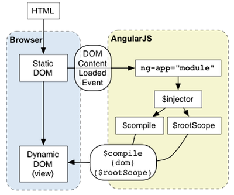
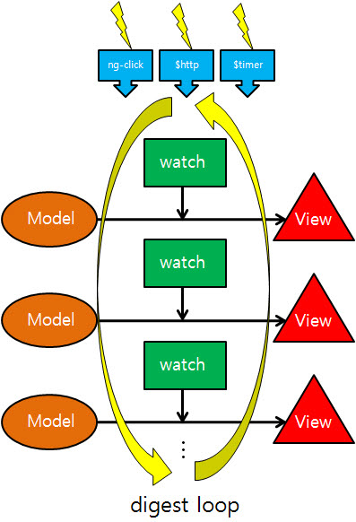
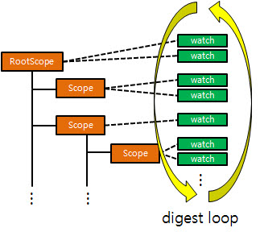

# AngularJS

작성자 : 전석환
    
작성일 : 2016-02-14

## AngularJS 란?

- AngularJS 는 2009년 Miško Hevery과 Adam Abrons에 의해 개발된 MVC(또는 MVW – Model View Whatever) 웹 프레임워크.
- SPA(Single Page Application) 형태의 웹 애플리케이션 개발에 최적화 되어있는 프레임워크.
    
## AngularJS 의 다른점?

- jQuery 등의 기존방식은 DOM을 제어하는 방식으로 변경이 필요한 대상 DOM 요소를 선택하고, 이후 필요한 작업을 수행하는 형태로 진행되지만 AngularJS 는 출력할 데이터에 초점을 맞추어 작업이 수행되며, 양방향 바인딩을 통해 데이터의 값이 변경되면 출력도 자동적으로 수행되도록 처리한다.
    
- jQuery 스타일

```html
<!DOCTYPE html>
<html ng-app="exampleApp">
<head>
    <title>jQuery Style</title>
    <style>
        .display-area {
            min-height: 100px;
            background-color: beige;
            margin-top: 20px;
        }
    </style>
    <script src="//code.jquery.com/jquery-1.12.0.min.js"></script>
    <script>
        $(function() {
            $("#btn").on("click", function() {
                var text = $("#textBox").val();
                
                $("#displayBox").text(text);
            });
        });
    </script>
</head>
<body>
	Text: <input id="textBox" type="text">
    <button id="btn" >확인</button>
    
    <div class="display-area">
        <span id="displayBox"></span>
    </div>
</body>
</html>
```
    
- Angular 스타일

```html
<!DOCTYPE html>
<html ng-app="exampleApp">
<head>
    <title>Angular Style</title>
    <style>
        .display-area {
            min-height: 100px;
            background-color: beige;
            margin-top: 20px;
        }
    </style>
    <script src="//cdnjs.cloudflare.com/ajax/libs/angular.js/1.3.14/angular.min.js"></script>
    <script>
        angular.module('exampleApp', []);
    </script>
</head>
<body>
	Text: <input type="text" ng-model="val">
    
    <div class="display-area">
        <span>{{val}}</span>
    </div>
</body>
</html>
```
    
## AngularJS 장점

- 유지보수가 쉽고 개발속도가 빠르다.
- 간편한 데이터 바인딩을 통해 뷰 업데이트가 쉽다.
- 코드 패턴이 동일해 개인간 차이에 따른 결과물의 차이가 적고 코드량이 감소한다.
- SPA 개발에 최적화 되어 있다.
- 기능적인 분리가 명확해 협업이 쉽다.
    
## AngularJS 초기 로딩 과정


    
1. 브라우저에 의해 HTML DOM Parsing이 이루어 진다.(HTML, Script 등…)
2. 파싱이 끝난 뒤 angular.js 에 의해 document.ready() 에 등록된 angular.init()호출하여 ng-app directive 를 찾는다. [init](https://github.com/angular/angular.js/blob/master/src/angular.suffix)
3. ng-app directive 를 찾은 후 선언된 module을 로드한다.
4. dependency injection시 사용할 $inject 를 생성한다.
5. $inject 는 $compile과 application의 모델 context 가 될 $rootScope 를 생성한다.
6. $compile 을 통해 HTML의 DOM을 angular application으로 컴파일 하고 $rootScope와 link를 맺어 동적인 View로 변환한다.

## Scope
    
- 애플리케이션 모델을 나타내는 객체
- 컨트롤러 / 지시자의 유효범위내의 저장공간
- AngularJS는 하나의 rootScope를 갖으며 directive에 따라서 계층 적인 구조로 scope를 갖는다.
- 계층 구조에 의해서 현재 scope내의 값이 없을 경우 상위 scope를 참조한다.

```html
<!DOCTYPE html>
<html ng-app="exampleApp">
<head>
    <title>Angular Scope</title>
    <script src="//cdnjs.cloudflare.com/ajax/libs/angular.js/1.3.14/angular.min.js"></script>
    <script>
        var app = angular.module('exampleApp', []);
        
        app.controller('ctrl1', function($scope) {
            $scope.text = 'scope 1 text';
        });
        
        app.controller('ctrl2', function($scope) {});
    </script>
</head>
<body>
	<div ng-controller="ctrl1">
        <span>{{text}}</span>
        <div ng-controller="ctrl2">
            <span>{{text}}</span>
        </div>
    </div>
</body>
</html>
```
    
- 단, isolate scope는 상위 scope 참조가 되지 않는다.

```html
<!DOCTYPE html>
<html ng-app="exampleApp">
<head>
    <title>Angular iSolate Scope</title>
    <script src="//cdnjs.cloudflare.com/ajax/libs/angular.js/1.3.14/angular.min.js"></script>
    <script>
        var app = angular.module('exampleApp', []);
        
        app.controller('ctrl', function($scope) {
            $scope.text = 'scope 1 text';
            
            var childScope = $scope.$new();
            console.log('child scope text :: ' + childScope.text);
            console.log('$scope === childe.parent ', $scope === childScope.$parent);
            
            var isolateChildScope = $scope.$new(true);
            console.log('isolate child scope text :: ' + isolateChildScope.text);
            console.log('$scope === isolate childe.parent ', $scope == isolateChildScope.$parent);
        });
    </script>
</head>
<body>
	<div ng-controller="ctrl">
        <span>{{text}}</span>
    </div>
</body>
</html>
```
## Scope - Digest Loop
    
- AngularJS 양방향 바인딩의 원리이다.
- AngularJS가 Model을 View에 반영하는 과정


    
- AngularJS는 특정한 상황(이벤트, Ajax 통신, $timer)에서 Model 변경 사항을 확인하여 View에 반영한다.
- 위의 상황에서 Scope에 등록된 Watch가 Model 변경사항 체크하고 변경사항이 발생할때 View에 반영한다.
- Digest Loop는 엄밀히 말해 Scope의 Watch들을 실행하는 과정
    


- Digest Loop Test

```html
<!DOCTYPE html>
<html ng-app="exampleApp">
<head>
    <title>Angular Digest Test</title>
    <script src="//code.jquery.com/jquery-1.12.0.min.js"></script>
    <script src="//cdnjs.cloudflare.com/ajax/libs/angular.js/1.3.14/angular.min.js"></script>
<!--    <script type="application/javascript" src="angular.js"></script>-->
    <script>
        var app = angular.module('exampleApp', []);
        
        app.controller('ctrl', function($scope) {
            $scope.text = '';
            
            $scope.angularClick = function() {
                $scope.text = 'angular Click';
            };
            
            $('#jQueryBtn').on('click', function () {
                $scope.text = 'jQuery Click';
                
//                $scope.$apply();
            });
        });
    </script>
</head>
<body>
	<div ng-controller="ctrl">
        <button ng-click="angularClick();">Angular Click</button>
        <button id="jQueryBtn">jQuery Click</button>
        
        text : <span>{{text}}</span>
    </div>
</body>
</html>
```
    
## Service

- SPA 개발을 할때 코드 재사용 및 개발 편의를 위해 공통적으로 사용하는 작업들을 하나의 서비스(객채)로 만들어 사용한다.
- 서비스는 항상 싱글톤 이며, 하나의 인스턴스만 존재한다.
- 보통 컨트롤러간의 통신을 제어하거나, 리소스 접근 권한을 가진 객체를 반환하여 데이터의 CRUD를 수행하는 방식으로 사용한다.
- AngularJS는 여러가지 종류의 Service를 제공한다. (provider, factory, service, value, constant 등..)
    
## Directive

- Directive는 AngularJS의 HTML 컴파일러가 특정 DOM요소에 명시된 행위를 추가하도록 하는 일종의 지시자이다.
- DOM 요소(attribute, element name, comment, class)에 Directive를 추가하여 사용한다.
- Directive(지시자)는 높은 수준으로 DOM을 사용하는 방법이라고 생각한다. [AngularJS Directive](https://docs.angularjs.org/guide/directive)

```
var myModule = angular.module('module', []);
myModule.directive('directiveName', function (injectables) {
    return {
        // HTML에서 디렉티브를 사용하기 위한 DOM 엘리먼트의 속성을 설정.(EACM)
        restrict: 'A',
    
        // html의 디렉티브를 사용한 부분에 보여줄 내용으로 In-Line value를 설정.
        template: '<div></div>',
    
        // template을 별도의 html 파일로 관리.
        templateUrl: 'directive.html',
    
        // 디렉티브를 사용한 HTML의 태그에 template 또는 templateUrl에 포함된 태그 내용을 추가할지 교체할지 설정.
        replace: false,
    
        // 디렉티브 별로 compile()과 link()의 호출 우선 순위를 지정.
        priority: 0,
    
        // ng-transclude를 이용하여 template 또는 templateUrl에서 디렉티브내의 원본내용을 포함시킬지 설정.
        transclude: false,

        // 디렉티브의 scope를 설정. (true, false, {}, =, @)
        scope: false,
    
        // AngularJS의 다른 컨트롤러나 디렉티브의 controller()에 this로 정의된 function을 사용할 때 선언.
        require: false,
    
        // 다른 디렉티브들과 통신하기 위한 역할을 하는 controller명칭을 정의.
        controller: function ($scope, $element, $attrs, $transclude, otherInjectables) {},
    
        /*
         * DOM 엘리먼트를 해석하여 디렉티브로 변환하며 두 종류의 link function을 리턴.
         * preLink() :   compile phase가 실행되고 child 엘리먼트가 link 되기 전에 호출
         * postLink() :   compile phase가 실행되고 child 엘리먼트가 link 된 후 호출
         */
        compile: function compile(tElement, tAttrs, transclude) {
            return {
                pre: function preLink(scope, iElement, iAttrs, controller) {},
                post: function postLink(scope, iElement, iAttrs, controller) {}
            }
        },
    
        // 2-way data binding을 위해 해당 디렉티브 DOM엘리먼트의 event  listener를 등록
        link: function postLink(scope, iElement, iAttrs) {}
    };
});
```


