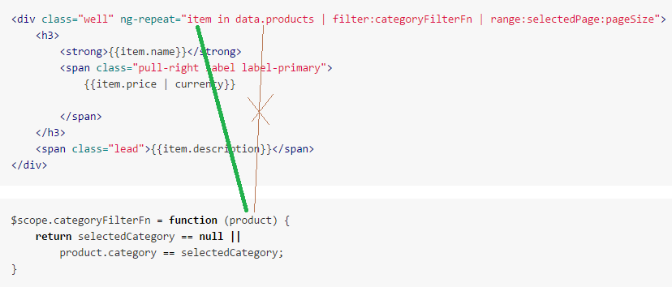

# angularJS 6장 

작성자 : 장현웅

작성일 : 2015-12-12


### 앵귤러JS 기본

앵귤러JS는 자바스크립트 프레임워크 언어이며 다음과같은 특징들이 있습니다.

  - 데이터 바인딩에 {{}} 를 사용한다 
  - ng- 로 시작하는 element속성(디렉티브)을 사용하여 dom을 재정의 한다.
  - 앵귤러JS는 실시간으로 dom과 js를 수정하고 다시 작성한다.


### 앵귤러JS로 리스트, 필터, 페이징등 기능 구현하기.
앵귤러JS에는 여러가지 구성요소들이 있지만 이번 문서에서는 다음의 내용을 다루도록 하겠습니다.
아래 예제소스는 ajax로 리스트를 서버에서 가져와서 각종 필터링과 페이징 등등을 구현한 소스입니다.


<br>
app.html
```html 
<!DOCTYPE html>
<!--//선언된 모듈 -->
<html ng-app="sportsStore">
<head>
    <title>SportsStore</title>
    <script src="js/angular.js"></script>
    <link href="css/bootstrap.css" rel="stylesheet" />
    <link href="css/bootstrap-theme.css" rel="stylesheet" />
    <script>
        <!--//모듈선언<html ng-app="sportsStore"> 두번째 인자값은 추가로 사용할 모듈을 넣는다.-->
        var sportsStore = angular.module("sportsStore", ["customFilters"]);
    </script>
    <!--//모듈선언을 한 뒤에 스크립트 소스를 읽어와야함(sportsStore.js에서 위에 선언된 모듈을 읽어오기 때문) -->
    <script src="controllers/sportsStore.js"></script>
    <script src="filters/customFilters.js"></script>
    <script src="controllers/productListControllers.js"></script>
</head>
<!--//sportsStore.js 에서 선언한 Controllerr 선언 -->
<body ng-controller="sportsStoreCtrl">
    <div class="navbar navbar-inverse">
        <a class="navbar-brand" href="#">SPORTS STORE</a>
    </div>
    
    <script>
        sportsStore.controller("testCtrl",function($scope){
            $scope.testClick=function(data){console.log(data)}
        })
    </script>
    <!-- 목록과 전혀 상관없는 함수를 호출한다고 해도 필터메소드는 다시 호출된다. -->
    <a ng-controller="testCtrl" ng-click="testClick('test')">test</a>
    
    <!-- //productListCtrl 해당 컨트롤러는 아래 선언하는 div영역에서만 동작한다 -->
    <div class="panel panel-default row" ng-controller="productListCtrl">
        <div class="col-xs-3">
            <a ng-click="selectCategory()"
               class="btn btn-block btn-default btn-lg">Home</a>
            <!--customFilter.js 에서 만든 unique필터를 적용, orderBy필터는 기본내장필터, 필터는 선언된 순서대로 적용(orderBy 먼저 적용후 category필터 적용)-->
            <a ng-repeat="item in data.products | orderBy:'category' | unique:'category'"
               ng-click="selectCategory(item)" class=" btn btn-block btn-default btn-lg" 
               ng-class="getCategoryClass(item)">
               <!-- selectCategory(item)함수를 호출하여 아래  categoryFilterFn를 통해 해당 클릭한 카테고리만 나오도록 목록을 재정의한다.
               getCategoryClass(item) 함수를 호출해 해당 선택된 카테고리에 클래스를 추가
               -->
                {{item}}
            </a>
        </div>
        <div class="col-xs-8">
            <!-- 
            //sportsStore.js 에서 불러온 데이터모델을 반복문돌림 
            //data.produnts는 배열이며 한번 반복될때마다 item변수에 하나씩 담아준다.-->
            <div class="well" ng-repeat="item in data.products | filter:categoryFilterFn | range:selectedPage:pageSize">
<!--        <div class="well" ng-repeat="item in data.products | categoryFilterFn:getSelectCategory()"> -->
                <!--
                //filter선언필터와 , controller선언필터   두가지 필터방식의차이점
                controller(filter:'필터명') -  배열을 반복할때 매 반복마다 검사를 하여  true|false 를 리턴받아 true면 보이고 false면 안보이게 하는 방식 (배열안의 데이터를 가공하거나 변경은 불가능하나 훨씬 쉽고 간략하다)
                filter(필터명:'인자값' - 해당 배열데이터를 모두 받아서 검사 혹은 가공후 다시 배열데이터를 리턴하면 그 배열정보로 재정의됨 (개발이 약간 어려워지지만 데이터자체를 모두 재정의 할 수 있는등 많은 기능을 구현가능)
                -->
                <h3>
                    <strong>{{item.name}}</strong>
                    <span class="pull-right label label-primary">
                        {{item.price | currency}}<!--//앵글러에서 지원하는 내장필터 {{값 |필터명}} 로 사용한다. 현재 필터는 숫자를 화폐단위로 변환해서 보여준다. (100,"100" 둘다 자동 형변환이 되어서 적용이 가능) -->
                        
                    </span>
                </h3>
                <span class="lead">{{item.description}}</span>
            </div>
            <div class="pull-right btn-group">
                <a ng-repeat="page in data.products | filter:categoryFilterFn | pageCount:pageSize"
                   ng-click="selectPage($index + 1)" class="btn btn-default"
                   ng-class="getPageClass($index + 1)">
                    {{$index + 1}}
                </a>
            </div>
        </div>
    </div>
</body>
</html>
```

sportsStore.js
```javascript
//module호출시 인자값이 1개만 있는경우는 새로 선언이 아닌 기존에 있던 모듈을 호출하게 된다 
//즉 app.html 파일에서 선언된 sportsStore 모듈을 가져오는 역할
angular.module("sportsStore")
.controller("sportsStoreCtrl", function ($scope,$http) {
    $scope.data = new Object();
    $http.get("http://localhost:5500/products").success(function(_data){
        console.log(_data);
        $scope.data.products = _data;
    })
    /*[
    {"name":"kayak"             ,"description":"1인용 보트"             ,"category":"수상스포츠" ,"price":"275"      ,"id":"c3092a908f990808"},
    {"name":"Lifejacket"        ,"description":"멋진 보호 장비"               ,"category":"수상스포츠" ,"price":"48.95"    ,"id":"ef2dbf0a35380928"},
    {"name":"Soccer Ball"       ,"description":"FIFA 인증 규격 및 무게"        ,"category":"축구"        ,"price":"19.5"     ,"id":"1c2963289dae68ce"},
    {"name":"Coner Flags"       ,"description":"코너플래그 "             ,"category":"축구"        ,"price":"34.95"    ,"id":"be305477aa9628da"},
    {"name":"Stadium"           ,"description":"35,000좌석 경기장"           ,"category":"축구"        ,"price":"79500.00" ,"id":"14967be4043eca6c"},
    {"name":"Tinking Cap"       ,"description":"두뇌효율을 75% 개선"           ,"category":"체스"        ,"price":"16"       ,"id":"65440347ee5c283d"},
    {"name":"Undteady Chair"    ,"description":"상대방에게 불리한 체스 의자"    ,"category":"체스"        ,"price":"29.95"    ,"id":"755b5a4b87036bed"},
    {"name":"Human Chess Board" ,"description":"가족이 하기에 즐거운 게임"     ,"category":"체스"        ,"price":"75"       ,"id":"f1b509b3774d4841"},
    {"name":"Bling-Bling King"  ,"description":"금과 다이아몬드로 장식한 킹"    ,"category":"체슨"        ,"price":"1200"     ,"id":"9649b7e680743898"}
    ]   */
});

```

productListController.js
```javascript
angular.module("sportsStore")
    .constant("productListActiveClass", "btn-primary")//상수를 선언. 
    .constant("productListPageCount", 3)
    .controller("productListCtrl", function ($scope, $filter, productListActiveClass,productListPageCount){//productListActiveClass 변수에 위에서 .constant로 선언한 상수 "btn-primary"를 담는다. 
        console.log($scope)
        var selectedCategory = null;

        $scope.selectedPage = 1;
        $scope.pageSize = productListPageCount;

        $scope.selectCategory = function (newCategory) {
            selectedCategory = newCategory;
            $scope.selectedPage = 1;
        }
        $scope.getSelectCategory = function () {
            return selectedCategory;
        }
        $scope.categoryFilterFn = function (product) {
            return selectedCategory == null ||
                product.category == selectedCategory;
        }
        $scope.getCategoryClass = function (category) {
            return selectedCategory == category ? productListActiveClass : "";
        }
        
        $scope.selectPage = function (newPage) {
            $scope.selectedPage = newPage;
        }


        $scope.getPageClass = function (page) {
            return $scope.selectedPage == page ? productListActiveClass : "";
        }
    });
```

customFilters.js
```javascript
//새로 모듈을 생성한다. 이는 sportsStore모듈과는 다른 독립된 모듈이다 2번째 인값이 있기 때문.
angular.module("customFilters", [])
.filter("unique", function () {
    return function (data, propertyName) {//필터이름의 :뒤의 값을 인자로 받아옴 ex) unique:'category'  라고 필터를 지정하면  propertyName = 'category'
        if (angular.isArray(data) && angular.isString(propertyName)) {
            var results = [];
            var keys = {};
            for (var i = 0; i < data.length; i++) {
                var val = data[i][propertyName];
                if (angular.isUndefined(keys[val])) {
                    keys[val] = true;
                    results.push(val);
                }
            }
            return results;
        } else {
            return data;
        }
    }
}).filter("categoryFilterFn",function(){//categoryFilterFn 방식을 .filter메소드로 구현
    return function(data, selectedCategory){
        if (angular.isArray(data) && angular.isString(selectedCategory)) {
            var results = [];
            for (var i = 0; i < data.length; i++) {

                if(selectedCategory == null ||
                            data[i].category == selectedCategory){
                    results.push(data[i]);  
                }
            }
            return results;
        } else {
            return data;
        }
    }
}).filter("range", function ($filter) {
    return function (data, page, size) {
        if (angular.isArray(data) && angular.isNumber(page) && angular.isNumber(size)) {
            var start_index = (page - 1) * size;
            if (data.length < start_index) {
                return [];
            } else {
                return $filter("limitTo")(data.splice(start_index), size);  //$filter("limitTo") 는 내장 필터함수
            }
        } else {
            return data;
        }
    }
})
.filter("pageCount", function () {
    return function (data, size) {
        if (angular.isArray(data)) {
            var result = [];
            for (var i = 0; i < Math.ceil(data.length / size) ; i++) {
                result.push(i);
            }
            return result;
        } else {
            return data;
        }
    }
});

```

가장 처음으로 앵귤러JS를 시작할때 할 일은 모듈선언입니다.

앵귤러JS에서 모듈은 최상위 구성요소이며 해당 영역에서 앵귤러JS를 사용하겠다..하고 라고 선언하는것.

angular.module()함수로 선언하며 첫번째 인자값은 모듈의 이름(혹은id 겹치면안됨)이며 두번째 인자값은 다른 이미 선언된 모듈을 추가로 불러들이는 값이며 배열로 되어있어서 여러 모듈을 한꺼번에 불러들일 수 있습니다.

현재 customFilters라는 customFilters.js 에선언된 모듈을 불러오고 있습니다.

디렉티브는 스크립트와 엘레먼트를 이어주는 기능을 가진 키워드입니다.

```html

<html ng-app="sportsStore">
    <script>
        var sportsStore = angular.module("sportsStore", ["customFilters"]);
    </script>
```

모듈선언시 첫번째 인자값을 html 태그에 ng-app="모듈명" 으로 선언함으로써 해당 영역에서 이 이름의 모듈을 사용함을 선언해줍니다. 현재로는 전체페이지에서 모두 사용하게 되므로 html태그에 선언하였지만
```html
<div ng-app="sportsStore">
...
<div>
```
이렇게 해당영역을 지정해 줄 수도 있습니다.
디렉티브는 html의 표준을 따르지 않기 때문에 표준을 지키면서 개발을 하시려면 data-ng-app="" 형식으로도 작성이 가능합니다.


####생명주기

모듈은 생명주기가 존재하며 각각의 순서가 있다 자세한 건 모듈 고급 장에서 설명하도록 하며, 이번에는 config,run 순서만 어떻게 잡는지 설명을 하도록 하겠습니다.
Config, Run 실행의 순위

Module은 module을 주입 받아 사용 할 수 있으며 각각 config, run을 설정/사용 할 수 있습니다.
실행 순서는 다음과 같습니다.

1. 주입받은 module.config

2. 대상 module.config

3. 주입받은 module.run

4. 대상 module.run

var module1 = angular.module(‘module1’, [‘module2’]);

var module2 = angular.module(‘module2’,[‘’]);

Module1.config(function(){ … }) // 2번째 실행

Module2.config(function(){ … }) // 1번째 실행

Module1.run(function(){ … }) // 4번째 실행

Module2.run(function(){ … }) // 3번째 실행


<br><br><br><br>
이후 컨트롤러를 선언합니다. 여기서는 sportsStore.js 와 productListControllers.js 두개에서 컨트롤러를 선언했습니다.

```javascript
//sportsStore.js
angular.module("sportsStore")
.controller("sportsStoreCtrl", function ($scope,$http) {

})

//productListControllers.js
angular.module("sportsStore")
    .constant("productListActiveClass", "btn-primary")//상수를 선언. 
    .constant("productListPageCount", 3)
    .controller("productListCtrl", function ($scope, $filter, productListActiveClass,productListPageCount){

...
});
```


여기서 js파일을 따로 만들었기때문에 app.html에서 생성한 모듈에 접근하려면 전역변수를 사용해야하지만 

여기서는 위와같이 module함수를 호출할때 2번째 인자값을 입력하지 않으면 모듈을 새로선언하는것이 아닌 기존에 있는 모듈을 불러오게되어 불필요한 전역변수 사용을 하지 않을 수 있습니다.

app.html에서 선언된 sportsStore모듈을 불러온 후 해당모듈에 컨트롤러를 선언하는 모습입니다.

두번째 컨트롤러 호출시 contant()라는 함수를 호출하였는데 이는 controller함수에 상수로 전달되게됩니다.

contant(1번인자값, 2번인자값) 으로 선언하게되면 controller에 1번인자값이 변수가되며 2번인자값이 그값으로 전달되게 됩니다.

$scope 변수와 $filter 변수는 앵귤러JS의 내장변수입니다.

앵귤러JS는 보통 자바스크립트와 다르게 인자값의 위치가 달라져도 변수명만 맞춰준다면 자동으로 바인딩이 됩니다.

쉽게말해 
```javascript
.controller("ctrl",function($filter, $scope){
...
}); 
```
이런식으로 함수 선언시에 변수의 위치를 바꿔도 자동으로 해당기능의 변수를 사용가능합니다. 하지만 변수이름을 꼭 동일하게 맞춰줘야합니다.

$filter변수는 여러 필터기능을 불러올 수 있는 내장변수입니다.

$scope변수는 컨트롤러와 필터 서비스 뷰 등의 데이터 전달을 가능하게 해주는 내장변수입니다.

$http변수는 ajax통신을 할수있게 해주는 내장변수입니다.


컨트롤러도 모듈과 마찬가지로 디렉티브로 뷰와 연결해줘야합니다.

```html
<body ng-controller="sportsStoreCtrl">
```
마찬가지로 모듈처럼 div태그에 적용하여 범위를 제한할 수 있습니다.

<br>
scopeStore 컨트롤러에서 데이터를 바인딩하는 부분입니다.
```javascript
    $scope.data = new Object();
    $http.get("http://localhost:5500/products").success(function(_data){
        console.log(_data);
        $scope.data.products = _data;
    })
    /*[
    {"name":"kayak"             ,"description":"1인용 보트"             ,"category":"수상스포츠" ,"price":"275"      ,"id":"c3092a908f990808"},
    {"name":"Lifejacket"        ,"description":"멋진 보호 장비"               ,"category":"수상스포츠" ,"price":"48.95"    ,"id":"ef2dbf0a35380928"},
    {"name":"Soccer Ball"       ,"description":"FIFA 인증 규격 및 무게"        ,"category":"축구"        ,"price":"19.5"     ,"id":"1c2963289dae68ce"},
    {"name":"Coner Flags"       ,"description":"코너플래그 "             ,"category":"축구"        ,"price":"34.95"    ,"id":"be305477aa9628da"},
    {"name":"Stadium"           ,"description":"35,000좌석 경기장"           ,"category":"축구"        ,"price":"79500.00" ,"id":"14967be4043eca6c"},
    {"name":"Tinking Cap"       ,"description":"두뇌효율을 75% 개선"           ,"category":"체스"        ,"price":"16"       ,"id":"65440347ee5c283d"},
    {"name":"Undteady Chair"    ,"description":"상대방에게 불리한 체스 의자"    ,"category":"체스"        ,"price":"29.95"    ,"id":"755b5a4b87036bed"},
    {"name":"Human Chess Board" ,"description":"가족이 하기에 즐거운 게임"     ,"category":"체스"        ,"price":"75"       ,"id":"f1b509b3774d4841"},
    {"name":"Bling-Bling King"  ,"description":"금과 다이아몬드로 장식한 킹"    ,"category":"체슨"        ,"price":"1200"     ,"id":"9649b7e680743898"}
    ]   */
```
ajax로 "http://localhost:5500/products" url을 호출하고 받아온 값을 
$scope.data.products 변수에 담고있습니다.


해당리스트를 app.html에서 표시해보겠습니다.
```html

            <div class="well" ng-repeat="item in data.products | filter:categoryFilterFn | range:selectedPage:pageSize">
                <h3>
                    <strong>{{item.name}}</strong>
                    <span class="pull-right label label-primary">                        {{item.price | currency}}
                        
                    </span>
                </h3>
                <span class="lead">{{item.description}}</span>
            </div>
```
$scope변수는 앵귤러JS의 컨트롤러와 뷰를 연결시켜주는 변수라고 앞에서 설명했습니다.

ng-repeat="item in data.products | ... "(이뒤의 기능은 뒤에서 다루겠습니다)

따라서 이 부분의 data.products는 위에서 바인딩한 리스트입니다.

item in data.products 는 배열의 내용을 하나씩 item이라는 변수에 담고 해당 엘레먼트를 리스트갯수만큼 반복한다는 뜻입니다.

{{item.name}} 이 항목은 실제 컴파일된 웹에서는 kayak, Lifejacket, SoccerBall 들이 리스트로 보이게 될겁니다.

{{item.price | currency}} 이 부분은 필터를 적용하는 방법입니다. 앵귤러JS에서는 '|' 뒤에 필터를 적용할 수있습니다. 자세한건 뒤에가서 다루겠습니다 여기서는 그냥 저 필터가 숫자를 화폐단위로 바꾸는정도로 이해하시면 됩니다.

해당 부분을 실제 컴파일하면 

```html
<div class="well ng-scope" ng-repeat="item in data.products | filter:categoryFilterFn | range:selectedPage:pageSize">
    <h3>
        <strong class="ng-binding">kayak</strong>
        <span class="pull-right label label-primary ng-binding">
            $275.00            
        </span>
    </h3>
    <span class="lead ng-binding">1인용 보트</span>
</div>
<div class="well ng-scope" ng-repeat="item in data.products | filter:categoryFilterFn | range:selectedPage:pageSize">
    <h3>
        <strong class="ng-binding">Lifejacket</strong>
        <span class="pull-right label label-primary ng-binding">
            $48.95
            
        </span>
    </h3>
    <span class="lead ng-binding">멋진 보호 장비</span>
</div>
...생략...
``` 

이런식으로 바뀌게 됩니다.


<br>

<br>

이번에는 해당 리스트를 필터링 하는 코드를 살펴보겠습니다.

```javascript
angular.module("customFilters", [])
.filter("unique", function () {
    return function (data, propertyName) {
        if (angular.isArray(data) && angular.isString(propertyName)) {
            var results = [];
            var keys = {};
            for (var i = 0; i < data.length; i++) {
                var val = data[i][propertyName];
                if (angular.isUndefined(keys[val])) {
                    keys[val] = true;
                    results.push(val);
                }
            }
            return results;
        } else {
            return data;
        }
    }
})

```
필터에대해 알아보기전에 모듈선언을 할 때 이번에는 .module()함수의 인자값이 2개인걸 확인하실 수 있습니다.

따라서 기존에 있던 모듈을 불러오는것이 아닌 새로운 모듈명"customFilters"를 새로 생성하는것입니다.

이는 app.html의 모듈생성시에 
```javascript
        var sportsStore = angular.module("sportsStore", ["customFilters"]);
```
뒤의 인자값에 들어간것을 볼수있습니다.

이런식으로 모듈을 따로 관리할 수있습니다.

<br>
filter는 해당 리스트를 받아서 가공하여 재정의하는 기능을 맡고 있습니다.

```html
<a ng-repeat="item in data.products | orderBy:'category' | unique:'category'"
   ng-click="selectCategory(item)" class=" btn btn-block btn-default btn-lg" 
   ng-class="getCategoryClass(item)">
    {{item}}
</a>
```
위의 소스는 리스트의 카테고리별로 필터링을 해주기위해 카테고리 리스트를 만드는 소스입니다. (팔터링처리부분은 좀더 뒤에 다루겠습니다)

카테고리가 겹치는건 하나만 만들어서 리턴해주는 필터소스입니다.

리스트중 겹치는항목 제외하는 소스설명은 여기서는 생략하도록 하겠습니다.

눈여겨보실부분은 
```javascript
.filter("unique", function () {
    return function (data, propertyName) {
...
})
```
```html
<a ng-repeat="item in data.products | unique:'category'">
```
여기서 "unique"는 필터의 이름이며 
함수를 선언할때 data에는 필터를 걸게된 리스트의 데이터이고 propertyName은 뷰단에서 받게될 인자값 입니다.


<br>
주의할 점은 data변수는 해당 리스트중 각 한가지가 아닌 전체 리스트가 들어온다는 점 입니다.

해당 소스를 컴파일 하면 
```html
<a ng-repeat="item in data.products | orderBy:'category' | unique:'category'" ng-click="selectCategory(item)" class="btn btn-block btn-default btn-lg ng-binding ng-scope" ng-class="getCategoryClass(item)">
    수상스포츠
</a>
<a ng-repeat="item in data.products | orderBy:'category' | unique:'category'" ng-click="selectCategory(item)" class="btn btn-block btn-default btn-lg ng-binding ng-scope" ng-class="getCategoryClass(item)">
</a>
...생략...
```

이번에는 ng-click="selectCaategory(item)" 과 ng-class="getCategoryClass(item)" 이부분에대해 알아보겠습니다.

ng-click 은 해당 엘레먼트를 클릭할시에 호출되는 디렉티브 이며 

ng-class 는 해당함수에서 리턴받은 내용을 클래스에 추가하는 디렉티브입니다

해당 함수선언은 컨트롤러에 되어있습니다.

productListControllers.js
```javascript
angular.module("sportsStore")
    .constant("productListActiveClass", "btn-primary")//상수를 선언. 
    .constant("productListPageCount", 3)
    .controller("productListCtrl", function ($scope, $filter, productListActiveClass,productListPageCount){
        var selectedCategory = null;

        $scope.selectCategory = function (newCategory) {
            selectedCategory = newCategory;
            $scope.selectedPage = 1;
        }

        $scope.getCategoryClass = function (category) {
            return selectedCategory == category ? productListActiveClass : "";
        }
```
뷰단에서 컨트롤러의 $scope변수에 선언한 함수에 접근을 할 수 있습니다.

해당 선택카테고리를 변수에 담고 클래스를 추가하여 색을 바꿔주는 소스입니다.

여기서 contant()로 선언된 변수 productListActiveClass 가 사용된걸 확인하실수 있습니다.


<br>

이제 다시 app.html 의 물품리스트 소스를 보겠습니다.
```html

<div class="well" ng-repeat="item in data.products | filter:categoryFilterFn | range:selectedPage:pageSize">
    <h3>
        <strong>{{item.name}}</strong>
        <span class="pull-right label label-primary">
            {{item.price | currency}}
            
        </span>
    </h3>
    <span class="lead">{{item.description}}</span>
</div>
```
```javascript
$scope.categoryFilterFn = function (product) {
    return selectedCategory == null ||
        product.category == selectedCategory;
}
```
productListController.js에서 선언을 해준 함수를 필터로 사용하였습니다.
이때 변수 바인드는 

<br>
이렇게 아까 .filter() 를 통해 만든 필터를 호출할때와는 다르게 리스트가 아닌 각 하나하나 반복할때마다 호출이 되면서 true를 리턴하면 리스트에 표시가 되고 false가 리턴되면 리스트에 표시되지 않는 방식입니다.

해당 필터는 현재 필터카테고리리스트에서 선택된 카테고리와 같은 카테고리만 보이게 하는 필터입니다.

여기서 특이한점은 처음 페이지를 로드할때 뿐 아니라 카테고리를 클릭할 때 마다 별도의 작업없이 자동으로 실시간으로 필터링이 이루어진다는 점 입니다.

#### 데이터 바인딩을 새로할때
  - $scope.$apply()를 부를 때
  - DOM 이벤트 (onChange, onClick 등)가 발생한 후.
  - $http와 $resource에서 응답이 돌아왔을 경우.
  - $location에서 URL을 변경한 후.
  - $timeout이벤트가 발생한 후.
  - 변경 검사가 완료되면 변경된 부분의 DOM을 다시 시작한다.


<br>

이번에는 페이징 처리를 해보겠습니다.

``` html
<div class="pull-right btn-group">
    <a ng-repeat="page in data.products | filter:categoryFilterFn | pageCount:pageSize"
       ng-click="selectPage($index + 1)" class="btn btn-default"
       ng-class="getPageClass($index + 1)">
        {{$index + 1}}
    </a>
</div>
```
해상 소스는 게시물의 건와 페이지사이즈를 계산해 페이지링크를 걸 숫자를 추출해내는 소스 입니다.

1 2 3 4 5 <-- 이런식으로 

필터를 통해 해당 숫자를 추출합니다. 페이징숫자를 추출하는 소스설명은 생략하겠습니다.
```javascript

.filter("pageCount", function () {
    return function (data, size) {
        if (angular.isArray(data)) {
            var result = [];
            for (var i = 0; i < Math.ceil(data.length / size) ; i++) {
                result.push(i);
            }
            return result;
        } else {
            return data;
        }
    }
});
```
여기서 넘겨주는 pageSize 변수는 productListController.js 의 constant로 선언되어있습니다.
```script
    .constant("productListPageCount", 3)


        $scope.pageSize = productListPageCount;
```
특정 페이지숫자를 클릭했을때 ng-click과 ng-class를 통해서 해당 클릭이벤트와 클래스를 추가해줍니다.

각 이벤트선언은 productListController.js 에 되어있습니다.

```javascript

        $scope.selectPage = function (newPage) {
            $scope.selectedPage = newPage;
        }


        $scope.getPageClass = function (page) {
            return $scope.selectedPage == page ? productListActiveClass : "";
        }
```

페이지 숫자를 클릭했을때 $.scope변수의 selectedPage에 현재 클릭한 숫자를 담고 있습니다.

이번에는 해당 클릭된 페이지숫자를 이용하여 해당 페이지의 게시건을 가져와보도록 하겠습니다.

```html

<div class="well" ng-repeat="item in data.products | filter:categoryFilterFn | range:selectedPage:pageSize">

    <h3>
        <strong>{{item.name}}</strong>
        <span class="pull-right label label-primary">
            {{item.price | currency}}
            
        </span>
    </h3>
    <span class="lead">{{item.description}}</span>
</div>
```
```javascript
.filter("range", function ($filter) {
    return function (data, page, size) {
        if (angular.isArray(data) && angular.isNumber(page) && angular.isNumber(size)) {
            var start_index = (page - 1) * size;
            if (data.length < start_index) {
                return [];
            } else {
                return $filter("limitTo")(data.splice(start_index), size);  
            }
        } else {
            return data;
        }
    }
})
```

range:selectedPage:pageSize <-- 이부분에서 range라는 필터를 통해 필터링을 하게됩니다.


:뒤에 값이 range필터의 인자값으로 들어가기 때문에 
page, size 변수에 $scope에 내장되어있는 selectedPage와 pageSize가 전달되게 됩니다.

선택된 페이지와 페이지사이즈로 해당 페이지의 게시물을 불러오는 스크립트 소스입니다.

여기서 $filter("limitTo")라는걸 볼 수 있는데 이는 앵귤러JS의 내강 필터함수입니다. 이부분은 좀더 나중에 다루도록 하겠습니다. 지금은 일단 몇가지 필터링을 할 수 있는 내장함수를 지원한다 정도로 생각하시면 될거같습니다.


