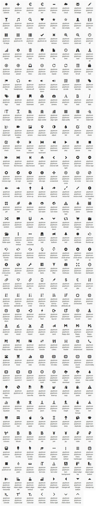
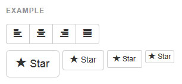
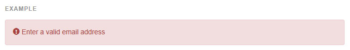

## 아이콘 (Glyphicons)

### [사용가능한 기호](http://getbootstrap.com/components/#glyphicons-glyphs)   
부트스트랩을 위해 무료로 아이콘을 제공합니다.
[Glyphicons](http://glyphicons.com/)Halflings 세트로 폰트 포멧에 250 기호 이상을 포함하고 있습니다. 

---

---
### [사용법](http://getbootstrap.com/components/#glyphicons-how-to-use)    

모든 아이콘은 기본클래스와 개개의 클래스를 필요로 합니다. 사용하려면, 다음의 코드를 어디든지 붙혀놓으면 됩니다. 적절한 패딩을 위해 아이콘과 글자 사이에 공간을 남겨두세요.

* 다른 콤포넌트와 섞지 마세요
> 아이콘 클래스는 다른 콤포넌트와 직접 섞일수 없습니다. 그들은 같은 요소에 다른 클래스와 함께 사용되지 않을 것입니다. 대신, 중첩된 <span> 를 추가하고 <span> 에 아이콘 클래스를 적용하세요.

* 빈요소에만 사용하세요
> 아이콘 클래스는 텍스트나 자식 요소가 없는 요소에만 사용되어야 합니다.

* 아이콘 폰트 위치 변경하기
> 부트스트랩은 아이콘 폰트 파일은 컴파일된 CSS 파일의 상대적인 `../fonts/` 에 있을 것이라고 추정합니다. 이 폰트 파일을 옮기거나 이름을 바꾸는 방법은 3가지 방법중 하나로 하시면 됩니다.    
Less 파일에서 `@icon-font-path` 와 `@icon-font-name` 변수를 변경합니다.    
Less 컴파일러에서 제공되는 `relative URLs 옵션` 을 활용하세요.    
컴파일된 CSS 에서 `url() 경로를 변경`하세요.    
당신의 개발 설정에 최대한 맞춘 옵션을 사용하세요.

* 접근가능한 아이콘
> 보조 공학의 현대 버전은 유니코드를 알릴것입니다. 스크린리더에서 의도치 않고 혼란스러운 출력을 피하기 위해, 우리는 그들을 `aria-hidden="true"` 속성으로 숨깁니다.
만약 당신이 의미를 전달하는 아이콘을 사용한다면, `.sr-only` 를 사용하여, 보조공학에도 의미가 전달되어야만 합니다.
만약 당신이 텍스트 없는 콘트롤(아이콘만 있는 `button` 처럼)을 만든다면, 당신은 항상 콘트롤의 목적을 식별할 수 있는 대체 콘텐츠를 제공해야 합니다. 이 경우, 당신은 콘트롤 자체에 aria-label 속성을 추가하셔도 됩니다.

```html
<span class="glyphicon glyphicon-search" aria-hidden="true"></span>
```
---


### [예제](http://getbootstrap.com/components/#glyphicons-examples)
툴바와 네비게이션을 위해 버튼과 버튼 그룹에 그들을 사용하거나, 폼 입력요소 앞에 덧붙힙니다.



```html
<button type="button" class="btn btn-default" aria-label="Left Align">
  <span class="glyphicon glyphicon-align-left" aria-hidden="true"></span>
</button>

<button type="button" class="btn btn-default btn-lg">
  <span class="glyphicon glyphicon-star" aria-hidden="true"></span> Star
</button>
```
아이콘은 경보에서 그것이 에러메시지라는 것을 전달하기 위해 사용됩니다. 그리고 그것은 보조 공학 사용자들에게도 알리기 위해 추가적인 `.sr-only `텍스트가 필요합니다.


```html
<div class="alert alert-danger" role="alert">
  <span class="glyphicon glyphicon-exclamation-sign" aria-hidden="true"></span>
  <span class="sr-only">Error:</span>
  Enter a valid email address
</div>
```

<br />
---

* [원문사이트 바로가기](http://getbootstrap.com/components/#glyphicons)
* [부트스트랩 ReadMe](../README.md)

---
* 다음페이지 - 드롭다운 [Dropdowns](component_02_dropdowns.md)