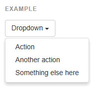
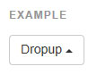
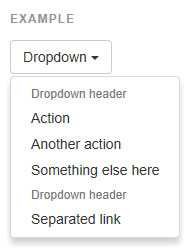
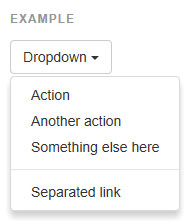

## 드롭다운

링크들의 목록을 보여주기 위한 토글이 가능한 컨텍스트 메뉴. 드롭다운 [자바스크립트 플러그인](http://bootstrapk.com/javascript/#dropdowns) 으로 상호작용하도록 만드세요.

---

###[예제](http://getbootstrap.com/components/#dropdowns-example)
드롭다운의 트리거와 드롭다운 메뉴를 `.dropdown` 으로 둘러싸세요, 아니면 다른 태그에 position: relative; 를 정의하고, 메뉴 HTML 을 추가하세요. 드롭다운 메뉴는 부모에 `.dropup` 를 추가하는 것으로 바뀌는 것이 가능합니다.    



```html

<div class="dropdown">
  <button class="btn btn-default dropdown-toggle" type="button" id="dropdownMenu1" data-toggle="dropdown" aria-expanded="true">
    Dropdown
    <span class="caret"></span>
  </button>
  <ul class="dropdown-menu" role="menu" aria-labelledby="dropdownMenu1">
    <li role="presentation"><a role="menuitem" tabindex="-1" href="#">Action</a></li>
    <li role="presentation"><a role="menuitem" tabindex="-1" href="#">Another action</a></li>
    <li role="presentation"><a role="menuitem" tabindex="-1" href="#">Something else here</a></li>
    <li role="presentation"><a role="menuitem" tabindex="-1" href="#">Separated link</a></li>
  </ul>
</div>
<div class="dropup">
  <button class="btn btn-default dropdown-toggle" type="button" id="dropdownMenu2" data-toggle="dropdown" aria-expanded="true">
    Dropdown
    <span class="caret"></span>
  </button>
  <ul class="dropdown-menu" role="menu" aria-labelledby="dropdownMenu2">
    <li role="presentation"><a role="menuitem" tabindex="-1" href="#">Action</a></li>
    <li role="presentation"><a role="menuitem" tabindex="-1" href="#">Another action</a></li>
    <li role="presentation"><a role="menuitem" tabindex="-1" href="#">Something else here</a></li>
    <li role="presentation"><a role="menuitem" tabindex="-1" href="#">Separated link</a></li>
  </ul>
</div>

```
---

###[정렬](http://getbootstrap.com/components/#dropdowns-alignment)
기본적으로, 드롭다운 메뉴는 자동적으로 좌상단에 위치합니다. 우측 정렬하려면 .dropdown-menu 에 `.dropdown-menu-right` 를 추가하세요.

* 추가적으로 위치를 잡는 것이 필요할 수 있습니다
> 드롭다운은 자동적으로 CSS 를 통해 문서의 기본 흐름으로 위치를 잡습니다. 이것은 드롭다운은 부모의 overflow 이나 뷰포트의 바깥영역에 의해 크롭(crop)될 수 있음을 의미합니다. 이런 이슈가 발생하면 스스로 해결해야합니다

* 폐지예정된 .pull-right 정렬    
>v3.1.0 이후로, 우리는 드롭다운 메뉴에 `.pull-right` 을 폐지예정으로 하였습니다. 메뉴를 우측정렬하려면, `.dropdown-menu-right` 를 사용하세요. 네비게이션바에서 우측정렬된 네비게이션 콤포넌트는 메뉴를 자동적으로 정렬하기 위해 이 클래스의 믹스인 버전을 사용합니다. 그것을 오버라이드하기 위해, `.dropdown-menu-left` 을 사용하세요.
```html

<ul class="dropdown-menu dropdown-menu-right" role="menu" aria-labelledby="dLabel">
  ...
</ul>

```
---   

###[제목(Headers)](http://getbootstrap.com/components/#dropdowns-headers)
드롭다운 메뉴의 액션 그룹에 라벨을 붙이려면 헤더를 추가하세요.



```html

<ul class="dropdown-menu" role="menu" aria-labelledby="dropdownMenu3">
  ...
  <li role="presentation" class="dropdown-header">Dropdown header</li>
  ...
</ul>

```
---   

###[구분선(Divider)](http://getbootstrap.com/components/#dropdowns-divider)

드롭다운 메뉴에 일련의 링크를 구분하기 위해 구분선을 추가하세요.



```html

<ul class="dropdown-menu" role="menu" aria-labelledby="dropdownMenuDivider">
  ...
  <li role="presentation" class="divider"></li>
  ...
</ul>
```
---   

###[비활성화된 메뉴 항목](http://getbootstrap.com/components/#dropdowns-disabled)
링크를 비활성화 하려면 드롭다운의 `<li>` 에 `.disabled` 를 추가하세요.



```html

<ul class="dropdown-menu" role="menu" aria-labelledby="dropdownMenu4">
  <li role="presentation"><a role="menuitem" tabindex="-1" href="#">Regular link</a></li>
  <li role="presentation" class="disabled"><a role="menuitem" tabindex="-1" href="#">Disabled link</a></li>
  <li role="presentation"><a role="menuitem" tabindex="-1" href="#">Another link</a></li>
</ul>
```

<br />
---

* [원문사이트 바로가기](http://getbootstrap.com/components/#dropdowns)
* [부트스트랩 ReadMe](../README.md)

---
* 이전페이지 - 아이콘 [Glyphicons](component_01_glyphicons.md)
* 다음페이지 - 버튼 그룹 [Button groups](component_03_button.md)