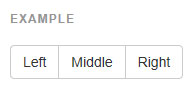
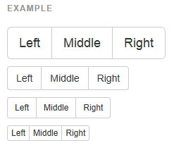
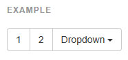
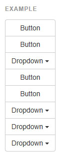
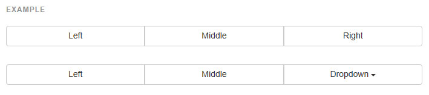
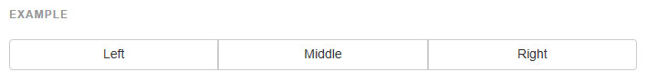

## 버튼(Button)

일련의 버튼들을 버튼 그룹으로 같이 한줄에 모으세요. [버튼 플러그인](http://bootstrapk.com/javascript/#buttons) 으로 라디오와 체크박스처럼 사용할 수도 있습니다.

---

###예제
드롭다운의 트리거와 드롭다운 메뉴를 `.dropdown` 으로 둘러싸세요, 아니면 다른 태그에 position: relative; 를 정의하고, 메뉴 HTML 을 추가하세요. 드롭다운 메뉴는 부모에 `.dropup` 를 추가하는 것으로 바뀌는 것이 가능합니다.    

* 버튼 그룹안의 툴팁 & 팝오버 특별한 설정이 필요합니다
> `.btn-group` 요소에 툴팁이나 팝오버를 사용할 때, 당신은 원치않는 부작용(요소가 넓어진다거나 모서리가 없어진다거나)을 피하기 위해 옵션 `container: 'body'` 을 명시해야 할 것입니다.

* 정확한 `role` 을 부여하고 라벨을 제공하세요
> 보조 공학을 위해 그룹화된 일련의 버튼들을 전달하기 위해서, 적절한 `role` 속성이 제공되어져야 합니다. 버튼 그룹을 위해, 이것은 `role="group"` 이 될 수 있습니다. 툴바는 `role="toolbar"` 을 가져야 합니다.
한가지 예외는 하나의 콘트롤 밖에 없는 그룹이나 드롭다운입니다. 예를 들면 `<button>` 요소와 함께하는 양쪽정렬된 버튼 그룹
게다, 대부분의 보조 공학은 올바른 `role` 속성이 존재함에도 불구하고, 그룹과 툴바는 명확하게 라벨이 주어져야 합니다. 여기에 제공된 예제에서, 우리는 `aria-label` 을 사용했습니다만 `aria-labelledby `같은 대안도 사용될 수 있습니다.

---

###[기본 예제](http://getbootstrap.com/components/#btn-groups-single)
`.btn` 로 된 일련의 버튼들을 `.btn-group` 으로 감싸세요.



```html

<div class="btn-group" role="group" aria-label="...">
  <button type="button" class="btn btn-default">Left</button>
  <button type="button" class="btn btn-default">Middle</button>
  <button type="button" class="btn btn-default">Right</button>
</div>

```
---   

###[버튼 툴바](http://getbootstrap.com/components/#btn-groups-toolbar)
더 복합적인 콤포넌트를 만드려면 `<div class="btn-group">` 세트를 `<div class="btn-toolbar">` 으로 합치세요.


```html

<div class="btn-toolbar" role="toolbar" aria-label="...">
  <div class="btn-group" role="group" aria-label="...">...</div>
  <div class="btn-group" role="group" aria-label="...">...</div>
  <div class="btn-group" role="group" aria-label="...">...</div>
</div>
 
```
---   

###[크기 조절](http://getbootstrap.com/components/#btn-groups-sizing)
그룹 내 모든 버튼에 일일이 크기조절 클래스를 적용하는 대신, `.btn-group` 에 `.btn-group-*` 을 추가합니다.



```html

<div class="btn-group btn-group-lg" role="group" aria-label="...">...</div>
<div class="btn-group" role="group" aria-label="...">...</div>
<div class="btn-group btn-group-sm" role="group" aria-label="...">...</div>
<div class="btn-group btn-group-xs" role="group" aria-label="...">...</div>
```
---   

###[중첩하기](http://getbootstrap.com/components/#btn-groups-nested)
일련의 버튼과 같이 있는 드롭다운 메뉴를 원할 때는 `.btn-group` 안에 다른 `.btn-group` 을 넣으시면 됩니다.



```html
<div class="btn-group" role="group" aria-label="...">
  <button type="button" class="btn btn-default">1</button>
  <button type="button" class="btn btn-default">2</button>

  <div class="btn-group" role="group">
    <button type="button" class="btn btn-default dropdown-toggle" data-toggle="dropdown" aria-expanded="false">
      Dropdown
      <span class="caret"></span>
    </button>
    <ul class="dropdown-menu" role="menu">
      <li><a href="#">Dropdown link</a></li>
      <li><a href="#">Dropdown link</a></li>
    </ul>
  </div>
</div>
```

---

###[수직형](http://getbootstrap.com/components/#btn-groups-vertical)
버튼 그룹이 수평으로 말고 수직으로 쌓입니다. `분리된 버튼 드롭다운은 지원되지 않습니다.`



```html
<div class="btn-group-vertical" role="group" aria-label="...">
  ...
</div>
```

---

###[양쪽정렬된 버튼 그룹](http://getbootstrap.com/components/#btn-groups-justified)
버튼 그룹을 그것의 부모의 꽉찬 너비 걸쳐 같은 크기로 늘리게 합니다. 또한 버튼 그룹내의 드롭다운에도 작동합니다.

* 모서리 다루기
> 양쪽정렬된 버튼을 위해 사용된 특정 HTML 과 CSS 로 인해 (말하자면, `display: table-cell`), 그들사이의 모서리는 두배입니다. 보통 버튼 그룹에서는, 그들을 없애기 위해 `margin-left: -1px` 를 사용됩니다. 하지만 margin 은 `display: table-cell` 와 같이 작동하지 않습니다. 결과적으로, 부트스트랩을 맞춤화하여, 모서리를 제거하거나 색을 적용하는 것을 원할 수 있습니다.

* IE8 과 모서리
> 인터넷 익스플로러 8 은 양쪽 정렬된 버튼 그룹의 버튼모서리를 렌더링 하지 않습니다. 그것이 `<a>` 이거나 `<button>` 인지는 상관이 없습니다. 이것을 우회하려면, 버튼을 또다른 `.btn-group` 으로 감싸세요.
더 많은 정보는 [#12476](https://github.com/twbs/bootstrap/issues/12476) 을 보세요.

#####[`<a> `요소](http://getbootstrap.com/components/#with-a-elements)
`<a> `요소와 그냥 일련의 `.btn` 들을 `.btn-group.btn-group-justified` 으로 감싸세요.



```html
<div class="btn-group btn-group-justified" role="group" aria-label="...">
  ...
</div>
```

* 버튼으로서의 링크   
 > 만약 `<a>` 요소가 버튼으로서 사용된다면, 그들은 적절한 `role="button"` 이 주어져야 합니다.


#####[`<button>` 요소](http://getbootstrap.com/components/#with-button-elements)

`<button> `요소와 양쪽정렬된 버튼 그룹을 사용하기 위해, **당신은 각 버튼을 버튼 그룹으로 감싸야 합니다.** 대부분의 브라우저들은 `<button>` 요소를 정렬하기 위한 우리의 CSS 를 적절히 적용하지 않습니다만, 우리가 버튼 드롭다운을 지원한 이후로, 우리는 그것을 우회하여 작동할 수 있습니다.



```html
<div class="btn-group btn-group-justified" role="group" aria-label="...">
  <div class="btn-group" role="group">
    <button type="button" class="btn btn-default">Left</button>
  </div>
  <div class="btn-group" role="group">
    <button type="button" class="btn btn-default">Middle</button>
  </div>
  <div class="btn-group" role="group">
    <button type="button" class="btn btn-default">Right</button>
  </div>
</div>
```


<br />
---

* [원문사이트 바로가기](http://getbootstrap.com/components/#btn-groups)
* [부트스트랩 ReadMe](../README.md)

---
* 이전페이지 - 드롭다운 [Dropdowns](component_02_dropdowns.md)
* 다음페이지 - 버튼 드롭다운 [Button dropdowns](component_04_button_dropdown.md) 