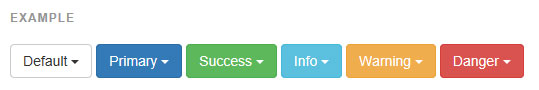
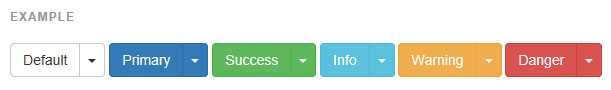
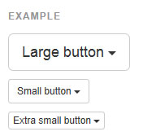
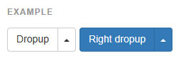

## 버튼 드롭다운(Button Dropdown)

드롭다운 메뉴가 작동되는 버튼을 사용하려면 `.btn-group` 안에 그것들을 두고 적절한 메뉴 마크업을 해줍니다.

*플러그인 의존성
> 버튼 드롭다운은 부트스트랩에 포함된 드롭다운 플러그인 를 필요로 합니다.

---

####단버튼 드롭다운

몇가지 기본 마크업을 변경하여 버튼을 드롭다운 토글로 바꾸세요.



```html

<!-- Single button -->
<div class="btn-group">
  <button type="button" class="btn btn-default dropdown-toggle" data-toggle="dropdown" aria-expanded="false">
    Action <span class="caret"></span>
  </button>
  <ul class="dropdown-menu" role="menu">
    <li><a href="#">Action</a></li>
    <li><a href="#">Another action</a></li>
    <li><a href="#">Something else here</a></li>
    <li class="divider"></li>
    <li><a href="#">Separated link</a></li>
  </ul>
</div>

```    

--- 

####[분할된 버튼 드롭다운](http://getbootstrap.com/components/#dropdowns)
똑같은 마크업에, 분리된 버튼만 추가하여 분할된 버튼 드롭다운을 만드세요.



```html

<!-- Split button -->
<div class="btn-group">
  <button type="button" class="btn btn-danger">Action</button>
  <button type="button" class="btn btn-danger dropdown-toggle" data-toggle="dropdown" aria-expanded="false">
    <span class="caret"></span>
    <span class="sr-only">Toggle Dropdown</span>
  </button>
  <ul class="dropdown-menu" role="menu">
    <li><a href="#">Action</a></li>
    <li><a href="#">Another action</a></li>
    <li><a href="#">Something else here</a></li>
    <li class="divider"></li>
    <li><a href="#">Separated link</a></li>
  </ul>
</div>

```    

--- 

####[크기조절](http://getbootstrap.com/components/#btn-dropdowns-sizing)
버튼 드롭다운은 모든 크기의 버튼에서 동작합니다.



```html

<!-- Large button group -->
<div class="btn-group">
  <button class="btn btn-default btn-lg dropdown-toggle" type="button" data-toggle="dropdown" aria-expanded="false">
    Large button <span class="caret"></span>
  </button>
  <ul class="dropdown-menu" role="menu">
    ...
  </ul>
</div>

<!-- Small button group -->
<div class="btn-group">
  <button class="btn btn-default btn-sm dropdown-toggle" type="button" data-toggle="dropdown" aria-expanded="false">
    Small button <span class="caret"></span>
  </button>
  <ul class="dropdown-menu" role="menu">
    ...
  </ul>
</div>

<!-- Extra small button group -->
<div class="btn-group">
  <button class="btn btn-default btn-xs dropdown-toggle" type="button" data-toggle="dropdown" aria-expanded="false">
    Extra small button <span class="caret"></span>
  </button>
  <ul class="dropdown-menu" role="menu">
    ...
  </ul>
</div>

```    

--- 

####[드롭업형](http://getbootstrap.com/components/#btn-dropdowns-dropup)
상위태그에 `.dropup` 을 더하여 드롭다운 메뉴를 요소 위로 올라가도록 작동시키세요.



```html

<div class="btn-group dropup">
  <button type="button" class="btn btn-default">Dropup</button>
  <button type="button" class="btn btn-default dropdown-toggle" data-toggle="dropdown" aria-expanded="false">
    <span class="caret"></span>
    <span class="sr-only">Toggle Dropdown</span>
  </button>
  <ul class="dropdown-menu" role="menu">
    <!-- Dropdown menu links -->
  </ul>
</div>

```    


<br />
---

* [원문사이트 바로가기](http://getbootstrap.com/components/#btn-dropdowns)
* [부트스트랩 ReadMe](../README.md)

---
* 이전페이지 - 버튼 그룹 [Button groups](docs/component_03_button.md)
* 다음페이지 - 입력 그룹 [Input groups](docs/component_05_input_groups.md)