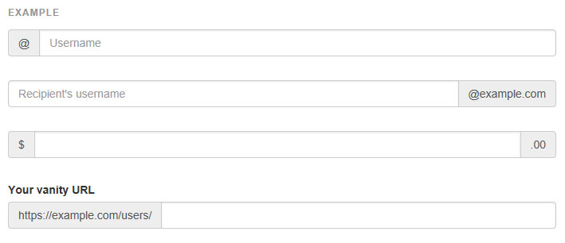
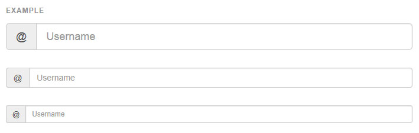
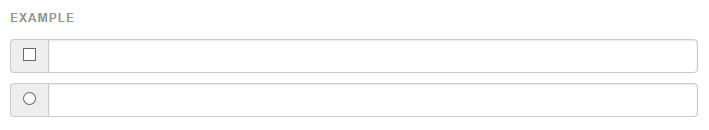
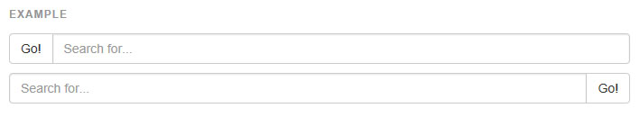
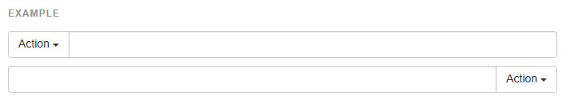
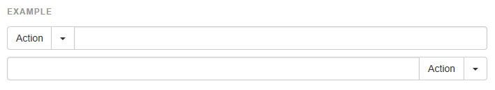
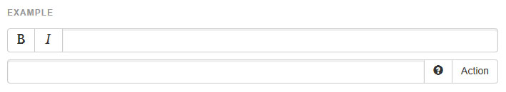

## 입력 그룹 (Input Groups)

문자 기반의 `<input>` 의 전,후 혹은 양쪽에 문자나 버튼을 추가하여 폼컨트롤을 확장하세요. `.form-control` 에 앞이나 뒤에 첨부된 `.input-group-addon` 과 함께 `.input-group` 을 사용합니다.

* 문자 기반의 `<input>` 만
> 여기에 `<select>` 요소를 사용하는 것을 피하세요. 왜냐하면 웹킷 브라우저에서 완전히 지원되지 않기 때문입니다.
여기에 `<textarea>` 요소를 사용하는 것을 피하세요. 왜냐하면 그들의 rows 속성은 몇몇 경우에 적용되지 않기 때문입니다.

* 입력 그룹안의 툴팁 & 팝오버는 특별한 설정이 필요합니다
> `.input-group` 요소에 툴팁이나 팝오버를 사용할 때, 당신은 원치않는 부작용(요소가 넓어진다거나 모서리가 없어진다거나)을 피하기 위해 옵션 `container: 'body'` 을 명시해야 할 것입니다.

* 다른 콤포넌트와 섞지 마세요
> 폼 그룹이나 그리드 열 클래스와 직접 섞지 마세요. 대신, 폼 그룹이나 그리드 관련 요소 안에 중첩하세요.

* 항상 라벨을 추가하세요
> 스크린 리더는 만약 모든 입력에 라벨을 포함하지 않는다면 당신의 폼에 있어 문제를 일으킬 것입니다. 이런 입력 그룹을 위해, 보조 공학에게 추가적인 라벨이나 기능성을 전달하는 것을 확실히 하도록 하세요.
사용되어질 수 있는 정확한 기법(`.sr-only` 클래스를 사용하여 숨겨진 `<label>` 요소나, `aria-label`, `aria-labelledby`, `aria-describedby`, `title`, `placeholder` 요소를 사용)과 전달하는 필요하게 될 추가적인 정보들은 당신이 사용하는 인터페이스 위젯의 정확한 유형에 따라서 달라질 것입니다. 이 섹션의 예제는 몇 가지 유형별 접근을 제안합니다.
---

###[기본 예제](http://getbootstrap.com/components/#input-groups-basic)

입력콘트롤의 양쪽에 애드온이나 버튼을 넣으세요. 당신은 한쪽 아니면 양쪽 다 넣을 수 있습니다.    

- **우리는 한쪽면에 다수의 애드온을 지원하지 않습니다.**    
- **우리는 하나의 입력 그룹내에 다수의 폼 콘트롤을 지원하지 않습니다.**    



```html

<div class="input-group">
  <span class="input-group-addon" id="basic-addon1">@</span>
  <input type="text" class="form-control" placeholder="Username" aria-describedby="basic-addon1">
</div>

<div class="input-group">
  <input type="text" class="form-control" placeholder="Recipient's username" aria-describedby="basic-addon2">
  <span class="input-group-addon" id="basic-addon2">@example.com</span>
</div>

<div class="input-group">
  <span class="input-group-addon">$</span>
  <input type="text" class="form-control" aria-label="Amount (to the nearest dollar)">
  <span class="input-group-addon">.00</span>
</div>

```

--- 

###[크기 조절](http://getbootstrap.com/components/#input-groups-sizing)
`.input-group` 에 크기조절 클래스를 추가하세요. 내부의 요소들은 자동으로 크기조절이 됩니다.     
각각의 태그에 폼콘트롤 크기 클래스들을 반복할 필요가 없습니다.



```html
<div class="input-group input-group-lg">
  <span class="input-group-addon" id="sizing-addon1">@</span>
  <input type="text" class="form-control" placeholder="Username" aria-describedby="sizing-addon1">
</div>

<div class="input-group">
  <span class="input-group-addon" id="sizing-addon2">@</span>
  <input type="text" class="form-control" placeholder="Username" aria-describedby="sizing-addon2">
</div>

<div class="input-group input-group-sm">
  <span class="input-group-addon" id="sizing-addon3">@</span>
  <input type="text" class="form-control" placeholder="Username" aria-describedby="sizing-addon3">
</div>
```
--- 

###[체크박스와 라디오 에드온](http://getbootstrap.com/components/#input-groups-checkboxes-radios)
입력그룹 내 에드온에 문자 대신 체크박스나 라디오를 두세요.



```html
<div class="row">
  <div class="col-lg-6">
    <div class="input-group">
      <span class="input-group-addon">
        <input type="checkbox" aria-label="...">
      </span>
      <input type="text" class="form-control" aria-label="...">
    </div><!-- /input-group -->
  </div><!-- /.col-lg-6 -->
  <div class="col-lg-6">
    <div class="input-group">
      <span class="input-group-addon">
        <input type="radio" aria-label="...">
      </span>
      <input type="text" class="form-control" aria-label="...">
    </div><!-- /input-group -->
  </div><!-- /.col-lg-6 -->
</div><!-- /.row -->
```

--- 

###[버튼 에드온](http://getbootstrap.com/components/#input-groups-buttons)
입력그룹 내 버튼은 별도의 약간 다른 중첩 태그를 필요로 합니다. `.input-group-addon` 대신 `.input-group-btn` 으로 버튼을 감쌉니다. 이것은 오버라이드 할 수 없는 기본 브라우저 스타일들로 인해 필요합니다.



```html
<div class="row">
  <div class="col-lg-6">
    <div class="input-group">
      <span class="input-group-btn">
        <button class="btn btn-default" type="button">Go!</button>
      </span>
      <input type="text" class="form-control" placeholder="Search for...">
    </div><!-- /input-group -->
  </div><!-- /.col-lg-6 -->
  <div class="col-lg-6">
    <div class="input-group">
      <input type="text" class="form-control" placeholder="Search for...">
      <span class="input-group-btn">
        <button class="btn btn-default" type="button">Go!</button>
      </span>
    </div><!-- /input-group -->
  </div><!-- /.col-lg-6 -->
</div><!-- /.row -->
```
--- 

###[드롭다운 버튼](http://getbootstrap.com/components/#input-groups-buttons-dropdowns)



```html
<div class="row">
  <div class="col-lg-6">
    <div class="input-group">
      <div class="input-group-btn">
        <button type="button" class="btn btn-default dropdown-toggle" data-toggle="dropdown" aria-expanded="false">Action <span class="caret"></span></button>
        <ul class="dropdown-menu" role="menu">
          <li><a href="#">Action</a></li>
          <li><a href="#">Another action</a></li>
          <li><a href="#">Something else here</a></li>
          <li class="divider"></li>
          <li><a href="#">Separated link</a></li>
        </ul>
      </div><!-- /btn-group -->
      <input type="text" class="form-control" aria-label="...">
    </div><!-- /input-group -->
  </div><!-- /.col-lg-6 -->
  <div class="col-lg-6">
    <div class="input-group">
      <input type="text" class="form-control" aria-label="...">
      <div class="input-group-btn">
        <button type="button" class="btn btn-default dropdown-toggle" data-toggle="dropdown" aria-expanded="false">Action <span class="caret"></span></button>
        <ul class="dropdown-menu dropdown-menu-right" role="menu">
          <li><a href="#">Action</a></li>
          <li><a href="#">Another action</a></li>
          <li><a href="#">Something else here</a></li>
          <li class="divider"></li>
          <li><a href="#">Separated link</a></li>
        </ul>
      </div><!-- /btn-group -->
    </div><!-- /input-group -->
  </div><!-- /.col-lg-6 -->
</div><!-- /.row -->
```

---

###[분할된 버튼](http://getbootstrap.com/components/#input-groups-buttons-segmented)



```html
<div class="input-group">
  <div class="input-group-btn">
    <!-- Button and dropdown menu -->
  </div>
  <input type="text" class="form-control" aria-label="...">
</div>

<div class="input-group">
  <input type="text" class="form-control" aria-label="...">
  <div class="input-group-btn">
    <!-- Button and dropdown menu -->
  </div>
</div>
```

---

###[복합적인 버튼](http://getbootstrap.com/components/#input-groups-buttons-multiple)



```html
<div class="input-group">
  <div class="input-group-btn">
    <!-- Buttons -->
  </div>
  <input type="text" class="form-control" aria-label="...">
</div>

<div class="input-group">
  <input type="text" class="form-control" aria-label="...">
  <div class="input-group-btn">
    <!-- Buttons -->
  </div>
</div>
```

<br />
---

* [원문사이트 바로가기](http://getbootstrap.com/components/#input-groups)
* [부트스트랩 ReadMe](../README.md)

---
* 이전페이지 - 버튼 드롭다운 [Button dropdowns](component_04_button_dropdown.md) 
* 다음페이지 - 네비게이션 [Navs](component_06_navs.md)