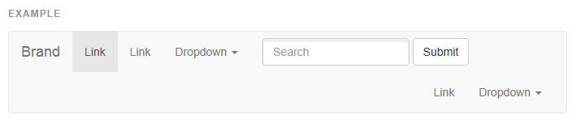
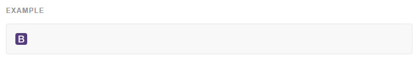
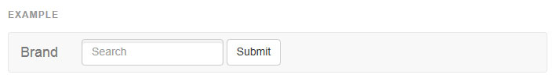
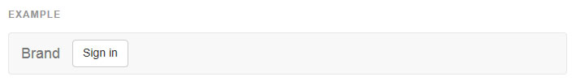
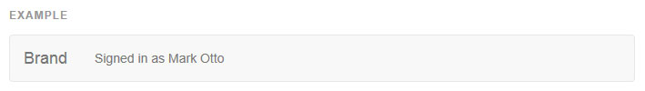
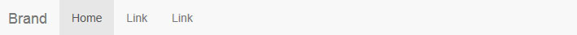
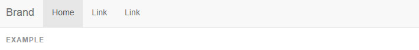
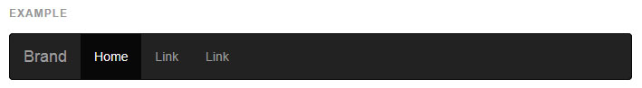

## 네비게이션 바 (Navbar)

###[기본 네비게이션 바 (Default navbar)](http://getbootstrap.com/components/#navbar)
네비게이션 바는 당신의 어플리케이션이나 사이트를 위한 상단 네비게이션으로 적합한 반응형 메타 콤포넌트입니다. 그것들은 모바일 뷰에서 가려진 상태(토글할 수 있음)로 시작하며 가능한 뷰포트 너비가 되었을 때 수평적으로 펼쳐집니다.
양쪽정렬된 네비게이션 바 링크는 현재 지원되지 않습니다.

* 콘텐츠 오버플로우 하는것
>이것을 해결하려면, 당신은 다음과 같이 할 수 있습니다. Since Bootstrap doesn't know how much space the content in your navbar needs, you might run into issues with content wrapping into a second row. To resolve this, you can:    
	a.navbar 항목들의 양이나 너비를 줄입니다.    
	b.[반응형 유틸리티 클래스](http://bootstrapk.com/components/#navbar) 를 사용하여 몇몇 화면 크기에서 몇몇 navbar 항목을 숨깁니다.    
	c.navbar 가 펼쳐지고 접어지는 지점을 바꿉니다. @grid-float-breakpoint 변수를 수정하거나 당신의 미디어 쿼리에 추가하세요.    

* 플러그인 의존성
>만약 자바스크립트가 비활성화되 뷰포트가 좁을때, 그것은 navbar 가 펼쳐지고 `.navbar-collapse` 의 내용이 보여지는 것이 불가능 할 것입니다.
반응형 navbar 는 부트스트랩에 포함된 컬랩스 플러그인 이 필요합니다.

* 접히는 모바일 navbar 분기점을 변경하기
>`navbar` 는 모바일 세로뷰에서 `@grid-float-breakpoint `보다 작으면 접히고,` @grid-float-breakpoint` 보다 크면 펼쳐집니다. navbar 접힘/펼침의 때을 제어하려면 Less 에서 이 변수를 조정하세요. 기본값은 `768px` 입니다. ("태블릿" 이하 화면)

* navbars 을 접근성있게 만드세요
>보조 공학의 사용자들에게 확실하게 알리기 위해 `<nav>` 을 사용하는 것을 확실히 하거나, 좀 더 일반적인 `<div>` 같은 요소에, `role="navigation"` 를 추가하도록 하세요.




```html

<nav class="navbar navbar-default">
  <div class="container-fluid">
    <!-- Brand and toggle get grouped for better mobile display -->
    <div class="navbar-header">
      <button type="button" class="navbar-toggle collapsed" data-toggle="collapse" data-target="#bs-example-navbar-collapse-1">
        <span class="sr-only">Toggle navigation</span>
        <span class="icon-bar"></span>
        <span class="icon-bar"></span>
        <span class="icon-bar"></span>
      </button>
      <a class="navbar-brand" href="#">Brand</a>
    </div>

    <!-- Collect the nav links, forms, and other content for toggling -->
    <div class="collapse navbar-collapse" id="bs-example-navbar-collapse-1">
      <ul class="nav navbar-nav">
        <li class="active"><a href="#">Link <span class="sr-only">(current)</span></a></li>
        <li><a href="#">Link</a></li>
        <li class="dropdown">
          <a href="#" class="dropdown-toggle" data-toggle="dropdown" role="button" aria-expanded="false">Dropdown <span class="caret"></span></a>
          <ul class="dropdown-menu" role="menu">
            <li><a href="#">Action</a></li>
            <li><a href="#">Another action</a></li>
            <li><a href="#">Something else here</a></li>
            <li class="divider"></li>
            <li><a href="#">Separated link</a></li>
            <li class="divider"></li>
            <li><a href="#">One more separated link</a></li>
          </ul>
        </li>
      </ul>
      <form class="navbar-form navbar-left" role="search">
        <div class="form-group">
          <input type="text" class="form-control" placeholder="Search">
        </div>
        <button type="submit" class="btn btn-default">Submit</button>
      </form>
      <ul class="nav navbar-nav navbar-right">
        <li><a href="#">Link</a></li>
        <li class="dropdown">
          <a href="#" class="dropdown-toggle" data-toggle="dropdown" role="button" aria-expanded="false">Dropdown <span class="caret"></span></a>
          <ul class="dropdown-menu" role="menu">
            <li><a href="#">Action</a></li>
            <li><a href="#">Another action</a></li>
            <li><a href="#">Something else here</a></li>
            <li class="divider"></li>
            <li><a href="#">Separated link</a></li>
          </ul>
        </li>
      </ul>
    </div><!-- /.navbar-collapse -->
  </div><!-- /.container-fluid -->
</nav>

```
----

###[브랜드 이미지](http://getbootstrap.com/components/#navbar-brand-image)
`` 를 위한 텍스트를 교체하는 것으로 navbar 브랜드를 당신의 이미지로 교체하세요. `.navbar-brand` 는 자신의 패딩과 높이를 가졌기때문에, 당신은 당신의 이미지에 맞게 약간의 CSS 를 오버라이드해야할 수 있습니다.



```html

<nav class="navbar navbar-default">
  <div class="container-fluid">
    <div class="navbar-header">
      <a class="navbar-brand" href="#">
        
      </a>
    </div>
  </div>
</nav>

```
----

###[폼](http://getbootstrap.com/components/#navbar-forms)
좁은 뷰포트에서 적절한 수직 정렬과 접히는 행위를 위해서 `.navbar-form `안에 폼콘텐츠를 넣으세요. 그것이 navbar 내에서 어디에 위치할지 결정하기 위해 정렬 옵션을 사용하세요.
주의할 점은 `.navbar-form` 은 믹스인을 통해 `.form-inline` 의 많은 코드를 공유합니다. **navbar 에서 적절하게 보여지게 하기 위해 입력 그룹같은 몇몇 폼 콘트롤은 고정된 너비가 필요할 수 있습니다.**



```html

<form class="navbar-form navbar-left" role="search">
  <div class="form-group">
    <input type="text" class="form-control" placeholder="Search">
  </div>
  <button type="submit" class="btn btn-default">Submit</button>
</form>

```
* 모바일 기기 경고
> 모바일기기에서 고정된 요소안에 폼 콘트롤을 사용하는데 몇가지 규칙이 있습니다. 자세한 것은 우리의 브라우저 지원 문서를 보세요

* 항상 라벨을 추가하세요
> 스크린 리더는 만약 모든 입력에 라벨을 포함하지 않는다면 당신의 폼에 있어 문제를 일으킬 것입니다. 이런 인라인 폼을 위해, 당신은 .sr-only 클래스로 라벨을 숨길수 있습니다. 여기에는 보조공학을 위해 라벨을 제공하는 `aria-label, aria-labelledby, title` 과 같은 또다른 대체 방법이 있습니다. 만약 이것들이 존재하지 않는다면, 스크린 리더는 `placeholder` 속성을 사용할 수도 있습니다. 하지만 이것은 권장하지 않습니다.

----

###[버튼](http://getbootstrap.com/components/#navbar-buttons)
`<button>` 요소에 `.navbar-btn`을 추가하면 navbar 안의 `<form>`에서의 정렬을 `vertically : center`로 맞출수 있습니다.



```html

<button type="button" class="btn btn-default navbar-btn">Sign in</button>

```
* 상황에 따라 사용.
> 표준 버튼 클래스처럼, `.navbar-btn`도 `<a>`나 `<input>`에서 사용할 수 있습니다. 그러나 `.navbar-btn`의 `<a>`나 `<input>`에서 사용할때는 `.navbar-nav`클래스 내에서만 사용해야합니다.

----

###[텍스트](http://getbootstrap.com/components/#navbar-buttons)
적절한 행간과 색을 위해 문자열을 .navbar-text 가 적용된 태그(보통은 `<p>`)로 감싸세요.



```html

<p class="navbar-text">Signed in as Mark Otto</p>

```
   

###[일반 링크](http://getbootstrap.com/components/#navbar-text)
.nav 내부에 있지 않은 링크를 사용하려면, 기본과 반전 네비게이션 바에 적절한 색을 맞추기 위해 `.navbar-link` 를 사용하세요.


```html

<p class="navbar-text navbar-right">Signed in as <a href="#" class="navbar-link">Mark Otto</a></p>

```
----   


###[콤포넌트 정렬 (Component alignment)](http://getbootstrap.com/components/#navbar-component-alignment)
보조 클래스 `.navbar-left` 나 `.navbar-right` 를 사용하여, 네비게이션 링크, 폼, 버튼, 텍스트를 정렬하세요. 이 클래스들은 특정한 방향으로 CSS float 을 적용합니다. 예를 들어, 네비게이션 링크를 정렬하려면, 그것들을 각각의 보조 클래스가 적용한 `<ul>` 로 분리하여 둡니다.
이 클래스들은 `.pull-left` 와 `.pull-right` 의 가공 버전입니다만, 그것들은 다양한 기기에서 네비게이션 바를 더 쉽게 다루기 위한 미디어 쿼리들에 맞춰져 있습니다.


```html
<p class="navbar-text navbar-right">Signed in as <a href="#" class="navbar-link">Mark Otto</a></p>

```

* 오른쪽 정렬의 여러 콤포넌트

>navbar에서 일반적으로 `.navbar-right` 클래스를 함께 사용하기에는 한계가 있습니다. 보통 적당한 여백을 주기위해 '.navbar-right'요소의 마지막에 margin을 사용합니다. 여러 요소와 이 클래스를 함께 사용하고자 할때 의도한대로 margin이 동작하지 않습니다.
우리가 V4에서 해당 구성 요소를 다시 쓸 수있을 때 재방문 할 것입니다.


----   

###[상단 고정 (Fixed to top)](http://getbootstrap.com/components/#navbar-fixed-top)
`.navbar-fixed-top`을 추가하고 그 안에 `.container`나 ` .container-fluid`등의 navbar 컨텐츠를 정렬할 클래스를 포함합니다.



```html

<nav class="navbar navbar-default navbar-fixed-top">
  <div class="container">
    ...
  </div>
</nav>

```

** Body 에 패딩이 필요합니다.**    
` <body> `의 상단에 padding 을 주지 않으면, 네비게이션 바는 다른 콘텐츠를 덮어버립니다. 당신만의 값을 시도해 보거나 하단의 값을 이용하세요.     
  팁: 기본적으로, 네비게이션 바는 50px 보다 큽니다.  
```css

body { padding-top: 70px; }

```
반드시 부트스트랩 CSS 보다 **뒤쪽**에 넣어야 합니다.

---    

###[하단 고정 (Fixed to bottom)](http://getbootstrap.com/components/#navbar-fixed-bottom)
`..navbar-fixed-bottom`을 추가하고 그 안에 `.container`나 ` .container-fluid`등의 navbar 컨텐츠를 정렬할 클래스를 포함합니다.


```html
<nav class="navbar navbar-default navbar-fixed-bottom">
  <div class="container">
    ...
  </div>
</nav>

```

** Body 에 패딩이 필요합니다.**    
` <body> `의 하세요단에 padding 을 주지 않으면, 네비게이션 바는 다른 콘텐츠를 덮어버립니다. 당신만의 값을 시도해 보거나 하단의 값을 이용하세요.     
  팁: 기본적으로, 네비게이션 바는 50px 보다 큽니다.  
```css

body { padding-bottom: 70px; }

```
반드시 부트스트랩 CSS 보다 **뒤쪽**에 넣어야 합니다.


###[정적 상단](http://getbootstrap.com/components/#navbar-static-top)
`.navbar-static-top` 를 추가하여 페이지에 스크롤 없는 꽉찬너비의 navbar 를 만들고, `.container` 나 `.container-fluid` 를 포함하세요.
`.navbar-fixed-*` 클래스와는 다르게, 당신은 `body` 의 패딩을 바꿀 필요가 없습니다.



```html
<nav class="navbar navbar-default navbar-static-top">
  <div class="container">
    ...
  </div>
</nav>

```

###[반전된 네비게이션 바](http://getbootstrap.com/components/#navbar-inverted)
`.navbar-inverse `을 추가하여 네비게이션 바의 모습을 바꿔보세요.



```html
<nav class="navbar navbar-inverse">
  ...
</nav>

```

<br >
---

* [원문사이트 바로가기](http://getbootstrap.com/components/#navbar)
* [부트스트랩 ReadMe](../README.md)

---
* 이전페이지 - 네비게이션 [Navs](component_06_navs.md)
* 다음페이지 - 사이트 이동경로 [Breadcrumbs](component_08_breadcrumbs.md)