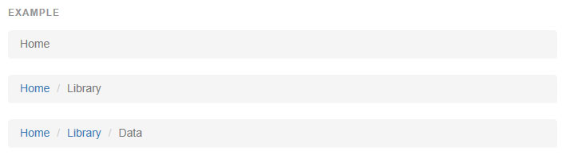

## [경로(Breadcrumbs)](http://getbootstrap.com/components/#breadcrumbs)

네비게이션 체계 내에서의 현재페이지 위치를 가르키세요.
구분자는 CSS 에서 `:before` 와 `content` 를 통해 자동으로 추가됩니다.




```html
<ol class="breadcrumb">
  <li><a href="#">Home</a></li>
  <li><a href="#">Library</a></li>
  <li class="active">Data</li>
</ol>

```


<br >
---

* [원문사이트 바로가기](http://getbootstrap.com/components/#breadcrumbs)
* [부트스트랩 ReadMe](../README.md)

---
* 이전페이지 - 네비게이션 바 [Navbar](component_07_navbar.md)
* 다음페이지 - 페이지네이션 [Pagination](component_09_pagination.md)