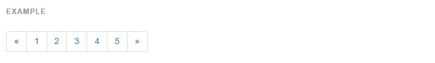
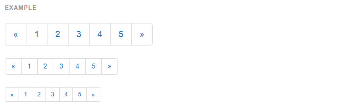
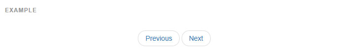
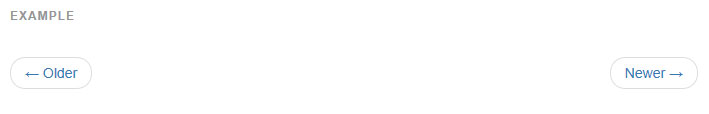
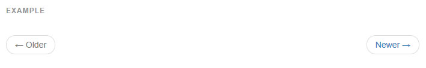

## 페이지네이션(Pagination)

멀티페이지 페이지네이션 콤포넌트나 좀 더 단순한 페이저 콤퍼넌트 로 당신의 사이트나 앱을 위한 페이지네이션 링크를 제공합니다.

### [기본 페이지네이션(Default pagination)](http://getbootstrap.com/components/#pagination-default)
Rdio 에서 영감을 받은 단순한 페이지네이션, 앱과 검색 결과에 좋습니다. 큰 블록은 눈에 잘 띄며, 쉽게 크기조절이 되고, 넓은 클릭 영역을 제공합니다.



```html
<nav>
  <ul class="pagination">
    <li>
      <a href="#" aria-label="Previous">
        <span aria-hidden="true">&laquo;</span>
      </a>
    </li>
    <li><a href="#">1</a></li>
    <li><a href="#">2</a></li>
    <li><a href="#">3</a></li>
    <li><a href="#">4</a></li>
    <li><a href="#">5</a></li>
    <li>
      <a href="#" aria-label="Next">
        <span aria-hidden="true">&raquo;</span>
      </a>
    </li>
  </ul>
</nav>

```

#### 비활성화된 그리고 활성상태
링크는 다른 상황을 위해 맞춤화 할 수 있습니다. 클릭할수 없는 링크를 위해 `.disabled` 를 사용하고 현재 페이지를 가르킬 때는 `.active` 를 사용하세요.


```html
<nav>
  <ul class="pagination">
    <li class="disabled"><a href="#" aria-label="Previous"><span aria-hidden="true">&laquo;</span></a></li>
    <li class="active"><a href="#">1 <span class="sr-only">(current)</span></a></li>
    ...
  </ul>
</nav>

```
당신은 선택적으로 의도한 스타일은 유지하면서 클릭 기능성을 제거하기 위해 활성화 되었거나 비활성화된 앵커 태그를 `<span>` 로 교체할 수 있습니다.

```html
<nav>
  <ul class="pagination">
    <li class="disabled">
      <span>
        <span aria-hidden="true">&laquo;</span>
      </span>
    </li>
    <li class="active">
      <span>1 <span class="sr-only">(current)</span></span>
    </li>
    ...
  </ul>
</nav>

```

#### 크기 조절    

좀 더 크거나 작은 페이지네이션을 원하세요? `.pagination-lg` 나 `.pagination-sm` 을 추가하시면 됩니다.    



```html
<nav><ul class="pagination pagination-lg">...</ul></nav>
<nav><ul class="pagination">...</ul></nav>
<nav><ul class="pagination pagination-sm">...</ul></nav>

```

### [페이저(Pager)](http://getbootstrap.com/components/#pagination-pager)
페이저는 가벼운 마크업과 스타일로 단순한 페이지네이션 구현을 위한 빠른 전후 이동 링크입니다. 블로그나 매거진 같은 간단한 사이트에 좋습니다. 

#### 기본 예제(Default example)
기본적으로, 페이저는 링크를 가운데 정렬합니다.



```html
<nav>
  <ul class="pager">
    <li><a href="#">Previous</a></li>
    <li><a href="#">Next</a></li>
  </ul>
</nav>

```

#### 정렬된 링크(Aligned links)
그렇지 않으면, 각 링크를 양쪽 모서리에 정렬할 수 있습니다:



```html
<nav>
  <ul class="pager">
    <li class="previous"><a href="#"><span aria-hidden="true">&larr;</span> Older</a></li>
    <li class="next"><a href="#">Newer <span aria-hidden="true">&rarr;</span></a></li>
  </ul>
</nav>

```

#### 비활성화 상태
페이저 링크는 또한 일반적인 `.disabled` 보조 클래스를 사용합니다.



```html
<nav>
  <ul class="pager">
    <li class="previous disabled"><a href="#"><span aria-hidden="true">&larr;</span> Older</a></li>
    <li class="next"><a href="#">Newer <span aria-hidden="true">&rarr;</span></a></li>
  </ul>
</nav>

```

<br >
---

* [원문사이트 바로가기](http://getbootstrap.com/components/#pagination)
* [부트스트랩 ReadMe](../README.md)

---
* 이전페이지 - 사이트 이동경로 [Breadcrumbs](component_08_breadcrumbs.md)
* 다음페이지 - 라벨 [Labels](component_10_labels.md)