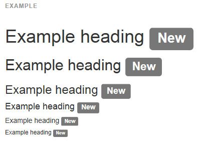
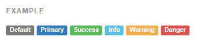

## 라벨(labels)

#### Example


```html
<h3>Example heading <span class="label label-default">New</span></h3>

```

#### 가능한 변화들(Available variations)
라벨 모습을 바꾸려면 아래 명시된 수식클래스 중 하나를 추가하세요.



```html
<span class="label label-default">Default</span>
<span class="label label-primary">Primary</span>
<span class="label label-success">Success</span>
<span class="label label-info">Info</span>
<span class="label label-warning">Warning</span>
<span class="label label-danger">Danger</span>

```

* 다수의 라벨을 가지고 있습니까?
> 렌더링 문제는 좁은 콘테이너 내에 많은 인라인 라벨을 가지고 있을 때 일어날 수 있습니다. 이것을 우회하는 방법은 `display: inline-block;` 으로 설정하는 것입니다. 맥락과 예제를 위해, [#13219 를 보세요.](https://github.com/twbs/bootstrap/issues/13219)

<br >
---

* [원문사이트 바로가기](http://getbootstrap.com/components/#labels)
* [부트스트랩 ReadMe](../README.md)

---
* 이전페이지 - 페이지네이션 [Pagination](component_09_pagination.md)
* 다음페이지 - 배지 [Badges](component_11_badges.md)