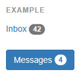
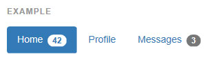

## 배지

**링크, 네비게이션 바 등에 `<span class="badge">` 을 추가하여, 새롭거나 읽지 않은 항목을 쉽게 강조하세요.**



```html
<a href="#">Inbox <span class="badge">42</span></a>

<button class="btn btn-primary" type="button">
  Messages <span class="badge">4</span>
</button>

```

#### 자동 가리기

새롭거나 읽지 않은 항목이 없을때, 배지는 간단하게 가려집니다. (CSS 의 :empty 셀렉터로)

* 크로스브라우저 호환성
> 배지는 IE8 에서는 자동 가리기가 되지 않습니다. 왜냐하면 IE8 은 :empty 셀렉트를 지원하지 않기 때문입니다.

#### 활성화된 네이게이션 상태에 맞춤

알약형이나 목록형 네비게이션에서 활성화 상태 안에 놓여진 배지를 위해 만들어진 스타일이 포함되어 있습니다.



```html
<ul class="nav nav-pills" role="tablist">
  <li role="presentation" class="active"><a href="#">Home <span class="badge">42</span></a></li>
  <li role="presentation"><a href="#">Profile</a></li>
  <li role="presentation"><a href="#">Messages <span class="badge">3</span></a></li>
</ul>

```

<br >
---

* [원문사이트 바로가기](http://getbootstrap.com/components/#badges)
* [부트스트랩 ReadMe](../README.md)

---
* 이전페이지 - 라벨 [Labels](component_10_labels.md)
* 다음페이지 - 점보트론 [Jumbotron](component_12_jumbotron.md)