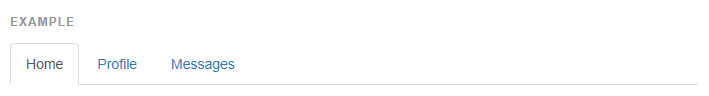
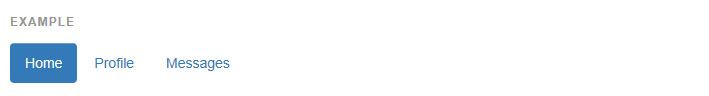
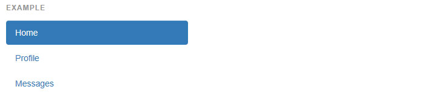
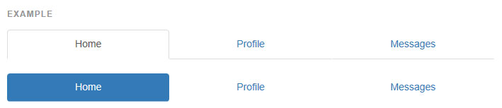
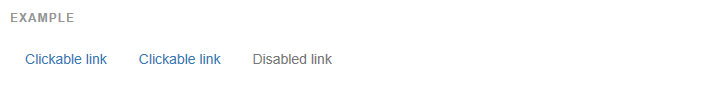

## 네비게이션
부트스트랩 내 사용가능한 네비게이션은 기본 `.nav` 클래스로 시작하는 마크업을 공유할 뿐만 아니라 상태 클래스도 공유합니다. 각 스타일로 전환하려면 수식 클래스를 교체하세요.

* 탭 패널을 위해 네비게이션을 사용하는 것은 자바스크립트 탭 플러그인을 필요로 합니다.
> 탭할수있는 영역에서의 탭을 위해, 당신은 탭 자바스크립트 플러그인 를 사용해야 합니다. 마크업은 또한 추가적인 `role` 과 `ARIA` 속성을 필요할 것입니다. 좀더 자세한 것은 플러그인의 마크업 예제 을 보세요.

* 접근가능한 네비게이션으로서 네비게이션(navs) 을 사용하세요
> 만약 당신이 네비게이션 바를 제공하기 위해 navs 를 사용한다면, `<ul>` 의 부모 콘테이너에 `role="navigation"` 를 추가하거나 `<nav> `으로 감싸야 합니다. `<ul>` 자체에 역할(role)을 추가하지 마세요. 왜냐하면 보조 공학에서 실제 목록을 가져오는 것을 막기 때문입니다.


----

####탭형
`.nav-tabs` 클래스는 `.nav` 클래스가 필요한 것을 기억하세요.



```html

<ul class="nav nav-tabs">
  <li role="presentation" class="active"><a href="#">Home</a></li>
  <li role="presentation"><a href="#">Profile</a></li>
  <li role="presentation"><a href="#">Messages</a></li>
</ul>

```    

--- 
####알약형 (Pills)
같은 HTML 이지만, .nav-pills 을 대신 사용하세요.



```html

<ul class="nav nav-pills">
  <li role="presentation" class="active"><a href="#">Home</a></li>
  <li role="presentation"><a href="#">Profile</a></li>
  <li role="presentation"><a href="#">Messages</a></li>
</ul>

```    
알약형은 수직적으로 쌓을 수도 있습니다. .nav-stacked 을 추가하세요.


```html

<ul class="nav nav-pills nav-stacked">
  ...
</ul>

```    

--- 

####양쪽정렬형 (Justified)
`.nav-justified` 로 탭형이나 알약형을 그것들의 상위 태그와 같은 너비로 만드세요. 작은 화면에서는, 네비게이션 링크는 쌓이게 됩니다.
양쪽정렬된 `navbar nav` 링크는 현재 지원되지 않습니다.

* 사파리와 반응형 양쪽정렬 navs
> v8.0 이후로, 사파리는 양쪽정렬된 `nav` 에서 당신의 브라우저를 수평적으로 크기를 조절할때 에러를 렌더링하는 버그를 보였습니다. 이 버그는 [양쪽정렬된 nav 예제](http://bootstrapk.com/examples/justified-nav/) 에서 볼 수 있습니다.



```html

<ul class="nav nav-tabs">
  <li role="presentation" class="active"><a href="#">Home</a></li>
  <li role="presentation"><a href="#">Profile</a></li>
  <li role="presentation"><a href="#">Messages</a></li>
</ul>

```    

--- 

####비활성화된 링크
어떤 네비게이션 콤포넌트(탭형, 알약형, 목록형)에서, 회색 링크와 금지 호버 효과 를 위해 `.disabled` 를 추가하세요.

* 링크 기능성은 영향을 받지 않습니다.
> 이 클래스는 의 기능성이 아닌 모습에만 변화하도록 합니다. 링크를 비활성화하려면 맞춤 자바스크립트를 사용하세요.



```html

<ul class="nav nav-tabs">
  <li role="presentation" class="active"><a href="#">Home</a></li>
  <li role="presentation"><a href="#">Profile</a></li>
  <li role="presentation"><a href="#">Messages</a></li>
</ul>

```    

--- 

####비활성화된 링크
어떤 네비게이션 콤포넌트(탭형, 알약형, 목록형)에서, 회색 링크와 금지 호버 효과 를 위해 `.disabled` 를 추가하세요.

* 링크 기능성은 영향을 받지 않습니다.
> 이 클래스는 의 기능성이 아닌 모습에만 변화하도록 합니다. 링크를 비활성화하려면 맞춤 자바스크립트를 사용하세요.


```html

<ul class="nav nav-tabs">
  <li role="presentation" class="active"><a href="#">Home</a></li>
  <li role="presentation"><a href="#">Profile</a></li>
  <li role="presentation"><a href="#">Messages</a></li>
</ul>

```    

--- 