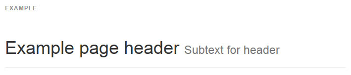

## 페이지 제목(Page header)

페이지에 h1 적절한 여백과 구분된 공간을 주는 간단한 껍데기입니다. 그것은 `h1` 의 기본 `small` 태그를 다른 콤포넌트들보다 가장 잘 활용할 수 있습니다.



```html
<div class="page-header">
  <h1>Example page header <small>Subtext for header</small></h1>
</div>

```

<br >
---

* [원문사이트 바로가기](http://getbootstrap.com/components/#page-header)
* [부트스트랩 ReadMe](../README.md)

---
* 이전페이지 - 점보트론 [Jumbotron](component_12_jumbotron.md)
* 다음페이지 - 썸네일 [Thumbnails](component_14_thumbnails.md)