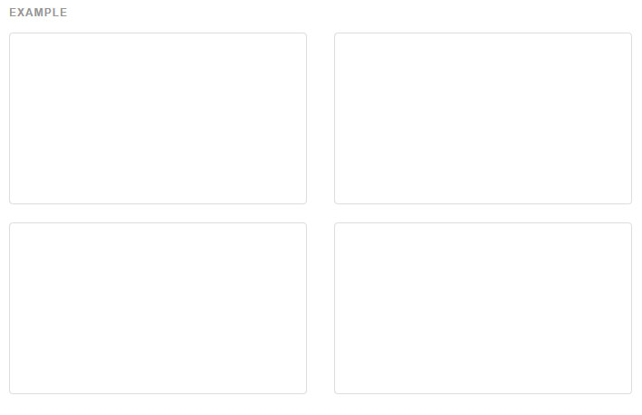
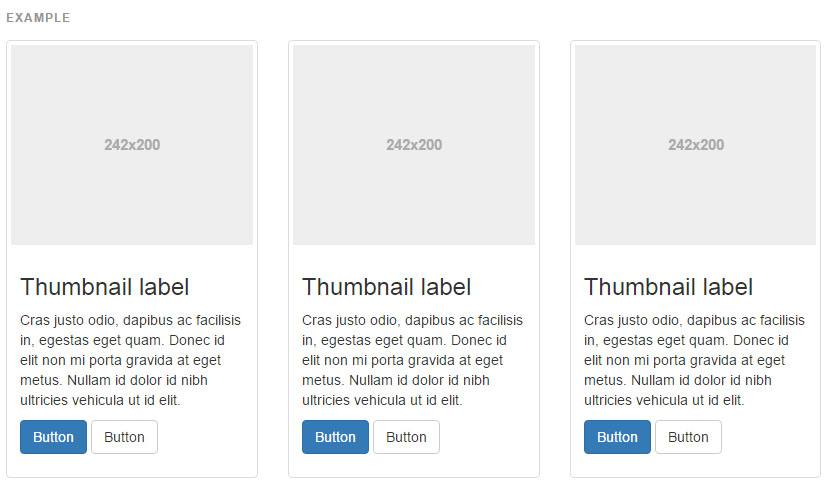

## 썸네일(Thumbnails)

이미지, 비디오, 텍스트 등을 쉽게 그리드하려면 썸네일 콤포넌트와 부트스트랩의 그리드 시스템을 동원하세요.
만약 당신이 핀터레스트같은 다양한 높이와 너비의 썸네일 표현을 찾고 있다면, 당신은 `Masonry, Isotope, Salvattore` 같은 서드파티 플러그인을 사용하는 것이 필요할 것입니다.

### [기본 예제](http://getbootstrap.com/components/#thumbnails-default)
기본적으로, 부트스트랩의 썸네일은 최소한의 필수 마크업으로 링크 이미지들을 보여주기 위해 고안되었습니다.



```html
<div class="row">
  <div class="col-xs-6 col-md-3">
    <a href="#" class="thumbnail">
      
    </a>
  </div>
  ...
</div>

```

### [맞춤 콘텐츠](http://getbootstrap.com/components/#thumbnails-custom-content)
약간의 추가적인 마크업으로, 썸네일 안에 제목, 본문, 버튼과 같이 어떤 종류의 HTML 내용이라도 추가할 수 있습니다.



```html
<div class="row">
  <div class="col-sm-6 col-md-4">
    <div class="thumbnail">
      
      <div class="caption">
        <h3>Thumbnail label</h3>
        <p>...</p>
        <p><a href="#" class="btn btn-primary" role="button">Button</a> <a href="#" class="btn btn-default" role="button">Button</a></p>
      </div>
    </div>
  </div>
</div>

```

<br >
---

* [원문사이트 바로가기](http://getbootstrap.com/components/#thumbnails)
* [부트스트랩 ReadMe](../README.md)

---
* 이전페이지 - 페이지 제목 [Page header](component_13_page_header.md)
* 다음페이지 - 경보 [Alerts](component_15_alerts.md)