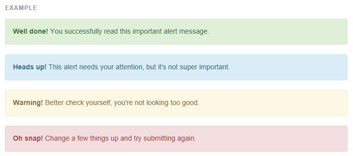
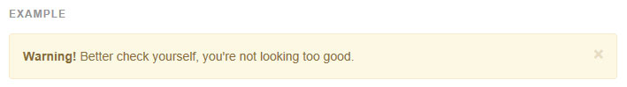
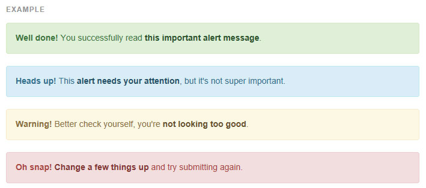

## Alerts (경보)


**적은 수의 사용가능하고 유연한 alert 메시지로 전형적인 사용자 액션에 대해 맥락적인 피드백 메시지를 제공합니다.**


### [예제](http://getbootstrap.com/components/#alerts-examples)
기본 alert 메시지를 위해 문자와 옵션인 없애기 버튼을 `.alert` 과 4개의 맥락적인 클래스들 중 하나로 감싸세요. (예: .alert-success)


* 기본(default) 클래스가 없습니다
> alert는 기본 클래스를 가지지 않습니다, 오직 기본과 수식클래스를 가집니다. 기본 회색 alert는 이상합니다. 그래서 당신은 맥락적인 클래스를 이용하여 타입을 명시해야 합니다. `success, info, warning, danger `중 하나를 선택하세요.




```html
<div class="alert alert-success" role="alert">...</div>
<div class="alert alert-info" role="alert">...</div>
<div class="alert alert-warning" role="alert">...</div>
<div class="alert alert-danger" role="alert">...</div>

```
----

### [없앨 수 있는 Alert](http://getbootstrap.com/components/#alerts-dismissible)

alert에 옵션인 `.alert-dismissible` 과 없애기 버튼을 추가하여 만듭니다.


* 자바스크립트 alert 플러그인이 필요합니다

> 완전한 기능, 지울수있는 alert를 위해, 당신은 [alert 플러그인](http://getbootstrap.com/javascript/#alerts) 를 사용해야합니다.




```html
<div class="alert alert-warning alert-dismissible" role="alert">
  <button type="button" class="close" data-dismiss="alert" aria-label="Close"><span aria-hidden="true">&times;</span></button>
  <strong>Warning!</strong> Better check yourself, you're not looking too good.
</div>

```

* 모든 기기에서 제대로 작동하도록 합니다

> `<button>` 태그를 반드시 `data-dismiss="alert"` 속성과 함께 사용해야 합니다.

### [alert 내 링크](http://getbootstrap.com/components/#alerts-links)

alert 내 맞춤색의 링크를 빠르게 제공하는 보조클래스 `.alert-link` 를 사용합니다.



```html
<div class="alert alert-success" role="alert">
  <a href="#" class="alert-link">...</a>
</div>
<div class="alert alert-info" role="alert">
  <a href="#" class="alert-link">...</a>
</div>
<div class="alert alert-warning" role="alert">
  <a href="#" class="alert-link">...</a>
</div>
<div class="alert alert-danger" role="alert">
  <a href="#" class="alert-link">...</a>
</div>
```

<br >
---

* [원문사이트 바로가기](http://getbootstrap.com/components/#alerts)
* [부트스트랩 ReadMe](../README.md)

---
* 이전페이지 - 썸네일 [Thumbnails](component_14_thumbnails.md)
* 다음페이지 - 프로그래스바 [Progress bars](component_16_progress_bars.md)