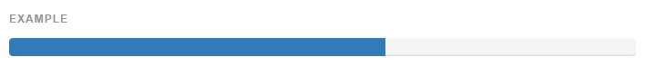
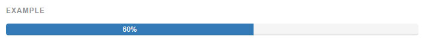
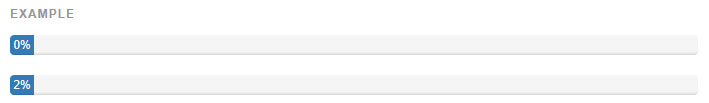
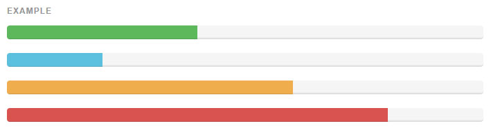
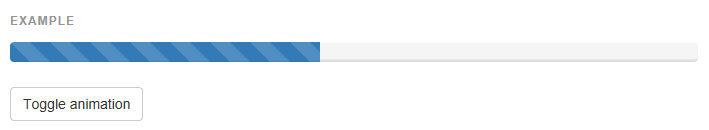
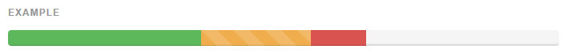

## 진행바(Progress bars)

작업흐름이나 액션의 진행에서 간단하고도 유연한 진행바로 최신 피드백을 제공합니다.

* 크로스브라우저 호환성
> 진행바는 몇몇 효과를 위해 CSS3 의 트랜지션과 애니메이션을 사용합니다. 이 기능들은 IE9 이하에서나 파이어폭스의 구버전에서 지원되지 않습니다. 오페라 12 는 애니메이션을 지원하지 않습니다.

### [기본 예제](http://getbootstrap.com/components/#progress-basic)
기본 진행바



```html
<div class="progress">
  <div class="progress-bar" role="progressbar" aria-valuenow="60" aria-valuemin="0" aria-valuemax="100" style="width: 60%;">
    <span class="sr-only">60% Complete</span>
  </div>
</div>
```
---

### [라벨과 함께](http://getbootstrap.com/components/#progress-label)
진행율을 보기위해 진행바내에 `.sr-only` 클래스가 있는 `<span>` 을 제거하세요.



```html
<div class="progress">
  <div class="progress-bar" role="progressbar" aria-valuenow="60" aria-valuemin="0" aria-valuemax="100" style="width: 60%;">
    60%
  </div>
</div>
```

낮은 진행율에서도 라벨 텍스트를 읽을 수 있게 하기 위해, 진행바에 min-width 를 추가하는 것을 고려해보세요.



```html
<div class="progress">
  <div class="progress-bar" role="progressbar" aria-valuenow="0" aria-valuemin="0" aria-valuemax="100" style="min-width: 2em;">
    0%
  </div>
</div>
<div class="progress">
  <div class="progress-bar" role="progressbar" aria-valuenow="2" aria-valuemin="0" aria-valuemax="100" style="min-width: 2em; width: 2%;">
    2%
  </div>
</div>
```
---

### [맥락적인 대안](http://getbootstrap.com/components/#progress-alternatives)
진행바는 일관된 스타일을 위해 버튼과 경보 클래스와 같은 것들을 사용합니다.



```html
<div class="progress">
  <div class="progress-bar progress-bar-success" role="progressbar" aria-valuenow="40" aria-valuemin="0" aria-valuemax="100" style="width: 40%">
    <span class="sr-only">40% Complete (success)</span>
  </div>
</div>
<div class="progress">
  <div class="progress-bar progress-bar-info" role="progressbar" aria-valuenow="20" aria-valuemin="0" aria-valuemax="100" style="width: 20%">
    <span class="sr-only">20% Complete</span>
  </div>
</div>
<div class="progress">
  <div class="progress-bar progress-bar-warning" role="progressbar" aria-valuenow="60" aria-valuemin="0" aria-valuemax="100" style="width: 60%">
    <span class="sr-only">60% Complete (warning)</span>
  </div>
</div>
<div class="progress">
  <div class="progress-bar progress-bar-danger" role="progressbar" aria-valuenow="80" aria-valuemin="0" aria-valuemax="100" style="width: 80%">
    <span class="sr-only">80% Complete (danger)</span>
  </div>
</div>
```
---

### [줄무늬(Striped)](http://getbootstrap.com/components/#progress-striped)
그라디언트를 이용해 줄무늬 효과를 만듭니다. IE8 에서는 작동하지 않습니다.


```html
<div class="progress">
  <div class="progress-bar progress-bar-success progress-bar-striped" role="progressbar" aria-valuenow="40" aria-valuemin="0" aria-valuemax="100" style="width: 40%">
    <span class="sr-only">40% Complete (success)</span>
  </div>
</div>
<div class="progress">
  <div class="progress-bar progress-bar-info progress-bar-striped" role="progressbar" aria-valuenow="20" aria-valuemin="0" aria-valuemax="100" style="width: 20%">
    <span class="sr-only">20% Complete</span>
  </div>
</div>
<div class="progress">
  <div class="progress-bar progress-bar-warning progress-bar-striped" role="progressbar" aria-valuenow="60" aria-valuemin="0" aria-valuemax="100" style="width: 60%">
    <span class="sr-only">60% Complete (warning)</span>
  </div>
</div>
<div class="progress">
  <div class="progress-bar progress-bar-danger progress-bar-striped" role="progressbar" aria-valuenow="80" aria-valuemin="0" aria-valuemax="100" style="width: 80%">
    <span class="sr-only">80% Complete (danger)</span>
  </div>
</div>
```
---

### [움직이는(Animated)](http://getbootstrap.com/components/#progress-animated)
진행바를 오른쪽에서 왼쪽으로 움직이는 줄무늬 효과를 주려면 .active 과 .progress-striped 을 추가하세요. IE 의 모든 버전에서 작동하지 않습니다.



```html
<div class="progress">
  <div class="progress-bar progress-bar-striped active" role="progressbar" aria-valuenow="45" aria-valuemin="0" aria-valuemax="100" style="width: 45%">
    <span class="sr-only">45% Complete</span>
  </div>
</div>
```

---

### [쌓는(Stacked)](http://getbootstrap.com/components/#progress-stacked)
여러 진행바를 쌓으려면 같은 .progress 안에 여러 개의 진행바를 둡니다.



```html
<div class="progress">
  <div class="progress-bar progress-bar-success" style="width: 35%">
    <span class="sr-only">35% Complete (success)</span>
  </div>
  <div class="progress-bar progress-bar-warning progress-bar-striped" style="width: 20%">
    <span class="sr-only">20% Complete (warning)</span>
  </div>
  <div class="progress-bar progress-bar-danger" style="width: 10%">
    <span class="sr-only">10% Complete (danger)</span>
  </div>
</div>
```

<br >
---

* [원문사이트 바로가기](http://getbootstrap.com/components/#progress)
* [부트스트랩 ReadMe](../README.md)

---
* 이전페이지 - 경보 [Alerts](component_15_alerts.md)
* 다음페이지 - 미디어 객체 [Media object](component_17_media_object.md)