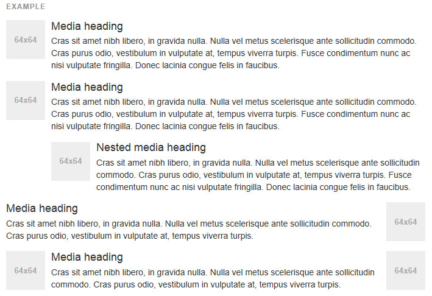
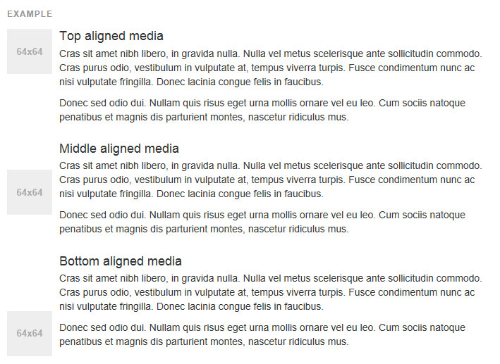
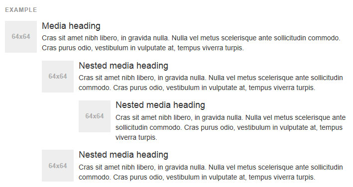

## 미디어객체

**텍스트 콘텐츠와 함께 왼쪽 또는 오른쪽 정렬 이미지 기능 (블로그 댓글, 트윗, 등 등) 구성 요소의 여러 유형을 구축하기위한 추상 객체 스타일.**

###[기본 미디어(Default media)](http://getbootstrap.com/components/#media-default)
기본 미디어는 미디어 객체 (그림, 영상, 소리) 를 내용 부분의 왼쪽이나 오른쪽에 float 하게 합니다.



```html
<div class="media">
  <div class="media-left">
    <a href="#">
      
    </a>
  </div>
  <div class="media-body">
    <h4 class="media-heading">Media heading</h4>
    ...
  </div>
</div>
```

.pull-left 와 .pull-right 클래스들은 존재하고 미디어 콤포넌트의 부분으로 사용되었습니다만, v3.3.0 부터 사용이 폐기예정이 되었습니다. 그들은 .media-left 와 .media-right 과 거의 유사합니다. Html 에서 .media-right 는 .media-body 다음에 위치해야한다는 것을 제외하구요.

---

###[미디어 정렬](http://getbootstrap.com/components/#media-alignment)
이미지나 다른 미디어는 위, 가운데, 아래로 정렬될 수 있습니다. 기본값은 상단 장렬입니다.



```html
<div class="media">
  <div class="media-left media-middle">
    <a href="#">
      
    </a>
  </div>
  <div class="media-body">
    <h4 class="media-heading">Middle aligned media</h4>
    ...
  </div>
</div>
```

###[미디어 목록(Media list)](http://getbootstrap.com/components/#media-list)
약간의 추가적인 마크업으로, 목록안에 미디어를 사용할 수 있습니다. (댓글이나 기사목록에 유용)



```html
<ul class="media-list">
  <li class="media">
    <div class="media-left">
      <a href="#">
        
      </a>
    </div>
    <div class="media-body">
      <h4 class="media-heading">Media heading</h4>
      ...
    </div>
  </li>
</ul>
```

<br >
---

* [원문사이트 바로가기](http://getbootstrap.com/components/#progress)
* [부트스트랩 ReadMe](../README.md)

---
* 이전페이지 - 프로그래스바 [Progress bars](component_16_progress_bars.md)
* 다음페이지 - 목록 그룹 [List group](component_18_list_group.md) 