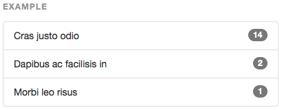
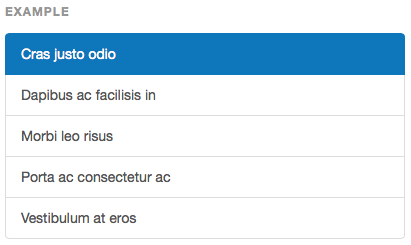
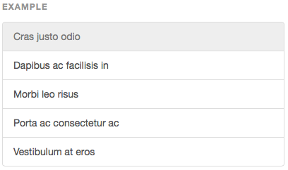
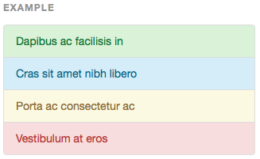
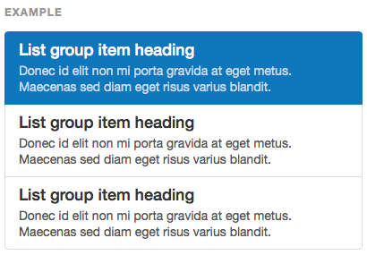

## 목록 그룹(List Group)

간단한 목록 뿐만 아니라 복잡한 내용도 맞춤화 하여 보여줄 수 있는 강력한 컴포넌트

----

#### 기본예제


```html
<ul class="list-group">
  <li class="list-group-item">Cras justo odio</li>
  <li class="list-group-item">Dapibus ac facilisis in</li>
  <li class="list-group-item">Morbi leo risus</li>
  <li class="list-group-item">Porta ac consectetur ac</li>
  <li class="list-group-item">Vestibulum at eros</li>
</ul>
```

---

#### 뱃지

목록 항목(item)에 뱃지를 추가하면 오른쪽에 자동 위치



```html
<ul class="list-group">
  <li class="list-group-item">
    <span class="badge">14</span>
    Cras justo odio
  </li>
</ul>
```

---

#### 링크항목

링크항목은 `<ul>` 대신 `<div>` 와 `<a>`를 사용. (class는 기본예제와 동일)

1. 실행중인 링크항목 : `.list-group-item.active`
2. 비활성 링크항목 : `.list-group-item.disabled`


* 실행중인 링크항목 표시



* 비활성 링크항목




```html
<div class="list-group">
  <a href="#" class="list-group-item active">
    Cras justo odio
  </a>
  <a href="#" class="list-group-item disable">
  	Dapibus ac facilisis in
  </a>
  <a href="#" class="list-group-item">Morbi leo risus</a>
  <a href="#" class="list-group-item">Porta ac consectetur ac</a>
  <a href="#" class="list-group-item">Vestibulum at eros</a>
</div>
```

---

#### 맥락적인 클래스(색상/스타일)

- 각 항목별 의미에 따라 기본 색상이 지정되어 있다.
- `list-group-item`에 클래스를 추가하여 사용
- 링크 항목에도 동일하게 적용


1. 초록 : `.list-group-item-success`
2. 파랑 : `.list-group-item-info`
3. 노랑 : `.list-group-item-warning`
4. 빨강 : `.list-group-item-danger`



```html
<ul class="list-group">
  <li class="list-group-item list-group-item-success">Dapibus ac facilisis in</li>
  <li class="list-group-item list-group-item-info">Cras sit amet nibh libero</li>
  <li class="list-group-item list-group-item-warning">Porta ac consectetur ac</li>
  <li class="list-group-item list-group-item-danger">Vestibulum at eros</li>
</ul>
<div class="list-group">
  <a href="#" class="list-group-item list-group-item-success">Dapibus ac facilisis in</a>
  <a href="#" class="list-group-item list-group-item-info">Cras sit amet nibh libero</a>
  <a href="#" class="list-group-item list-group-item-warning">Porta ac consectetur ac</a>
  <a href="#" class="list-group-item list-group-item-danger">Vestibulum at eros</a>
</div>
```

---

#### 컨텐츠가 있는 항목
- 항목에 컨텐츠를 추가하는 것이 가능함.



```html
<div class="list-group">
  <a href="#" class="list-group-item active">
    <h4 class="list-group-item-heading">List group item heading</h4>
    <p class="list-group-item-text">...</p>
  </a>
</div>
```

---

* [원문사이트 바로가기](http://getbootstrap.com/components/#list-group)

* [이전페이지- 부트스트랩CSS_그리드](css-grid.md)
* [다음페이지- 부트스트랩 컴포넌트 : 패널(panelmark)](component-panelmark.md)

