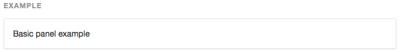
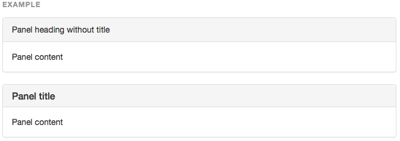
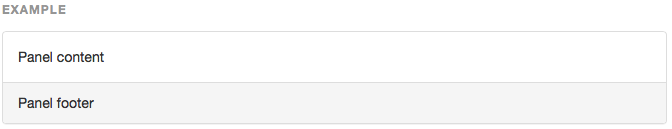
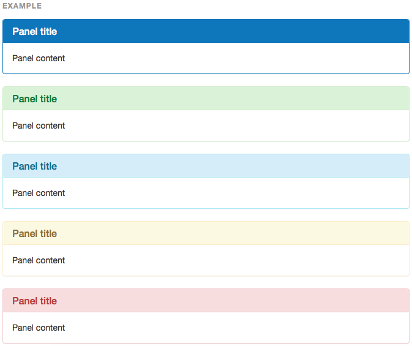
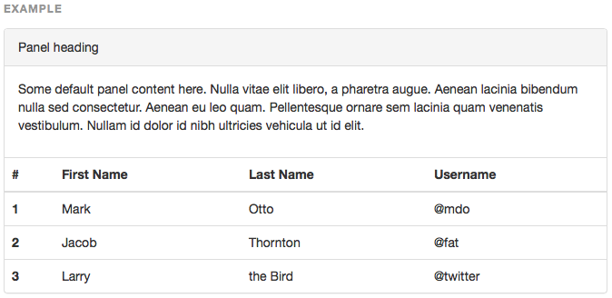
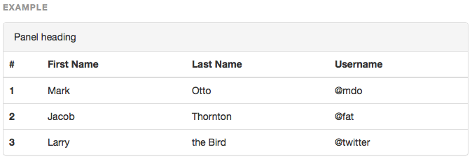
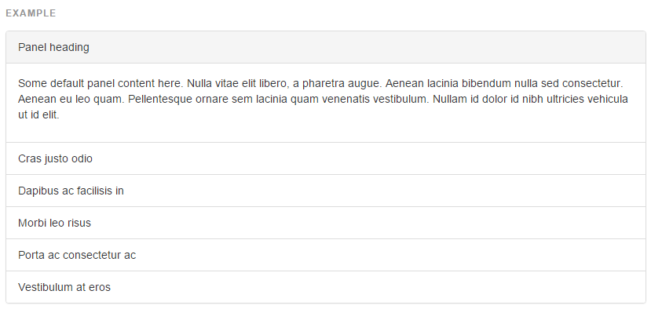

## 패널(Panel)

박스 안에 DOM을 넣고 싶을 때 패널을 사용합니다.

---

#### [기본 패널](http://getbootstrap.com/components/#panels-basic)

- 기본적으로 패딩과 테두리가 들어가 있음.
- 기본클래스는 `.panel.panel-default`
- 패널 본문은 `.panel-body`로 감싸서 사용



```html
<div class="panel panel-default">
  <div class="panel-body">
    Basic panel example
  </div>
</div>
```

---

#### [상단/타이틀이 있는 패널](http://getbootstrap.com/components/#panels-heading)

- 패널 내부에 `.panel-heading` 항목을 추가할 수 있음.
- `.panel-heading` 내부엔 `<h1> ~ <h6>` 태그를 이용하여 타이틀 추가가 가능함.
- `<h1> ~ <h6>` 엔 `.panel-title` 클래스를 추가한다.



```html
<div class="panel panel-default">
  <div class="panel-heading">Panel heading without title</div>
  <div class="panel-body">
    Panel content
  </div>
</div>

<div class="panel panel-default">
  <div class="panel-heading">
    <h3 class="panel-title">Panel title</h3>
  </div>
  <div class="panel-body">
    Panel content
  </div>
</div>
```

---

#### [하단(푸터)가 있는 패널](http://getbootstrap.com/components/#panels-footer)

- 하단에 버튼이나 부가적인 텍스트를 추가할 수 있음.
- 패널 내부에 `.panel-footer` 로 추가.
- 맥락적인 클래스(색상)의 영향을 받지 않음.



```html
<div class="panel panel-default">
  <div class="panel-body">
    Panel content
  </div>
  <div class="panel-footer">Panel footer</div>
</div>
```

---

#### [맥락적인 클래스(색상/스타일)](http://getbootstrap.com/components/#panels-alternatives)

- 각 항목별 의미에 따라 기본 색상이 지정되어 있다.
- 다섯가지 종류가 있음.



1. 파랑 : `.panel-primary`
2. 초록 : `.panel-success`
3. 하늘 : `.panel-info`
4. 노랑 : `.panel-warning`
5. 빨강 : `.panel-danger`

```html
<div class="panel panel-primary">...</div>
<div class="panel panel-success">...</div>
<div class="panel panel-info">...</div>
<div class="panel panel-warning">...</div>
<div class="panel panel-danger">...</div>
```

---

#### [테이블과 함께 사용](http://getbootstrap.com/components/#panels-tables)

- 패널 내부에 테이블을 추가할 수 있음.
- 두가지 경우
   - `.panel-body`가 있는 경우 : 본문과 테이블 사이에 구분선이 들어감
   - `.panel-body`가 없는 경우

* `.panel-body`가 있는 경우



```html
<div class="panel panel-default">
  <!-- Default panel contents -->
  <div class="panel-heading">Panel heading</div>
  <div class="panel-body">
    <p>...</p>
  </div>

  <!-- Table -->
  <table class="table">
    ...
  </table>
</div>
```

* `.panel-body`가 없는 경우



```html
<div class="panel panel-default">
  <!-- Default panel contents -->
  <div class="panel-heading">Panel heading</div>
  <div class="panel-body">
    <p>...</p>
  </div>

  <!-- Table -->
  <table class="table">
    ...
  </table>
</div>
```


#### [list 그룹과 함께 사용](http://getbootstrap.com/components/#panels-list-group)
- 패널 내부에 꽉찬 너비의 [list group](component_18_list_group.md)을 추가할 수 있음.



```html
<div class="panel panel-default">
  <!-- Default panel contents -->
  <div class="panel-heading">Panel heading</div>
  <div class="panel-body">
    <p>...</p>
  </div>

  <!-- List group -->
  <ul class="list-group">
    <li class="list-group-item">Cras justo odio</li>
    <li class="list-group-item">Dapibus ac facilisis in</li>
    <li class="list-group-item">Morbi leo risus</li>
    <li class="list-group-item">Porta ac consectetur ac</li>
    <li class="list-group-item">Vestibulum at eros</li>
  </ul>
</div>
```


<br >
---

* [원문사이트 바로가기](http://getbootstrap.com/components/#panels)
* [부트스트랩 ReadMe](../README.md)

---
* 이전페이지 - 목록 그룹 [List group](component_18_list_group.md) 
* 다음페이지 - 반응성 임베드 [Responsive embed](component_20_responsive_embed.md)
