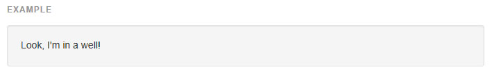
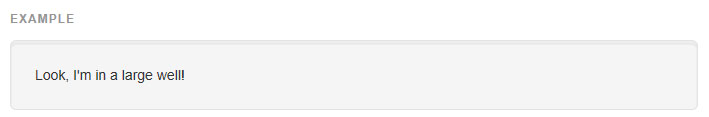
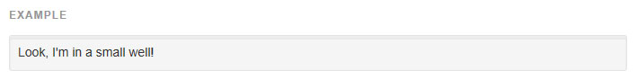

## Wells

###[기본(Default) well](http://getbootstrap.com/components/#default-well)
태그에 오목한 효과를 주는 well 을 사용하세요.



```html
<div class="well">...</div>

```

###[옵션 클래스(Optional classes)](http://getbootstrap.com/components/#optional-classes)
2개의 옵션 수식 클래스로 패딩과 둥근모서리를 조정하세요.



```html
<!-- 16:9 aspect ratio -->
<div class="embed-responsive embed-responsive-16by9">
  <iframe class="embed-responsive-item" src="..."></iframe>
</div>

<!-- 4:3 aspect ratio -->
<div class="well well-lg">...</div>

```



```html
<div class="well well-sm">...</div>

```
<br >
---

* [원문사이트 바로가기](http://getbootstrap.com/components/#wells)
* [부트스트랩 ReadMe](../README.md)

---
* 이전페이지 - 반응성 임베드 [Responsive embed](component_20_responsive_embed.md)