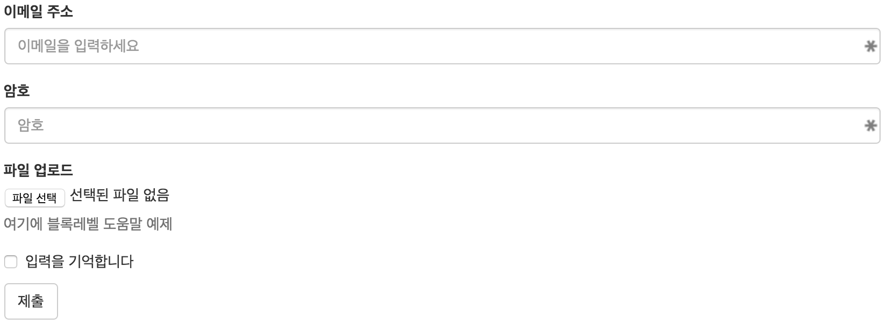
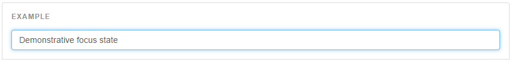

# Form

작성자 : 이기섭

작성일 : 2015-12-19


### 기본 예제

각각의 폼 컨트롤은 자동적으로 약간의 전역 스타일을 받게 받게 됩니다. `.form-control`에 있는 모든 텍스트 형식의 `<input>`, `<textarea>`, `<select>`는 기본으로 width를 100%로 정해집니다. 최적의 여백을 위해 라벨들과 콘트롤들은 `.form-group`으로 묶어야 합니다.



[예제](http://codepen.io/luensys/pen/GoZwYj?editors=100)
```html
<form>
  <div class="form-group">
    <label for="exampleInputEmail1">이메일 주소</label>
    <input type="email" class="form-control" id="exampleInputEmail1" placeholder="이메일을 입력하세요">
  </div>
  <div class="form-group">
    <label for="exampleInputPassword1">암호</label>
    <input type="password" class="form-control" id="exampleInputPassword1" placeholder="암호">
  </div>
  <div class="form-group">
    <label for="exampleInputFile">파일 업로드</label>
    <input type="file" id="exampleInputFile">
    <p class="help-block">여기에 블록레벨 도움말 예제</p>
  </div>
  <div class="checkbox">
    <label>
      <input type="checkbox"> 입력을 기억합니다
    </label>
  </div>
  <button type="submit" class="btn btn-default">제출</button>
</form>
```
```
form-group과 input-group을 같이 쓰지 마세요.
form-group과 input-group을 직접 같이 쓰지 마세요. 대신 input-group은 form-group 안에 쓰세요.
```

### 인라인 폼

좌측으로 정렬하기 위해서는 `form-inline`을 추가하세요. 단, 이것은 최소 768px의 뷰포트 내의 폼에만 적용됩니다.

맞춤 너비가 필요할 수 이습니다.  
입력 콘트롤이나 셀렉트 콘트롤은 부트스트랩에서 기본적으로 `width:100%`가 적용되어 있습니다.  
인라인 폼 내에서는 이 것을 `width: auto;`로 초기화 하여 몇 개의 콘트롤들을 같은 줄에 있도록 할 수 있습니다.  
레이아웃에 따라 추가적인 맞춤 너비가 필요할 수 있습니다.  


언제나 라벨을 추가하세요.  
스크린 리더는 input 라벨을 포함하지 않을 경우 문제가 생길 수 있습니다.  
인라인 폼을 위해서 `.sr-only`를 사용하여 라벨을 숨길 수 있습니다.  
보조적인 방법으로 `area-label`, `aria-labelledby`, `title`이 있습니다.  
이런 것들이 존재하지 않는다면 스크린 리더는 `placeholder` 속성에 의지할 수 밖에 없으나,  
`placeholder`로 다른 라벨링을 대체하는 것은 권장하지 않습니다.  


[예제](http://codepen.io/luensys/pen/JGEZwK?editors=100)

```html
<form class="form-inline">
  <div class="form-group">
    <label for="exampleInputName2">Name</label>
    <input type="text" class="form-control" id="exampleInputName2" placeholder="Jane Doe">
  </div>
  <div class="form-group">
    <label for="exampleInputEmail2">Email</label>
    <input type="email" class="form-control" id="exampleInputEmail2" placeholder="jane.doe@example.com">
  </div>
  <button type="submit" class="btn btn-default">Send invitation</button>
</form>
```

### 수평 폼
폼에 `.form-horizontal`을 추가하여 라벨들과 폼 컨트롤을 미리 정의된 그리드 클래스로 조절이 가능합니다.  
그리드행 역할은 `.form-group`이 하기 때문에 `.row`는 필요가 없습니다.


[예제](http://codepen.io/luensys/pen/BjpPLv?editors=100)
```html
<form class="form-horizontal">
  <div class="form-group">
    <label for="inputEmail3" class="col-sm-2 control-label">Email</label>
    <div class="col-sm-10">
      <input type="email" class="form-control" id="inputEmail3" placeholder="Email">
    </div>
  </div>
  <div class="form-group">
    <label for="inputPassword3" class="col-sm-2 control-label">Password</label>
    <div class="col-sm-10">
      <input type="password" class="form-control" id="inputPassword3" placeholder="Password">
    </div>
  </div>
  <div class="form-group">
    <div class="col-sm-offset-2 col-sm-10">
      <div class="checkbox">
        <label>
          <input type="checkbox"> Remember me
        </label>
      </div>
    </div>
  </div>
  <div class="form-group">
    <div class="col-sm-offset-2 col-sm-10">
      <button type="submit" class="btn btn-default">Sign in</button>
    </div>
  </div>
</form>
```

### 지원되는 컨트롤 들

#####입력들

아래의 타입들을 모두 지원합니다.(HTML5)

`text`, `password`, `datetime`, `datetime-local`, `date`, `month`, `time`, `week`, `number`, `email`, `url`, `search`, `tel`, `color`

```
입력은 type이 제대로 선언된 경우에만 스타일 됩니다.
```

[예제](http://codepen.io/luensys/pen/EPZpdv?editors=100)
아래의 예제는 type을 바꿔보기 위해 간단하게 작성하였습니다.

```html
<input type="month" class="form-control" placeholder="Text input">
```

#####TextArea

여러줄의 입력을 지원하는 폼  
`row`를 이용해서 줄을 바꿀 수 있습니다.

[예제](http://codepen.io/luensys/pen/eJWMwJ?editors=100)
```html
<textarea class="form-control" rows="3"></textarea>
```

##### 체크박스, 라디오

`disabled` 속성이 있을 경우에는 적절하게 스타일 될 것입니다.

###### 기본

[예제](http://codepen.io/luensys/pen/jWmzjg?editors=100)
```html
<div class="checkbox">
  <label>
    <input type="checkbox" value="">
    Option one is this and that&mdash;be sure to include why it's great
  </label>
</div>
<div class="checkbox disabled">
  <label>
    <input type="checkbox" value="" disabled>
    Option two is disabled
  </label>
</div>

<div class="radio">
  <label>
    <input type="radio" name="optionsRadios" id="optionsRadios1" value="option1" checked>
    Option one is this and that&mdash;be sure to include why it's great
  </label>
</div>
<div class="radio">
  <label>
    <input type="radio" name="optionsRadios" id="optionsRadios2" value="option2">
    Option two can be something else and selecting it will deselect option one
  </label>
</div>
<div class="radio disabled">
  <label>
    <input type="radio" name="optionsRadios" id="optionsRadios3" value="option3" disabled>
    Option three is disabled
  </label>
</div>
```

###### 인라인 체체크박스와 라디오

체크박스나 라디오 콘트롤들을 같은 줄에 보이게 하려면 `.checkbox-inline` 이나 `radio-inline` 클래스를 사용하세요.

[예제](http://codepen.io/luensys/pen/bEWvXJ?editors=100)
```html
<label class="checkbox-inline">
  <input type="checkbox" id="inlineCheckbox1" value="option1"> 1
</label>
<label class="checkbox-inline">
  <input type="checkbox" id="inlineCheckbox2" value="option2"> 2
</label>
<label class="checkbox-inline">
  <input type="checkbox" id="inlineCheckbox3" value="option3"> 3
</label>
<br>
<label class="radio-inline">
  <input type="radio" name="inlineRadioOptions" id="inlineRadio1" value="option1"> 1
</label>
<label class="radio-inline">
  <input type="radio" name="inlineRadioOptions" id="inlineRadio2" value="option2"> 2
</label>
<label class="radio-inline">
  <input type="radio" name="inlineRadioOptions" id="inlineRadio3" value="option3"> 3
</label>
```

###### 라벨 텍스트 없는 체크박스와 라디오

입력 콘트롤이 상식적으로 위치한다면 `<label>`에 텍스트가 필요하지 않을 수 있습니다.`현재 인라인이 아닌 체크박스와 라디오에서만 동작`  
여전히 라벨폼에는 보조공학이 제공되어야 함을 기억하세요.(예 `aria-label`)

[예제](http://codepen.io/luensys/pen/gPWzYB?editors=100)

```html
<div class="checkbox">
  <label>
    <input type="checkbox" id="blankCheckbox" value="option1" aria-label="...">
  </label>
</div>
<div class="radio">
  <label>
    <input type="radio" name="blankRadio" id="blankRadio1" value="option1" aria-label="...">
  </label>
</div>
```

###### 셀렉트

사파리와 크롬의 셀렉트는 `border-radius` 속성으로 수정되지 않는 둥근 코너를 가질 수 있게 합니다.

[예제](http://codepen.io/luensys/pen/jWmxON?editors=100)

```html
<select class="form-control">
  <option>1</option>
  <option>2</option>
  <option>3</option>
  <option>4</option>
  <option>5</option>
</select>

```

기본적으로 여러 옵션을 보여주기 위해서는 셀렉트 컨트롤은 `multiple` 속성이 있다.

[예제](http://codepen.io/luensys/pen/EPmLxZ?editors=100)

```html
<select multiple class="form-control">
  <option>1</option>
  <option>2</option>
  <option>3</option>
  <option>4</option>
  <option>5</option>
</select>
```

### 정적 콘트롤

폼에서 텍스트를 넣고 싶을 때는 `<p>`에 `.form-control-static` 클래스를 사용합니다.

[예제]http://codepen.io/luensys/pen/LGymYz?editors=100)

```html
<form class="form-horizontal">
  <div class="form-group">
    <label class="col-sm-2 control-label">Email</label>
    <div class="col-sm-10">
      <p class="form-control-static">email@example.com</p>
    </div>
  </div>
  <div class="form-group">
    <label for="inputPassword" class="col-sm-2 control-label">Password</label>
    <div class="col-sm-10">
      <input type="password" class="form-control" id="inputPassword" placeholder="Password">
    </div>
  </div>
</form>
```

```html
<form class="form-inline">
  <div class="form-group">
    <label class="sr-only">Email</label>
    <p class="form-control-static">email@example.com</p>
  </div>
  <div class="form-group">
    <label for="inputPassword2" class="sr-only">Password</label>
    <input type="password" class="form-control" id="inputPassword2" placeholder="Password">
  </div>
  <button type="submit" class="btn btn-default">Confirm identity</button>
</form>
```

### 포커스 상태

`:focus`를 위해 몇 몇 폼콘트롤들에 `box-shadow`를 적용했습니다.


```
문서 상에서 바로 포커싱을 표현할 수 없어 캡쳐된 이미지로 대체합니다.
```

### 비활성화 상태

input에서 상호작용을 막기위해 `disabled` 속성을 추가하세요.  
비활성화된 입력양식은 좀 더 밝게 보여지고 `not-allowed` 커서가 추가됩니다.

[예제](http://codepen.io/luensys/pen/WrjJvV?editors=100)

```html
<input class="form-control" id="disabledInput" type="text" placeholder="Disabled input here..." disabled>
```

##### 비활성화 된 필드셋

한 번에 `<fieldset>` 내 모든 콘트롤을 비활성화 하려면 `<fieldset>`에 `disabled`속성을 추가하세요.

```
<a> 링크 기능성에 대한 경고
기본적으로 비활성화된 필드셋에대한 모든 폼 콘트롤들은 이 기능을 통해 비활성화 되겠지만,
만일 폼을 <a ... class="btn btn-*">를 포함하면,
이 것은 폼이 아니므로 제대로 동작하지 않을 수 있습니다.
이러한 링크는 따로 맞춤 자바스크립트를 사용하세요.
```
```
크로스 브라우저 호환성
부트스트랩은 이 스타일들을 모든 브라우저에 적용하지만,
인터넷 익스플로러 11과 그 이하에서는 지원하지 않습니다.
이 브라우저들의 필드셋을 비활성화 하려면 맞춤 자바스크립트를 사용하세요.
```

[예제](http://codepen.io/luensys/pen/WrjJQV?editors=100)

```html
<form>
  <fieldset disabled>
    <div class="form-group">
      <label for="disabledTextInput">Disabled input</label>
      <input type="text" id="disabledTextInput" class="form-control" placeholder="Disabled input">
    </div>
    <div class="form-group">
      <label for="disabledSelect">Disabled select menu</label>
      <select id="disabledSelect" class="form-control">
        <option>Disabled select</option>
      </select>
    </div>
    <div class="checkbox">
      <label>
        <input type="checkbox"> Can't check this
      </label>
    </div>
    <button type="submit" class="btn btn-primary">Submit</button>
  </fieldset>
</form>
```

### 읽기 전용 상태

입력 값의 수정을 막기위해 입력콘트롤에 `readonly` 속성을 추가합니다.  
읽기전용 입력콘트롤은 좀 더 밝게 보여지며, 커서는 기본커서로 남아있습니다.

[예제](http://codepen.io/luensys/pen/EPmLPm?editors=100)

```html
<input class="form-control" type="text" placeholder="Readonly input here…" readonly>
```

##### 유효 상태
부트스트랩은 폼 콘롤 상의 에러, 경고, 성공 상태를 위한 유효상태 스타일을 포함하고 있습니다.  
사용하려면, 부모 요소에 `has-warning`, `has-error`, `has-success` 를 추가하세요.  
그 요소안의 모든 `control-label`, `.form-control`, `.help-block`은 유효성 스타일을 적용 받습니다.

```
보조공학으로 유효 상태를 전달하기
폼 콘트롤의 상태를 알리기 위한 것은 시각적인 표시일 뿐입니다.  
따라서 이 경우의 대안으로는 <label> 텍스트 자체에 힌트를 포함할 수 있습니다.
아니면 aria-dscribedby를 사용하는 폼콘트롤 유효상태에 관한 텍스트 정보를 추가적인 속성으로 사용할 수 있습니다.
에러의 경우, 당신의 폼콘트롤에 area-invalid="true"를 사용할 수 있습니다.
```

[예제](http://codepen.io/luensys/pen/yebjOe?editors=100)

```html
<div class="form-group has-success">
  <label class="control-label" for="inputSuccess1">Input with success</label>
  <input type="text" class="form-control" id="inputSuccess1">
</div>
<div class="form-group has-warning">
  <label class="control-label" for="inputWarning1">Input with warning</label>
  <input type="text" class="form-control" id="inputWarning1">
</div>
<div class="form-group has-error">
  <label class="control-label" for="inputError1">Input with error</label>
  <input type="text" class="form-control" id="inputError1">
</div>
<div class="has-success">
  <div class="checkbox">
    <label>
      <input type="checkbox" id="checkboxSuccess" value="option1">
      Checkbox with success
    </label>
  </div>
</div>
<div class="has-warning">
  <div class="checkbox">
    <label>
      <input type="checkbox" id="checkboxWarning" value="option1">
      Checkbox with warning
    </label>
  </div>
</div>
<div class="has-error">
  <div class="checkbox">
    <label>
      <input type="checkbox" id="checkboxError" value="option1">
      Checkbox with error
    </label>
  </div>
</div>
```

##### 선택적인 아이콘

당신은 또한 `.has-feedback`과 우측 아이콘의 추가로 선택적인 피드백 아이콘을 추가할 수 있습니다.  
단, 피드백 아이콘은 오직 텍스트를 사용하는 `<input class="form-control"> 요소에서만 작동합니다.

```
아이콘, 라벨, 입력 그룹
피드백 아이콘의 수동 위치는 라벨 없는 입력콘트롤과 애드온이 오른쪽에 있는 input groups을 위해 필요합니다.
당신은 접근성 이유를 위해 모든 입력 콘트롤을 위한 라벨을 제공하는 것을 강력하게 장려해야 합니다.
만약 당신이 라벨 없이 한다면, 피드백아이콘의 top값은 조정합니다.
입력 그룹을 위해, 당신의 애드온의 너비를 고려하여 적절한 픽셀값으로 right값을 조정하세요.
```
```
보조공학에 아이콘의 의미를 전달하는 것
스크린 리더같은 보조 공학에게 아이콘의 의미를 확실하게 전달하려면, .sr-only 클래스로 추가적인 숨겨진 텍스트를 포함하거나, aria-describedby를 사용하여 폼 콘트롤과 연관되어 있어야 합니다.
그렇지 않으면 폼콘트롤에 연결된 <label>의 텍스트를 바꾸는 것처럼 다른 방법을 사용해야 합니다.
아래의 예제에서 확인할 수 있습니다.
```

[예제](http://codepen.io/luensys/pen/EPmLym?editors=100)

```html
<div class="form-group has-success has-feedback">
  <label class="control-label" for="inputSuccess2">Input with success</label>
  <input type="text" class="form-control" id="inputSuccess2" aria-describedby="inputSuccess2Status">
  <span class="glyphicon glyphicon-ok form-control-feedback" aria-hidden="true"></span>
  <span id="inputSuccess2Status" class="sr-only">(success)</span>
</div>
<div class="form-group has-warning has-feedback">
  <label class="control-label" for="inputWarning2">Input with warning</label>
  <input type="text" class="form-control" id="inputWarning2" aria-describedby="inputWarning2Status">
  <span class="glyphicon glyphicon-warning-sign form-control-feedback" aria-hidden="true"></span>
  <span id="inputWarning2Status" class="sr-only">(warning)</span>
</div>
<div class="form-group has-error has-feedback">
  <label class="control-label" for="inputError2">Input with error</label>
  <input type="text" class="form-control" id="inputError2" aria-describedby="inputError2Status">
  <span class="glyphicon glyphicon-remove form-control-feedback" aria-hidden="true"></span>
  <span id="inputError2Status" class="sr-only">(error)</span>
</div>
<div class="form-group has-success has-feedback">
  <label class="control-label" for="inputGroupSuccess1">Input group with success</label>
  <div class="input-group">
    <span class="input-group-addon">@</span>
    <input type="text" class="form-control" id="inputGroupSuccess1" aria-describedby="inputGroupSuccess1Status">
  </div>
  <span class="glyphicon glyphicon-ok form-control-feedback" aria-hidden="true"></span>
  <span id="inputGroupSuccess1Status" class="sr-only">(success)</span>
</div>
```

###### 수평폼과 인라인폼에서 보조 아이콘

아래의 예제는 수평폼에서와 인라인폼에서 보조아이콘이 어떻게 표시되는지를 보여주는 예시입니다.

[예제](http://codepen.io/luensys/pen/BjRxzE?editors=100)

```html
<form class="form-horizontal">
  <div class="form-group has-success has-feedback">
    <label class="control-label col-sm-3" for="inputSuccess3">Input with success</label>
    <div class="col-sm-9">
      <input type="text" class="form-control" id="inputSuccess3" aria-describedby="inputSuccess3Status">
      <span class="glyphicon glyphicon-ok form-control-feedback" aria-hidden="true"></span>
      <span id="inputSuccess3Status" class="sr-only">(success)</span>
    </div>
  </div>
  <div class="form-group has-success has-feedback">
    <label class="control-label col-sm-3" for="inputGroupSuccess2">Input group with success</label>
    <div class="col-sm-9">
      <div class="input-group">
        <span class="input-group-addon">@</span>
        <input type="text" class="form-control" id="inputGroupSuccess2" aria-describedby="inputGroupSuccess2Status">
      </div>
      <span class="glyphicon glyphicon-ok form-control-feedback" aria-hidden="true"></span>
      <span id="inputGroupSuccess2Status" class="sr-only">(success)</span>
    </div>
  </div>
</form>
```
```html
<form class="form-inline">
  <div class="form-group has-success has-feedback">
    <label class="control-label" for="inputSuccess4">Input with success</label>
    <input type="text" class="form-control" id="inputSuccess4" aria-describedby="inputSuccess4Status">
    <span class="glyphicon glyphicon-ok form-control-feedback" aria-hidden="true"></span>
    <span id="inputSuccess4Status" class="sr-only">(success)</span>
  </div>
</form>
<form class="form-inline">
  <div class="form-group has-success has-feedback">
    <label class="control-label" for="inputGroupSuccess3">Input group with success</label>
    <div class="input-group">
      <span class="input-group-addon">@</span>
      <input type="text" class="form-control" id="inputGroupSuccess3" aria-describedby="inputGroupSuccess3Status">
    </div>
    <span class="glyphicon glyphicon-ok form-control-feedback" aria-hidden="true"></span>
    <span id="inputGroupSuccess3Status" class="sr-only">(success)</span>
  </div>
</form>
```

###### 숨겨진 `.sr-only` 라벨과 보조 아이콘
만약 폼콘트롤의 `<lable>`을 숨기기위해 `.sr-only` 클래스를 사용한다면, 부트스트랩은 자동으로 아이콘의 위치를 조정합니다.  
(aria-label 속성같은 다른 라벨링 대안을 사용하지 않고)

[예제](http://codepen.io/luensys/pen/adWGmy?editors=100)

```html
<div class="form-group has-success has-feedback">
  <label class="control-label sr-only" for="inputSuccess5">Hidden label</label>
  <input type="text" class="form-control" id="inputSuccess5" aria-describedby="inputSuccess5Status">
  <span class="glyphicon glyphicon-ok form-control-feedback" aria-hidden="true"></span>
  <span id="inputSuccess5Status" class="sr-only">(success)</span>
</div>
<div class="form-group has-success has-feedback">
  <label class="control-label sr-only" for="inputGroupSuccess4">Input group with success</label>
  <div class="input-group">
    <span class="input-group-addon">@</span>
    <input type="text" class="form-control" id="inputGroupSuccess4" aria-describedby="inputGroupSuccess4Status">
  </div>
  <span class="glyphicon glyphicon-ok form-control-feedback" aria-hidden="true"></span>
  <span id="inputGroupSuccess4Status" class="sr-only">(success)</span>
</div>
```

### 폼 콘트롤 크기 조절

`.input-lg` 같은 클래스를 사용하여 높이를 설정하세요. 그리고 `.col-lg=*` 같은 그리드 열 클래스를 사용하여 너비를 설정하세요.

##### 높이 조절

폼 콘트롤을 버튼 크기에 맞춰 크거나 작게 만드세요.

[예제](http://codepen.io/luensys/pen/jWmxVP?editors=100)

```html
<input class="form-control input-lg" type="text" placeholder=".input-lg">
<input class="form-control" type="text" placeholder="Default input">
<input class="form-control input-sm" type="text" placeholder=".input-sm">

<select class="form-control input-lg">
  <option value="">.input-lg</option>
</select>
<select class="form-control">
  <option value="">Default select</option>
</select>
<select class="form-control input-sm">
  <option value="">.input-sm</option>
</select>
```

##### 수평폼 그룹 크기 조절

`.form-horizontal`안의 라벨과 폼콘트롤을 간편하게 `.form-group-lg`나 `.form-group-sm`으로 크기조절 하세요.

[예제](http://codepen.io/luensys/pen/wMdjoL?editors=100)

```html
<form class="form-horizontal">
  <div class="form-group form-group-lg">
    <label class="col-sm-2 control-label" for="formGroupInputLarge">Large label</label>
    <div class="col-sm-10">
      <input class="form-control" type="text" id="formGroupInputLarge" placeholder="Large input">
    </div>
  </div>
  <div class="form-group form-group-sm">
    <label class="col-sm-2 control-label" for="formGroupInputSmall">Small label</label>
    <div class="col-sm-10">
      <input class="form-control" type="text" id="formGroupInputSmall" placeholder="Small input">
    </div>
  </div>
</form>
```

##### 열 크기 조절

입력콘트롤을 그리드 열이나 간단히 원하는 너비로 맞춰주는 맞춤 부모 요소로 감싸세요.

[예제](http://codepen.io/luensys/pen/XXRqpM?editors=100)

```html
<div class="row">
  <div class="col-xs-2">
    <input type="text" class="form-control" placeholder=".col-xs-2">
  </div>
  <div class="col-xs-3">
    <input type="text" class="form-control" placeholder=".col-xs-3">
  </div>
  <div class="col-xs-4">
    <input type="text" class="form-control" placeholder=".col-xs-4">
  </div>
</div>
```

### 도움말

폼 콘트롤을 위한 블록 레벨 도움말.

```
폼콘트롤과 도움말을 연계하기
도움말은 명확하게 aria-describedby 를 사용하여 폼콘트롤과 연계되어야 합니다.  
이것은 보조 공학 ㄱ이 콘트롤에 포커스 되거나 들어왔을 때 도움말을 알려줍니다.
```

[예제](http://codepen.io/luensys/pen/VebxPd?editors=100)

```html
<label class="sr-only" for="inputHelpBlock">Input with help text</label>
<input type="text" id="inputHelpBlock" class="form-control" aria-describedby="helpBlock">
...
<span id="helpBlock" class="help-block">A block of help text that breaks onto a new line and may extend beyond one line.</span>
```