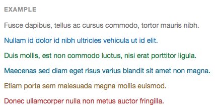
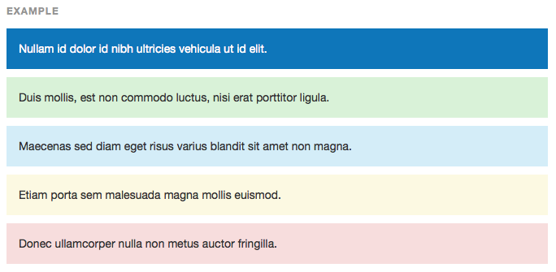
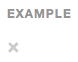
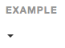

작성자 : 최욱주 / 작성일 : 2015-12-18


# 헬퍼클래스

스타일링을 좀더 편하게 도와주는 클래스들.

---

## 맥락적인 의미가 있는 색상

- 클래스를 이용하여 색상을 통한 강조를 할 수 있음.
- 링크에도 적용되며, 마우스 오버시에도 스타일이 지정되어 있다.


```html
<p class="text-muted">...</p>
<p class="text-primary">...</p>
<p class="text-success">...</p>
<p class="text-info">...</p>
<p class="text-warning">...</p>
<p class="text-danger">...</p>
```

#### 특수성 해결
```
가끔 텍스트 강조 클래스는 또 다른 앵커 셀렉터의 특수성으로 인해 적용되지 않을 수 있음.
해결책은 텍스트를 클래스와 함께 <span> 으로 감싸면 된다.
```

#### 의미를 전달하기
```
클래스를 적용한 텍스트들은 시각적인 색상이 변경된 것 뿐, 실제로 의미를 가지지는 않음.
컨텐츠 자체에 색에 의해 전달하려는 의도를 정확히 표시하는 것이 좋다.
보이지 않기를 원하면 .sr-only 클래스로 가려둘 수 있음.
```


## 맥락적인 의미가 있는 배경색

- 텍스트와 마찬가지로, 맥락적인 의미가 있는 컨텐츠에 배경 색상을 입힐 수 있음.
- 텍스트와 마찬가지로, 링크에도 적용되며 마우스 오버시에도 스타일이 입혀진다.


```html
<p class="bg-primary">...</p>
<p class="bg-success">...</p>
<p class="bg-info">...</p>
<p class="bg-warning">...</p>
<p class="bg-danger">...</p>
```

#### 특수성 해결
```
가끔 배경 클래스는 또 다른 앵커 셀렉터의 특수성으로 인해 적용되지 않을 수 있음.
해결책은 텍스트를 클래스와 함께 <div> 으로 감싸면 된다.
```

#### 의미를 전달하기
```
'맥락적인 의미가 있는 색상' 과 마찬가지로, 색의 의미를 컨텐츠를 통해 확실히 전달할 것을 권장.
```


## 닫기 아이콘
모달이나 경고같은 콘텐츠를 없애기 위한 보통의 닫기 아이콘을 사용(`<button>` 태그를 이용)


```html
<button type="button" class="close" aria-label="Close"><span aria-hidden="true">&times;</span></button>
```


## 캐럿 (Carets)
- 드롭다운의 기능과 방향을 알려줌
- 드롭업 메뉴에서는 화살표 방향이 반대


```html
<span class="caret"></span>
```

## 간편한 float
- 클래스를 이용해 좌우로 float
- `!important`는 특정 이슈들을 피하기 위해 적용됨.
- 믹스인으로 사용 가능

```html
<div class="pull-left">...</div>
<div class="pull-right">...</div>
```

```css
// Classes
.pull-left {
  float: left !important;
}
.pull-right {
  float: right !important;
}

// Usage as mixins
.element {
  .pull-left();
}
.another-element {
  .pull-right();
}
```

#### 네비게이션 바에서 사용하지 마세요.
```
네비게이션 바에서 콤포넌트를 정리하려면 .navbar-left 나 .navbar-right 를 사용
자세한 내용은 [네비게이션바](http://bootstrapk.com/components/#navbar-component-alignment) 문서 참고.
```


## 콘텐츠 블록 중앙 정렬
- `display: block` 와 `margin` 로 요소를 설정하세요
- 믹스인으로 사용 가능

```html
<div class="center-block">...</div>
```

```css
// Class
.center-block {
  display: block;
  margin-left: auto;
  margin-right: auto;
}

// Usage as a mixin
.element {
  .center-block();
}
```


## Clearfix
- `.clearfix`를 사용하여 `float`를 쉽게 클리어
- Nicolas Gallagher 가 공개한 [the micro clearfix](http://nicolasgallagher.com/micro-clearfix-hack/) 사용
- 믹스인으로 사용 가능

```html
<!-- Usage as a class -->
<div class="clearfix">...</div>
```

```css
// Mixin itself
.clearfix() {
  &:before,
  &:after {
    content: " ";
    display: table;
  }
  &:after {
    clear: both;
  }
}

// Usage as a mixin
.element {
  .clearfix();
}
```


## 콘텐츠 보이고 숨기기
- `.show`, `.hide`를 이용하여 컨텐츠를 보이거나 숨길 수 있음.
- 특정 이슈들을 피하기 위해 `!important` 사용
- 오직 `block` 레벨에서만 가능

* `.hide`는 가능하지만 스크린 리더에서 항상 효과가 있는것이 아님.(v3.0.1 부터 사용되지 않음.)
* `.hide` 대신 `.sr-only`, `.hidden` 사용
* `.invisible` 은 문서의 흐름(공간)을 차지하지만, 보이지 않는 요소를 위해 사용.

```html
<div class="show">...</div>
<div class="hidden">...</div>
```

```css
// Classes
.show {
  display: block !important;
}
.hidden {
  display: none !important;
  visibility: hidden !important;
}
.invisible {
  visibility: hidden;
}

// Usage as mixins
.element {
  .show();
}
.another-element {
  .hidden();
}
```


## 스크린 리더와 키보드 네비게이션의 콘텐츠
- **스크린 리더를 제외한** 모든 기기에서 콘텐츠를 숨기기 위한 클래스 : `.sr-only`
- 그것을 포커스 되었을 때 보이게 하기 위한 클래스 : `.sr-only-focusable`
  - 최적의 접근성을 위해 사용됨.(예 - 키보드만 가지고 있는 사용자들을 위해)
- 믹스인으로 사용 가능

```html
<a class="sr-only sr-only-focusable" href="#content">Skip to main content</a>
```

```css
// Usage as a mixin
.skip-navigation {
  .sr-only();
  .sr-only-focusable();
}
```


## 이미지 대체
`.text-hide` 클래스나 믹스인을 텍스트 콘텐츠를 배경 이미지로 대체하는 데 활용.

```html
<h1 class="text-hide">Custom heading</h1>
```

```css
// 믹스인으로 사용
.heading {
  .text-hide();
}
```