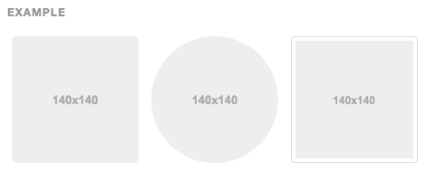

작성자 : 최욱주 / 작성일 : 2015-12-18


# 이미지

## 반응형 이미지

부트스트랩3에서 이미지를 반응형으로 만드는 클래스 : `.img-responsive`

이미지에 `max-width: 100%; height: auto; display: block;`을 적용하여 부모요소에 알맞는 이미지로 변화됨.

```html

```

#### SVG 이미지와 IE 8~10

```
인터넷 익스플로러 8~10에서 .img-responsive 는 불균형적으로 적용됨.
이것을 고치기 위해 width:100% \9;을 더하면 됨.
부트스트랩은 다른 이미지 포멧에 문제를 일으킬 여지가 있어 위 속성을 기본으로 포함시키지는 않음.
```


## 이미지 모양
클래스를 추가하여 손쉽게 이미지를 스타일링 할 수 있음.


```html


```


