작성자 : 최욱주 / 작성일 : 2015-12-15

# 예제들

* 부트스트랩의 컴포넌트들을 사용한 기본 템플릿들
* 프로젝트에 따라 커스터마이징 하여 사용할 수 있음

## 프레임워크 사용하기
| 템플릿명 | 미리보기 | 설명 및 링크 |
|--------|--------|-----------|
|초보자 템플릿|| 콘테이너와 함께 합쳐진 css와 자바스크립트. [[바로가기](http://bootstrapk.com/examples/starter-template/)] |
|부트스트랩 테마|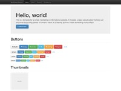| 시각적 강화된 다양한 테마들을 로드하는 탬플릿. [[바로가기](http://bootstrapk.com/examples/theme/)] |
|그리드|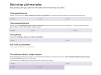| 4단계, 중첩 등 그리드 레이아웃의 몇가지 예제. [[바로가기](http://bootstrapk.com/examples/grid/)] |
|점보트론|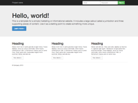| 네비게이션바와 기본 그리드 컬럼이 포함된 점보트론 예제. [[바로가기](http://bootstrapk.com/examples/jumbotron/)] |
|좁은 점보트론|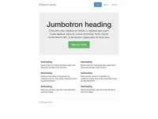| 좁은 콘테이너와 점보트론. [[바로가기](http://bootstrapk.com/examples/jumbotron-narrow/)] |

## 움직이는 네비게이션
| 템플릿명 | 미리보기 | 설명 및 링크 |
|--------|--------|-----------|
|네비게이션 바|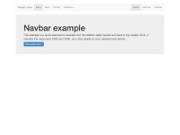| 약간의 콘텐츠와 네비게이션 바(기본). [[바로가기](http://bootstrapk.com/examples/navbar/)] |
|정적 상단 네비게이션 바|| 약간의 콘텐츠와 상단에 붙어있는 네비게이션 바. [[바로가기](http://bootstrapk.com/examples/navbar-static-top/)] |
|고정된 네비게이션 바|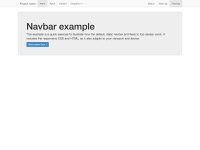| 약간의 콘텐츠와 상단에 고정된 네비게이션 바. [[바로가기](http://bootstrapk.com/examples/navbar-fixed-top/)] |

### 맞춤 콤포넌트
| 템플릿명 | 미리보기 | 설명 및 링크 |
|--------|--------|-----------|
|커버|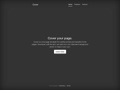| 간단한 메인페이지를 위한 원페이지 템플릿. [[바로가기](http://bootstrapk.com/examples/cover/)] |
|캐러셀|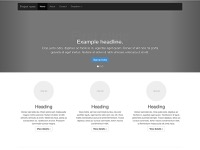| 네비게이션바와 캐러셀을 맞춤화하고 새로운 컴포넌트를 더함. [[바로가기](http://bootstrapk.com/examples/carousel/)] |
|블로그|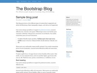| 맞춤화 네비게이션, 헤더, 글자와 간단한 2열 블로그 레이아웃. [[바로가기](http://bootstrapk.com/examples/blog/)] |
|대시보드|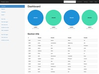| 고정된 사이드바와 네비게이션바, 관리자 대시보드를 위한 기본 구조. [[바로가기](http://bootstrapk.com/examples/dashboard/)] |
|로그인 페이지|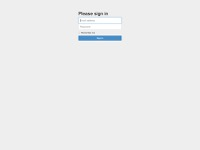| 간단한 로그인을 위한 맞춤화된 폼 레이아웃과 디자인. [[바로가기](http://bootstrapk.com/examples/signin/)] |
|양쪽정렬된 네비게이션|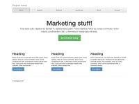| 양쪽정렬된 링크로 맞춤 네비게이션바. (사파리에서는 잘 작동 안함) [[바로가기](http://bootstrapk.com/examples/justified-nav/)] |
|밑에 붙는 하단|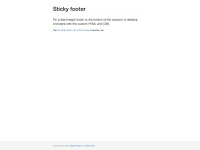| 콘텐츠가 뷰포트보다 작아도 밑에 붙는 하단. [[바로가기](http://bootstrapk.com/examples/sticky-footer/)] |
|네비게이션바와 밑에 붙는 하단|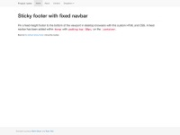| 위에 붙는 고정된 네비게이션 바와 뷰포트 밑에 붙는 하단. [[바로가기](http://bootstrapk.com/examples/sticky-footer-navbar/)] |

### 실험
| 템플릿명 | 미리보기 | 설명 및 링크 |
|--------|--------|-----------|
|비반응성 부트스트랩|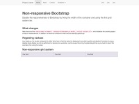| 부트스트랩의 반응성을 간편하게 비활성화([참고](http://bootstrapk.com/getting-started/#disable-responsive)). [[바로가기](http://bootstrapk.com/examples/non-responsive/)] |
|오픈캔버스|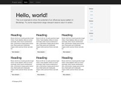| 토글이 가능한 오프캔버스 네비게이션 메뉴. [[바로가기](http://bootstrapk.com/examples/offcanvas/)] |

