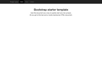

작성자 : 최욱주 / 작성일 : 2015-12-15


# 기본템플릿

* 기본 html 템플릿으로 시작하거나
* 예제들을 수정하여 사용

```html
<!DOCTYPE html>
<html lang="ko">
  <head>
    <meta charset="utf-8">
    <meta http-equiv="X-UA-Compatible" content="IE=edge">
    <meta name="viewport" content="width=device-width, initial-scale=1">
    <!-- 위 3개의 메타 태그는 *반드시* head 태그의 처음에 와야합니다; 어떤 다른 콘텐츠들은 반드시 이 태그들 *다음에* 와야 합니다 -->
    <title>부트스트랩 101 템플릿</title>

    <!-- 부트스트랩 -->
    <link href="css/bootstrap.min.css" rel="stylesheet">

    <!-- IE8 에서 HTML5 요소와 미디어 쿼리를 위한 HTML5 shim 와 Respond.js -->
    <!-- WARNING: Respond.js 는 당신이 file:// 을 통해 페이지를 볼 때는 동작하지 않습니다. -->
    <!--[if lt IE 9]>
      <script src="https://oss.maxcdn.com/html5shiv/3.7.2/html5shiv.min.js"></script>
      <script src="https://oss.maxcdn.com/respond/1.4.2/respond.min.js"></script>
    <![endif]-->
  </head>
  <body>
    <h1>Hello, world!</h1>

    <!-- jQuery (부트스트랩의 자바스크립트 플러그인을 위해 필요합니다) -->
    <script src="https://ajax.googleapis.com/ajax/libs/jquery/1.11.2/jquery.min.js"></script>
    <!-- 모든 컴파일된 플러그인을 포함합니다 (아래), 원하지 않는다면 필요한 각각의 파일을 포함하세요 -->
    <script src="js/bootstrap.min.js"></script>
  </body>
</html>
```


## 예제들

* 부트스트랩의 컴포넌트들을 사용한 기본 템플릿들
* 프로젝트에 따라 커스터마이징 하여 사용할 수 있음


### 프레임워크 사용하기
| 템플릿명 | 미리보기 | 설명 및 링크 |
|--------|--------|-----------|
|초보자 템플릿|| 콘테이너와 함께 합쳐진 css와 자바스크립트. [바로가기](http://bootstrapk.com/examples/starter-template/) |