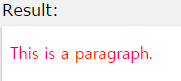

# CSS3

## css3 레퍼런스 작성 방법

### css3 레퍼런스 참조 사이트
* [CSS3 Browser Support Reference](http://www.w3schools.com/cssref/css3_browsersupport.asp)

### 문서 작성 방법

작성자 : 김동일

작성일 : 2015-09-02 17:29

css 레퍼런스 설명: 
- color : 텍스트에 색상을 입힌다.
- text-align : 텍스트의 위치를 정렬한다.

`sample code` : 

```html
<!DOCTYPE html>
<html>
<head>
<style>
p {
    color: red; /*p테그 색상*/ 
    text-align: center;  /*p테크 글자 정렬*/
}
</style>
</head>
<body>
<p>This is a paragraph.</p>

</body>
</html>
```

결과 



### 파일 작성 방법
File 

 - Format : css3_reference명.md 파일로 작성할 것

 - 경로 : docs 폴더에 해당 파일을 넣을 것

image : 

 - Format : 레퍼런스 내용에 보여지는 이미지는 css3_reference명.jpg 파일로 작성할 것

 - 경로 : images 폴더에 넣을 것

 - 문서(*.md 파일)에 이미지 출력시 다음의 방법으로 작성함

```sh

```

cf) 문서 작성에 대한 상세 내용은 README.md파일의 소스를 참고하시기 바랍니다.

cf) Github 사이트에 등록하는 방법도 [09-GitHub-for-Windows](../../Github/docs/09-GitHub-for-Windows)를 참고하시기 바랍니다

### 목록
* [align-content](docs/align-content.md)
* [align-items](docs/align-items.md)
* [align-self](docs/align-self.md)
* [@keyframes](docs/@keyframes.md)
* [animation](docs/animation.md)
* [animation-name](docs/animation-name.md)
* [animation-duration](docs/animation-duration.md)
* [animation-timing-function](docs/animation-timing-function.md)
* [animation-delay](docs/animation-delay.md)
* [animation-iteration-count](docs/animation-iteration-count.md)
* [animation-direction](docs/animation-direction.md)
* [animation-play-state](docs/animation-play-state.md)
* [backface-visibility](docs/backface-visibility.md)
* [background-clip](docs/background-clip.md)
* [background-origin](docs/background-origin.md)
* [background-size](docs/background-size.md)
* [border-bottom-left-radius](docs/border-bottom-left-radius.md)
* [border-bottom-right-radius](docs/border-bottom-right-radius.md)
* [border-image](docs/border-image.md)
* [border-image-outset](docs/border-image-outset.md)
* [border-image-repeat](docs/border-image-repeat.md)
* [border-image-slice](docs/border-image-slice.md)
* [border-image-source](docs/border-image-source.md)
* [border-image-width](docs/border-image-width.md)
* [border-radius](docs/border-radius.md)
* [border-top-left-radius](docs/border-top-left-radius.md)
* [border-top-right-radius](docs/border-top-right-radius.md)
* [box-shadow](docs/box-shadow.md)
* [box-sizing](docs/box-sizing.md)
* [column-count](docs/column-count.md)
* [column-gap](docs/column-gap.md)
* [column-rule](docs/column-rule.md)
* [column-rule-color](docs/column-rule-color.md)
* [column-rule-style](docs/column-rule-style.md)
* [column-rule-width](docs/column-rule-width.md)
* [column-span](docs/column-span.md)
* [column-width](docs/column-width.md)
* [columns](docs/columns.md)
* [flex](docs/flex.md)
* [flex-basis](docs/flex-basis.md)
* [flex-direction](docs/flex-direction.md)
* [flex-flow](docs/flex-flow.md)
* [flex-grow](docs/flex-grow.md)
* [flex-shrink](docs/flex-shrink.md)
* [flex-wrap](docs/flex-wrap.md)
* [@font-face](docs/@font-face.md)
* [font-feature-settings](docs/font-feature-settings.md)
* [hyphens](docs/hyphens.md)
* [justify-content](docs/justify-content.md)
* [opacity](docs/opacity.md)
* [order](docs/order.md)
* [outline-offset](docs/outline-offset.md)
* [overflow-wrap](docs/overflow-wrap.md)
* [overflow-x](docs/overflow-x.md)
* [overflow-y](docs/overflow-y.md)
* [@page](docs/@page.md)
* [perspective](docs/perspective.md)
* [perspective-origin](docs/perspective-origin.md)
* [resize](docs/resize.md)
* [tab-size](docs/tab-size.md)
* [text-align-last](docs/text-align-last.md)
* [text-overflow](docs/text-overflow.md)
* [text-shadow](docs/text-shadow.md)
* [transform](docs/transform.md)
* [transform-origin](docs/transform-origin.md)
* [transform-style](docs/transform-style.md)
* [transition](docs/transition.md)
* [transition-delay](docs/transition-delay.md)
* [transition-duration](docs/transition-duration.md)
* [transition-property](docs/transition-property.md)
* [transition-timing-function](docs/transition-timing-function.md)
* [word-break](docs/word-break.md)
* [word-wrap](docs/word-wrap.md)