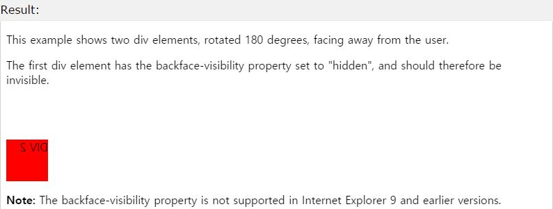

## backface-visibility

작성자 : 김동일

작성일 : 2015-09-18

css 레퍼런스 설명: 
 - backface-visibility : div 테그 뒷면의 출력 여부를 정의한다.
 
 - syntax : 
```sh 
backface-visibility: visible|hidden|initial|inherit;
```

visible : 기본 값, 뒷면이 보여진다.

hidden : 뒷면을 숨긴다.

initial:기본 값으로 set되어 있는 값을 불러온다.

inherit:부모 element에 설정되어 있는 값을 상속 받는다.

sample code : 
```sh
<!DOCTYPE html>
<html>
<head>
<style>
div {
    position: relative;
    height: 60px;
    width: 60px;
    background-color: red;
    -webkit-transform: rotateY(180deg);  /* Chrome, Safari, Opera */
    transform: rotateY(180deg);
}

#div1 {
    -webkit-backface-visibility: hidden;  /* Chrome, Safari, Opera */
    backface-visibility: hidden;
}

#div2 {
    -webkit-backface-visibility: visible;  /* Chrome, Safari, Opera */
    backface-visibility: visible;
}
</style>
</head>
<body>

<p>This example shows two div elements, rotated 180 degrees, facing away from the user.</p>
<p>The first div element has the backface-visibility property set to "hidden", and should therefore be invisible.</p>

<div id="div1">DIV 1</div>
<div id="div2">DIV 2</div>

<p><strong>Note:</strong> The backface-visibility property is not supported in Internet Explorer 9 and earlier versions.</p>

</body>
</html>


```

결과 




### 목록
* [align-content](align-content.md)
* [align-items](align-items.md)
* [align-self](align-self.md)
* [@keyframes](@keyframes.md)
* [animation](animation.md)
* [animation-name](animation-name.md)
* [animation-duration](animation-duration.md)
* [animation-timing-function](animation-timing-function.md)
* [animation-delay](animation-delay.md)
* [animation-iteration-count](animation-iteration-count.md)
* [animation-direction](animation-direction.md)
* [animation-play-state](animation-play-state.md)
* [backface-visibility](backface-visibility.md)
* [background-clip](background-clip.md)
* [background-origin](background-origin.md)
* [background-size](background-size.md)
* [border-bottom-left-radius](border-bottom-left-radius.md)
* [border-bottom-right-radius](border-bottom-right-radius.md)
* [border-image](border-image.md)
* [border-image-outset](border-image-outset.md)
* [border-image-repeat](border-image-repeat.md)
* [border-image-slice](border-image-slice.md)
* [border-image-source](border-image-source.md)
* [border-image-width](border-image-width.md)
* [border-radius](border-radius.md)
* [border-top-left-radius](border-top-left-radius.md)
* [border-top-right-radius](border-top-right-radius.md)
* [box-shadow](box-shadow.md)
* [box-sizing](box-sizing.md)
* [column-count](column-count.md)
* [column-gap](column-gap.md)
* [column-rule](column-rule.md)
* [column-rule-color](column-rule-color.md)
* [column-rule-style](column-rule-style.md)
* [column-rule-width](column-rule-width.md)
* [column-span](column-span.md)
* [column-width](column-width.md)
* [columns](columns.md)
* [flex](flex.md)
* [flex-basis](flex-basis.md)
* [flex-direction](flex-direction.md)
* [flex-flow](flex-flow.md)
* [flex-grow](flex-grow.md)
* [flex-shrink](flex-shrink.md)
* [flex-wrap](flex-wrap.md)
* [@font-face](@font-face.md)
* [font-feature-settings](font-feature-settings.md)
* [hyphens](hyphens.md)
* [justify-content](justify-content.md)
* [opacity](opacity.md)
* [order](order.md)
* [outline-offset](outline-offset.md)
* [overflow-wrap](overflow-wrap.md)
* [overflow-x](overflow-x.md)
* [overflow-y](overflow-y.md)
* [perspective](perspective.md)
* [perspective-origin](perspective-origin.md)
* [resize](resize.md)
* [tab-size](tab-size.md)
* [text-align-last](text-align-last.md)
* [text-overflow](text-overflow.md)
* [text-shadow](text-shadow.md)
* [transform](transform.md)
* [transform-origin](transform-origin.md)
* [transform-style](transform-style.md)
* [transition](transition.md)
* [transition-delay](transition-delay.md)
* [transition-duration](transition-duration.md)
* [transition-property](transition-property.md)
* [transition-timing-function](transition-timing-function.md)
* [word-break](word-break.md)
* [word-wrap](word-wrap.md)