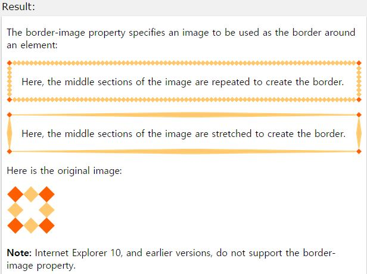

## border-image

작성자 : 김동일

작성일 : 2015-09-18

css 레퍼런스 설명:
 - border-image : border를 이미지로 정의한다.

 - syntax :
```sh
border-image: source slice width outset repeat|initial|inherit;
```

source slice width outset repeat : border로 사용하는 이미지 경로, slice 타입, 크기(%), outset, 반복(round/stretch) 값을 정의한다.

initial:기본 값으로 set되어 있는 값을 불러온다.

inherit:부모 element에 설정되어 있는 값을 상속 받는다.

sample code :
```html
<!DOCTYPE html>
<html>
<head>
<style>
#borderimg1 {
    border: 10px solid transparent;
    padding: 15px;
    -webkit-border-image: url(border.png) 30 round repeat; /* Safari 3.1-5 */
    -o-border-image: url(border.png) 30 round; /* Opera 11-12.1 */
    border-image: url(border.png) 30 round; /*ie11 and chrome 버전에서 사용*/
}

#borderimg2 {
    border: 10px solid transparent;
    padding: 15px;
    -webkit-border-image: url(border.png) 30 stretch; /* Safari 3.1-5 */
    -o-border-image: url(border.png) 30 stretch; /* Opera 11-12.1 */
    border-image: url(border.png) 30 stretch; /*ie11 and chrome 버전에서 사용*/
}
</style>
</head>
<body>

<p>The border-image property specifies an image to be used as the border around an element:</p>
<p id="borderimg1">Here, the middle sections of the image are repeated to create the border.</p>
<p id="borderimg2">Here, the middle sections of the image are stretched to create the border.</p>

<p>Here is the original image:</p>
<p><strong>Note:</strong> Internet Explorer 10, and earlier versions, do not support the border-image property.</p>

</body>
</html>
```

결과




* [border-image](border-image.md)
* [border-image-outset](border-image-outset.md)
* [border-image-repeat](border-image-repeat.md)
* [border-image-slice](border-image-slice.md)
* [border-image-source](border-image-source.md)
* [border-image-width](border-image-width.md)
* [border-radius](border-radius.md)
