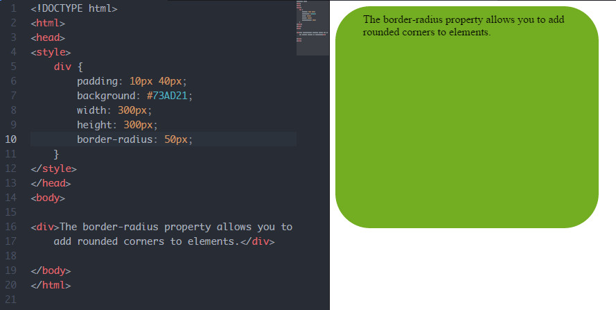
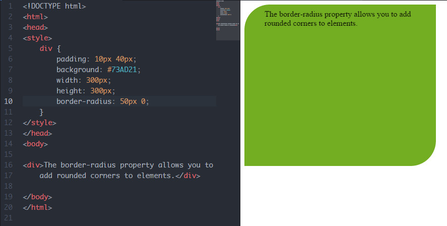
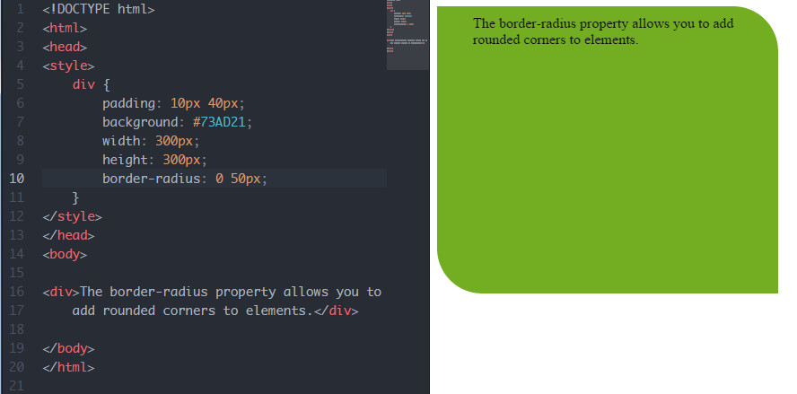
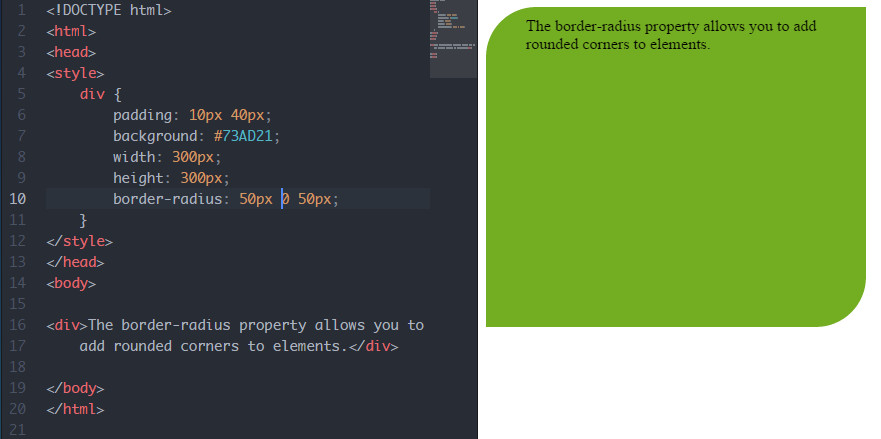
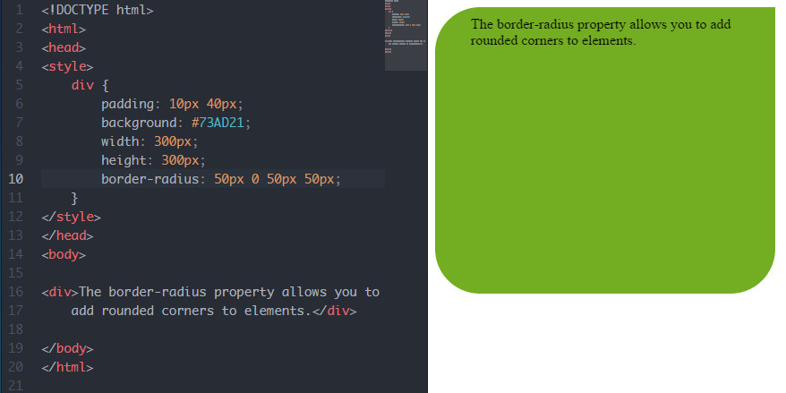

# border-radius

* 작성자 : 박성희,
* 작성일 : 2015-10-28
* 추가 : 허종문 2015-12-15


<br>

css 레퍼런스 설명:

사각형 각 모서리 둥글게 만드는 속성, 4개 모서리의 축약 속성, border-radius로 선언하면 4개의 모서리가 동일하게 적용됨.

예제 :




* length : `px`, `em` 등 단위로 직접 숫자 지정
* `%` : % 값으로 둥근 정도를 지정


* `border-radius` 의 값으로 하나만 주면 `4군데` 모두 적용된다. 예: `border-radius: 10px`
* 순서는 `top-left` , `top-right` , `bottom-right` , `bottom-left` 적용되고 두번째값부터는 생략가능하다.


* `border-radius: 25px 0` 이면 `25px 0 25px 0`



* `border-radius: 0 25px` 이면 `0 25px 0 25px`



* `border-radius: 25px 0 25px` 이면 `25px 0 25px 0`



* `border-radius: 25px 0 25px 25px` 이면 `25px 0 25px 25px`




* 각 속성을 따로 줄수도 있다

```css
.test {
    /* top left */
    border-top-left-radius: 50px;

    /* top right */
    border-top-right-radius: 50px;

    /* bottom left */
    border-bottom-left-radius: 50px;

    /* bottom right */
    border-bottom-right-radius: 50px;
}


### 목록
* [align-content](align-content.md)
* [align-items](align-items.md)
* [align-self](align-self.md)
* [@keyframes](@keyframes.md)
* [animation](animation.md)
* [backface-visibility](backface-visibility.md)
* [background-clip](background-clip.md)
* [background-origin](background-origin.md)
* [background-size](background-size.md)
* [border-image](border-image.md)
* [border-image-outset](border-image-outset.md)
* [border-image-repeat](border-image-repeat.md)
* [border-image-slice](border-image-slice.md)
* [border-image-source](border-image-source.md)
* [border-image-width](border-image-width.md)
* [border-radius](border-radius.md)
* [box-shadow](box-shadow.md)
* [box-sizing](box-sizing.md)
* [column-count](column-count.md)
* [column-gap](column-gap.md)
* [column-rule](column-rule.md)
* [column-rule-color](column-rule-color.md)
* [column-rule-style](column-rule-style.md)
* [column-rule-width](column-rule-width.md)
* [column-span](column-span.md)
* [column-width](column-width.md)
* [columns](columns.md)
* [flex](flex.md)
* [flex-basis](flex-basis.md)
* [flex-direction](flex-direction.md)
* [flex-flow](flex-flow.md)
* [flex-grow](flex-grow.md)
* [flex-shrink](flex-shrink.md)
* [flex-wrap](flex-wrap.md)
* [@font-face](@font-face.md)
* [font-feature-settings](font-feature-settings.md)
* [hyphens](hyphens.md)
* [justify-content](justify-content.md)
* [opacity](opacity.md)
* [order](order.md)
* [outline-offset](outline-offset.md)
* [overflow-wrap](overflow-wrap.md)
* [overflow-x](overflow-x.md)
* [overflow-y](overflow-y.md)
* [perspective](perspective.md)
* [perspective-origin](perspective-origin.md)
* [resize](resize.md)
* [tab-size](tab-size.md)
* [text-align-last](text-align-last.md)
* [text-overflow](text-overflow.md)
* [text-shadow](text-shadow.md)
* [transform](transform.md)
* [transform-origin](transform-origin.md)
* [transform-style](transform-style.md)
* [transition](transition.md)
* [transition-delay](transition-delay.md)
* [transition-duration](transition-duration.md)
* [transition-property](transition-property.md)
* [transition-timing-function](transition-timing-function.md)
* [word-break](word-break.md)
* [word-wrap](word-wrap.md)
