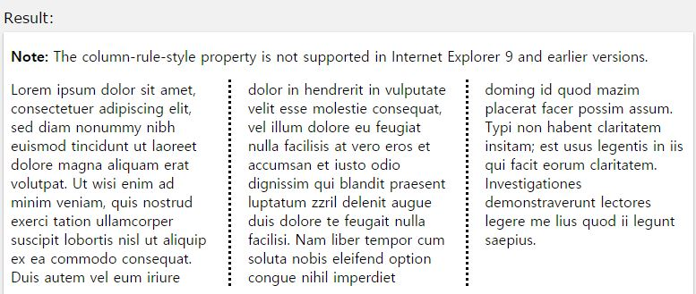
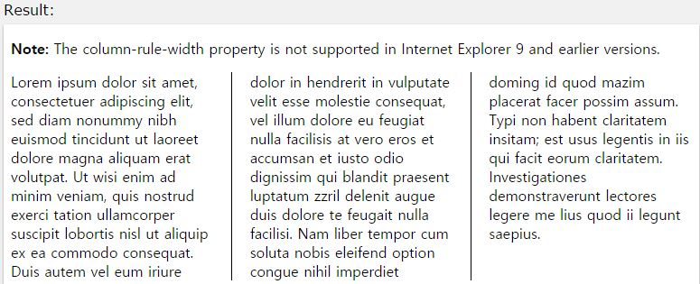
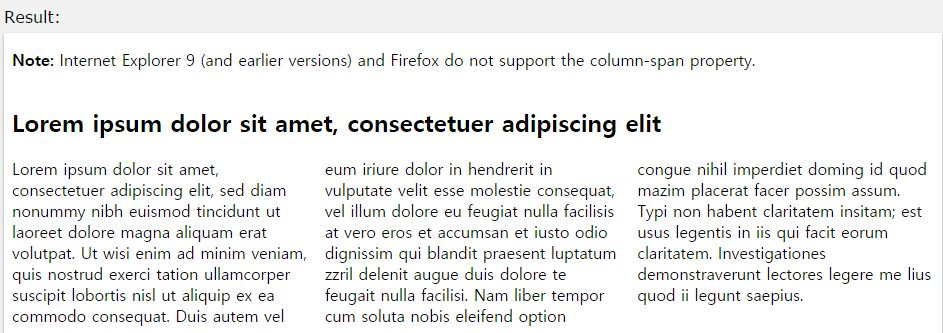
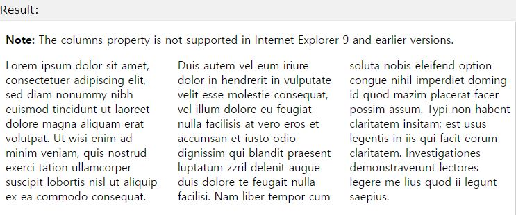
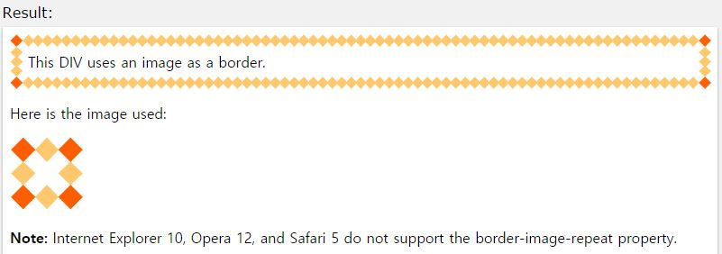
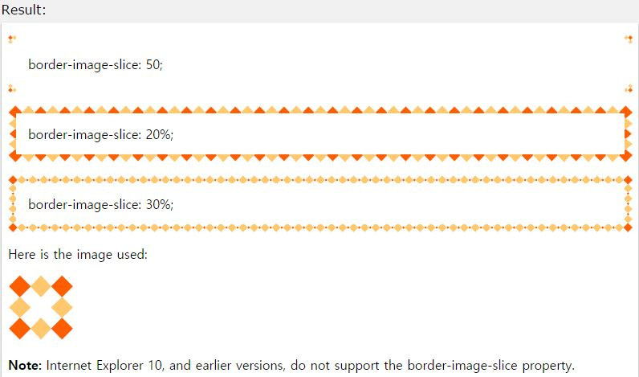
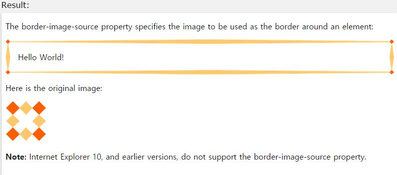

# CSS3 Reference

## column-count

작성자 : 김동일

작성일 : 2015-09-14

css 레퍼런스 설명: 
 - column-count : div 내 텍스트를 분할한다.

 - syntax : 
```sh 
column-count: length|auto|initial|inherit;
```

length:column 개수를 명시한다.

auto:기본 값, column-width에 따라 컬럼 수가 결정된다.

initial:기본 값으로 set되어 있는 값을 불러온다.

inherit:부모 element에 설정되어 있는 값을 상속 받는다.

sample code : 
```sh
<!DOCTYPE html>
<html>
<head>
<style> 
.newspaper {
    -webkit-column-count: 3; /* Chrome, Safari, Opera에서 사용하는 css (반드시 앞에 -webkit-을 붙여야함)*/
    -moz-column-count: 3; /* Firefox에서 사용하는 css (반드시 앞에 -moz-을 붙여야함)*/
    column-count: 3; /*IE 10.0 이후 에서 사용하는 css (이전 버전은 지원 안함)*/
}
</style>
</head>
<body>

<p><strong>Note:</strong> The column-count property is not supported in Internet Explorer 9 and earlier versions.</p>

<div class="newspaper">
Lorem ipsum dolor sit amet, consectetuer adipiscing elit, sed diam nonummy nibh euismod tincidunt ut laoreet dolore magna aliquam erat volutpat. Ut wisi enim ad minim veniam, quis nostrud exerci tation ullamcorper suscipit lobortis nisl ut aliquip ex ea commodo consequat. Duis autem vel eum iriure dolor in hendrerit in vulputate velit esse molestie consequat, vel illum dolore eu feugiat nulla facilisis at vero eros et accumsan et iusto odio dignissim qui blandit praesent luptatum zzril delenit augue duis dolore te feugait nulla facilisi. Nam liber tempor cum soluta nobis eleifend option congue nihil imperdiet doming id quod mazim placerat facer possim assum. Typi non habent claritatem insitam; est usus legentis in iis qui facit eorum claritatem. Investigationes demonstraverunt lectores legere me lius quod ii legunt saepius.
</div>

</body>
</html>
```

결과 


## column-gap

작성자 : 김동일

작성일 : 2015-09-14

css 레퍼런스 설명: 
 - column-gap : column으로 분할된 텍스트 사이의 간격을 설정한다.
 
 - syntax : 
```sh 
column-gap: length|normal|initial|inherit;
```

length:column 크기를 명시한다.(px,em 등)

normal:기본 값, W3C에서는 1em의 값을 추천한다. 

initial:기본 값으로 set되어 있는 값을 불러온다.

inherit:부모 element에 설정되어 있는 값을 상속 받는다.

sample code : 
```sh
<!DOCTYPE html>
<html>
<head>
<style> 
.newspaper {
    -webkit-column-count: 3; /* Chrome, Safari, Opera에서 사용하는 css (반드시 앞에 -webkit-을 붙여야함)*/
    -moz-column-count: 3; /* Firefox에서 사용하는 css (반드시 앞에 -moz-을 붙여야함)*/
    column-count: 3; /*IE 10.0 이후 에서 사용하는 css (이전 버전은 지원 안함)*/

    -webkit-column-gap: 40px; /* Chrome, Safari, Opera에서 사용하는 css (반드시 앞에 -webkit-을 붙여야함)*/
    -moz-column-gap: 40px; /* Firefox 에서 사용하는 css (반드시 앞에 -moz-을 붙여야함)*/
    column-gap: 40px; /*IE 10.0 이후 에서 사용하는 css (이전 버전은 지원 안함)*/
}
</style>
</head>
<body>

<p><strong>Note:</strong> The column-count property is not supported in Internet Explorer 9 and earlier versions.</p>

<div class="newspaper">
Lorem ipsum dolor sit amet, consectetuer adipiscing elit, sed diam nonummy nibh euismod tincidunt ut laoreet dolore magna aliquam erat volutpat. Ut wisi enim ad minim veniam, quis nostrud exerci tation ullamcorper suscipit lobortis nisl ut aliquip ex ea commodo consequat. Duis autem vel eum iriure dolor in hendrerit in vulputate velit esse molestie consequat, vel illum dolore eu feugiat nulla facilisis at vero eros et accumsan et iusto odio dignissim qui blandit praesent luptatum zzril delenit augue duis dolore te feugait nulla facilisi. Nam liber tempor cum soluta nobis eleifend option congue nihil imperdiet doming id quod mazim placerat facer possim assum. Typi non habent claritatem insitam; est usus legentis in iis qui facit eorum claritatem. Investigationes demonstraverunt lectores legere me lius quod ii legunt saepius.
</div>

</body>
</html>
```

결과 


## column-rule

작성자 : 김동일

작성일 : 2015-09-14

css 레퍼런스 설명: 
 - column-rule : column간의 width, style 등을 명시 한다.
 
 - syntax : 
```sh 
column-rule: column-rule-width column-rule-style column-rule-color|initial|inherit;
```

column-rule-width column-rule-style column-rule-color : column의 width, 스타일, column간 컬러를 명시한다.

initial:기본 값으로 set되어 있는 값을 불러온다.

inherit:부모 element에 설정되어 있는 값을 상속 받는다.

sample code : 
```sh
<!DOCTYPE html>
<html>
<head>
<style> 
.newspaper {
    -webkit-column-count: 3; /* Chrome, Safari, Opera에서 사용하는 css (반드시 앞에 -webkit-을 붙여야함)*/
    -moz-column-count: 3; /* Firefox에서 사용하는 css (반드시 앞에 -moz-을 붙여야함)*/
    column-count: 3; /*IE 10.0 이후 에서 사용하는 css (이전 버전은 지원 안함)*/

    -webkit-column-gap: 40px; /* Chrome, Safari, Opera에서 사용하는 css (반드시 앞에 -webkit-을 붙여야함)*/
    -moz-column-gap: 40px; /* Firefox 에서 사용하는 css (반드시 앞에 -moz-을 붙여야함)*/
    column-gap: 40px; /*IE 10.0 이후 에서 사용하는 css (이전 버전은 지원 안함)*/

    -webkit-column-rule: 4px outset #ff00ff; /* Chrome, Safari, Opera 에서 사용하는 css (반드시 앞에 -webkit-을 붙여야함)*/
    -moz-column-rule: 4px outset #ff00ff; /* Firefox css 에서 사용하는 css (반드시 앞에 -moz-을 붙여야함)*/
    column-rule: 4px outset #ff00ff; /*IE 10.0 이후 에서 사용하는 css (이전 버전은 지원 안함)*/
}
</style>
</head>
<body>

<p><strong>Note:</strong> The column-count property is not supported in Internet Explorer 9 and earlier versions.</p>

<div class="newspaper">
Lorem ipsum dolor sit amet, consectetuer adipiscing elit, sed diam nonummy nibh euismod tincidunt ut laoreet dolore magna aliquam erat volutpat. Ut wisi enim ad minim veniam, quis nostrud exerci tation ullamcorper suscipit lobortis nisl ut aliquip ex ea commodo consequat. Duis autem vel eum iriure dolor in hendrerit in vulputate velit esse molestie consequat, vel illum dolore eu feugiat nulla facilisis at vero eros et accumsan et iusto odio dignissim qui blandit praesent luptatum zzril delenit augue duis dolore te feugait nulla facilisi. Nam liber tempor cum soluta nobis eleifend option congue nihil imperdiet doming id quod mazim placerat facer possim assum. Typi non habent claritatem insitam; est usus legentis in iis qui facit eorum claritatem. Investigationes demonstraverunt lectores legere me lius quod ii legunt saepius.
</div>

</body>
</html>
```

결과 


## column-rule-color

작성자 : 김동일

작성일 : 2015-09-17

css 레퍼런스 설명: 
 - column-rule-color : column간의 컬러를 명시 한다.
 
 - syntax : 
```sh 
column-rule-color: color|initial|inherit;
```

column-rule-color : column 컬러를 명시한다.(ex: #fff, #f3f3f3, red, rgb(255, 0, 0), rgba(255, 0, 0, 0.3), hsl(120, 100%, 50%), hsla(120, 100%, 50%, 0.3) 등)

initial:기본 값으로 set되어 있는 값을 불러온다.

inherit:부모 element에 설정되어 있는 값을 상속 받는다.

sample code : 
```sh
<!DOCTYPE html>
<html>
<head>
<style> 
.newspaper {
    /* Chrome, Safari, Opera에서 사용하는 css (반드시 앞에 -webkit-을 붙여야함)*/
    -webkit-column-count: 3;
    -webkit-column-gap: 40px;
    -webkit-column-rule-style: outset;
    -webkit-column-rule-color: #ff0000;

    /* Firefox 에서 사용하는 css (반드시 앞에 -moz-을 붙여야함)*/
    -moz-column-count: 3;
    -moz-column-gap: 40px;
    -moz-column-rule-style: outset;
    -moz-column-rule-color: #ff0000;

    /*IE 10.0 이후 에서 사용하는 css (이전 버전은 지원 안함)*/
    column-count: 3;
    column-gap: 40px;
    column-rule-style: outset;
    column-rule-color: #ff0000;
}
</style>
</head>
<body>

<p><strong>Note:</strong> The column-rule-color property is not supported in Internet Explorer 9 and earlier versions.</p>

<div class="newspaper">
Lorem ipsum dolor sit amet, consectetuer adipiscing elit, sed diam nonummy nibh euismod tincidunt ut laoreet dolore magna aliquam erat volutpat. Ut wisi enim ad minim veniam, quis nostrud exerci tation ullamcorper suscipit lobortis nisl ut aliquip ex ea commodo consequat. Duis autem vel eum iriure dolor in hendrerit in vulputate velit esse molestie consequat, vel illum dolore eu feugiat nulla facilisis at vero eros et accumsan et iusto odio dignissim qui blandit praesent luptatum zzril delenit augue duis dolore te feugait nulla facilisi. Nam liber tempor cum soluta nobis eleifend option congue nihil imperdiet doming id quod mazim placerat facer possim assum. Typi non habent claritatem insitam; est usus legentis in iis qui facit eorum claritatem. Investigationes demonstraverunt lectores legere me lius quod ii legunt saepius.
</div>

</body>
</html>

```

결과 


## column-rule-style

작성자 : 김동일

작성일 : 2015-09-17

css 레퍼런스 설명: 
 - column-rule-style : column간의 스타일를 명시 한다.
 
 - syntax : 
```sh 
column-rule-style: none|hidden|dotted|dashed|solid|double|groove|ridge|inset|outset|initial|inherit;
```

none : 기본 값, 아무것도 적용하지 않는다.

hidden : column간 스타일을 숨긴다.

dotted : column간 스타일 짧은 점선으로 설정

dashed : column간 스타일 긴 점선으로 설정

solid : column간 스타일 선으로 설정

double : column간 스타일 두 선으로 설정

groove : column간 스타일에 groove가 들어간 3D선으로 설정. width와 색상에 영향을 받음

ridge :column간 스타일에 ridge가 들어간 3D선으로 설정. width와 색상에 영향을 받음

inset : column간 스타일에 inset가 들어간 3D선으로 설정. width와 색상에 영향을 받음

outset : column간 스타일에 outset가 들어간 3D선으로 설정. width와 색상에 영향을 받음

initial:기본 값으로 set되어 있는 값을 불러온다.

inherit:부모 element에 설정되어 있는 값을 상속 받는다.

sample code : 
```sh
<!DOCTYPE html>
<html>
<head>
<style> 
.newspaper {
    /* Chrome, Safari, Opera에서 사용하는 css (반드시 앞에 -webkit-을 붙여야함)*/
    -webkit-column-count: 3;
    -webkit-column-gap: 40px;
    -webkit-column-rule-style: dotted;

    /* Firefox 에서 사용하는 css (반드시 앞에 -moz-을 붙여야함)*/
    -moz-column-count: 3;
    -moz-column-gap: 40px;
    -moz-column-rule-style: dotted;

    /*IE 10.0 이후 에서 사용하는 css (이전 버전은 지원 안함)*/
    column-count: 3;
    column-gap: 40px;
    column-rule-style: dotted;
}
</style>
</head>
<body>

<p><strong>Note:</strong> The column-rule-style property is not supported in Internet Explorer 9 and earlier versions.</p>

<div class="newspaper">
Lorem ipsum dolor sit amet, consectetuer adipiscing elit, sed diam nonummy nibh euismod tincidunt ut laoreet dolore magna aliquam erat volutpat. Ut wisi enim ad minim veniam, quis nostrud exerci tation ullamcorper suscipit lobortis nisl ut aliquip ex ea commodo consequat. Duis autem vel eum iriure dolor in hendrerit in vulputate velit esse molestie consequat, vel illum dolore eu feugiat nulla facilisis at vero eros et accumsan et iusto odio dignissim qui blandit praesent luptatum zzril delenit augue duis dolore te feugait nulla facilisi. Nam liber tempor cum soluta nobis eleifend option congue nihil imperdiet doming id quod mazim placerat facer possim assum. Typi non habent claritatem insitam; est usus legentis in iis qui facit eorum claritatem. Investigationes demonstraverunt lectores legere me lius quod ii legunt saepius.
</div>

</body>
</html>


```

결과 



## column-rule-width

작성자 : 김동일

작성일 : 2015-09-17

css 레퍼런스 설명: 
 - column-rule-width : column간의 넓이를 명시 한다.
 
 - syntax : 
```sh 
column-rule-width: medium|thin|thick|length|initial|inherit;
```

medium : 기본 값, 중간 크기로 정의한다.

thin : 얇은 크기로 정의한다.

thick : 두꺼운 크기로 정의한다.

length : 넓이 값을 정의한다.

initial:기본 값으로 set되어 있는 값을 불러온다.

inherit:부모 element에 설정되어 있는 값을 상속 받는다.

sample code : 
```sh
<!DOCTYPE html>
<html>
<head>
<style> 
.newspaper {
    /* Chrome, Safari, Opera에서 사용하는 css (반드시 앞에 -webkit-을 붙여야함)*/
    -webkit-column-count: 3;
    -webkit-column-gap: 40px;
    -webkit-column-rule-style: outset;
    -webkit-column-rule-width: 1px;

    /* Firefox 에서 사용하는 css (반드시 앞에 -moz-을 붙여야함)*/
    -moz-column-count: 3;
    -moz-column-gap: 40px;
    -moz-column-rule-style: outset;
    -moz-column-rule-width: 1px;

    /*IE 10.0 이후 에서 사용하는 css (이전 버전은 지원 안함)*/
    column-count: 3;
    column-gap: 40px;
    column-rule-style: outset;
    column-rule-width: 1px;
}
</style>
</head>
<body>

<p><strong>Note:</strong> The column-rule-style property is not supported in Internet Explorer 9 and earlier versions.</p>

<div class="newspaper">
Lorem ipsum dolor sit amet, consectetuer adipiscing elit, sed diam nonummy nibh euismod tincidunt ut laoreet dolore magna aliquam erat volutpat. Ut wisi enim ad minim veniam, quis nostrud exerci tation ullamcorper suscipit lobortis nisl ut aliquip ex ea commodo consequat. Duis autem vel eum iriure dolor in hendrerit in vulputate velit esse molestie consequat, vel illum dolore eu feugiat nulla facilisis at vero eros et accumsan et iusto odio dignissim qui blandit praesent luptatum zzril delenit augue duis dolore te feugait nulla facilisi. Nam liber tempor cum soluta nobis eleifend option congue nihil imperdiet doming id quod mazim placerat facer possim assum. Typi non habent claritatem insitam; est usus legentis in iis qui facit eorum claritatem. Investigationes demonstraverunt lectores legere me lius quod ii legunt saepius.
</div>

</body>
</html>


```

결과 



## column-span

작성자 : 김동일

작성일 : 2015-09-17

css 레퍼런스 설명: 
 - column-span : 모든 column을 통합하여 하나의 column으로 통합 정의한다.
 
 - syntax : 
```sh 
column-span: 1|all|initial|inherit;
```

1 : 기본 값. 하나의 column에 text로 정의한다.

all : 모든 컬럼을 한 column으로 정의하여 text를 정의한다.

initial:기본 값으로 set되어 있는 값을 불러온다.

inherit:부모 element에 설정되어 있는 값을 상속 받는다.

sample code : 
```sh
<!DOCTYPE html>
<html>
<head>
<style> 
.newspaper {
    -webkit-column-count: 3; /* Chrome, Safari, Opera에서 사용하는 css (반드시 앞에 -webkit-을 붙여야함)*/
    -moz-column-count: 3; /* Firefox */
    column-count: 3;
}

h2 {
    -webkit-column-span: all; /* Chrome, Safari, Opera에서 사용하는 css (반드시 앞에 -webkit-을 붙여야함)*/
    column-span: all; /*IE 10.0 이후 에서 사용하는 css (이전 버전은 지원 안함)*/
    /*Firefox 버전은 지원 안함*/
}
</style>
</head>
<body>

<p><b>Note:</b> Internet Explorer 9 (and earlier versions) and Firefox do not support the column-span property.</p>

<div class="newspaper">
<h2>Lorem ipsum dolor sit amet, consectetuer adipiscing elit</h2>
Lorem ipsum dolor sit amet, consectetuer adipiscing elit, sed diam nonummy nibh euismod tincidunt ut laoreet dolore magna aliquam erat volutpat. Ut wisi enim ad minim veniam, quis nostrud exerci tation ullamcorper suscipit lobortis nisl ut aliquip ex ea commodo consequat. Duis autem vel eum iriure dolor in hendrerit in vulputate velit esse molestie consequat, vel illum dolore eu feugiat nulla facilisis at vero eros et accumsan et iusto odio dignissim qui blandit praesent luptatum zzril delenit augue duis dolore te feugait nulla facilisi. Nam liber tempor cum soluta nobis eleifend option congue nihil imperdiet doming id quod mazim placerat facer possim assum. Typi non habent claritatem insitam; est usus legentis in iis qui facit eorum claritatem. Investigationes demonstraverunt lectores legere me lius quod ii legunt saepius.
</div>

</body>
</html>


```

결과 



## column-width

작성자 : 김동일

작성일 : 2015-09-17

css 레퍼런스 설명: 
 - column-width : column의 크기를 px단위로 정의한다.
 
 - syntax : 
```sh 
column-width: auto|length|initial|inherit;
```

auto : 기본 값. 브라우저 사이즈별로 column값이 균등하게 분할된다.

length : column의 크기 값을 설정한다.

initial:기본 값으로 set되어 있는 값을 불러온다.

inherit:부모 element에 설정되어 있는 값을 상속 받는다.

sample code : 
```sh
<!DOCTYPE html>
<html>
<head>
<style> 
.newspaper {
    -webkit-column-width: 100px; /* Chrome, Safari, Opera에서 사용하는 css (반드시 앞에 -webkit-을 붙여야함)*/
    -moz-column-width: 100px; /* Firefox 에서 사용하는 css (반드시 앞에 -moz-을 붙여야함)*/
    column-width: 100px; /*IE 10.0 이후 에서 사용하는 css (이전 버전은 지원 안함)*/
}

</style>
</head>
<body>

<p><b>Note:</b> Internet Explorer 9 (and earlier versions) and Firefox do not support the column-span property.</p>

<div class="newspaper">
Lorem ipsum dolor sit amet, consectetuer adipiscing elit, sed diam nonummy nibh euismod tincidunt ut laoreet dolore magna aliquam erat volutpat. Ut wisi enim ad minim veniam, quis nostrud exerci tation ullamcorper suscipit lobortis nisl ut aliquip ex ea commodo consequat. Duis autem vel eum iriure dolor in hendrerit in vulputate velit esse molestie consequat, vel illum dolore eu feugiat nulla facilisis at vero eros et accumsan et iusto odio dignissim qui blandit praesent luptatum zzril delenit augue duis dolore te feugait nulla facilisi. Nam liber tempor cum soluta nobis eleifend option congue nihil imperdiet doming id quod mazim placerat facer possim assum. Typi non habent claritatem insitam; est usus legentis in iis qui facit eorum claritatem. Investigationes demonstraverunt lectores legere me lius quod ii legunt saepius.
</div>

</body>
</html>


```

결과 


## columns

작성자 : 김동일

작성일 : 2015-09-17

css 레퍼런스 설명: 
 - columns : column의 개수 및 크기를 정의한다.
 
 - syntax : 
```sh 
columns: auto|column-width column-count|initial|inherit;
```

auto : 기본 값. 브라우저 사이즈별로 column값이 균등하게 분할된다.

column-width column-count : column의 크기 값과 개수를 설정한다.

initial:기본 값으로 set되어 있는 값을 불러온다.

inherit:부모 element에 설정되어 있는 값을 상속 받는다.

sample code : 
```sh
<!DOCTYPE html>
<html>
<head>
<style> 
.newspaper {
    -webkit-columns: 100px 3; /* Chrome, Safari, Opera에서 사용하는 css (반드시 앞에 -webkit-을 붙여야함)*/
    -moz-columns: 100px 3; /* Firefox 에서 사용하는 css (반드시 앞에 -moz-을 붙여야함)*/
    column-columns: 100px 3; /*IE 10.0 이후 에서 사용하는 css (이전 버전은 지원 안함)*/
}

</style>
</head>
<body>

<p><b>Note:</b> Internet Explorer 9 (and earlier versions) and Firefox do not support the column-span property.</p>

<div class="newspaper">
Lorem ipsum dolor sit amet, consectetuer adipiscing elit, sed diam nonummy nibh euismod tincidunt ut laoreet dolore magna aliquam erat volutpat. Ut wisi enim ad minim veniam, quis nostrud exerci tation ullamcorper suscipit lobortis nisl ut aliquip ex ea commodo consequat. Duis autem vel eum iriure dolor in hendrerit in vulputate velit esse molestie consequat, vel illum dolore eu feugiat nulla facilisis at vero eros et accumsan et iusto odio dignissim qui blandit praesent luptatum zzril delenit augue duis dolore te feugait nulla facilisi. Nam liber tempor cum soluta nobis eleifend option congue nihil imperdiet doming id quod mazim placerat facer possim assum. Typi non habent claritatem insitam; est usus legentis in iis qui facit eorum claritatem. Investigationes demonstraverunt lectores legere me lius quod ii legunt saepius.
</div>

</body>
</html>


```

결과 



## @keyframes

작성자 : 김동일

작성일 : 2015-09-18

css 레퍼런스 설명: 
 - @keyframes : 단계적으로 변화를 주는 애니메이션 코드
 
 - syntax : 
```sh 
@keyframes animationname {keyframes-selector {css-styles;}}
```

animationname : 사용할 애니메이션 명을 정의한다.

keyframes-selector : 애니메이션을 %별로 정의한다.

                     정의 범위 0 ~ 100% 또는 from(0%) ~ to(100%)

css-styles : 하나 이상의 css 스타일을 정의한다.

sample code : 
```sh
<!DOCTYPE html>
<html>
<head>
<style> 
div {
    width: 100px;
    height: 100px;
    background: red;
    position :relative;
    -webkit-animation: mymove 5s infinite; /* Chrome, Safari, Opera */ 
    animation: mymove 5s infinite;
}

/* Chrome, Safari, Opera */ 
@-webkit-keyframes mymove1 {
    0%   {top: 0px;}
    25%  {top: 200px;}
    75%  {top: 50px}
    100% {top: 100px;}
}

/* Standard syntax */
@keyframes mymove {
    0%   {top: 0px;}
    25%  {top: 200px;}
    75%  {top: 50px}
    100% {top: 100px;}
}
</style>
</head>
<body>

<p><strong>Note:</strong> The @keyframes rule is not supported in Internet Explorer 9 and earlier versions.</p>

<div></div>

</body>
</html>

```

결과 

[http://www.w3schools.com/cssref/tryit.asp?filename=trycss3_keyframes](http://www.w3schools.com/cssref/tryit.asp?filename=trycss3_keyframes)

## border-image

작성자 : 김동일

작성일 : 2015-09-18

css 레퍼런스 설명: 
 - border-image : border를 이미지로 정의한다.
 
 - syntax : 
```sh 
border-image: source slice width outset repeat|initial|inherit;
```

source slice width outset repeat : border로 사용하는 이미지 경로, slice 타입, 크기(%), outset, 반복(round/stretch) 값을 정의한다.

initial:기본 값으로 set되어 있는 값을 불러온다.

inherit:부모 element에 설정되어 있는 값을 상속 받는다.

sample code : 
```sh
<!DOCTYPE html>
<html>
<head>
<style> 
#borderimg1 { 
    border: 10px solid transparent;
    padding: 15px;
    -webkit-border-image: url(border.png) 30 round repeat; /* Safari 3.1-5 */
    -o-border-image: url(border.png) 30 round; /* Opera 11-12.1 */
    border-image: url(border.png) 30 round; /*ie11 and chrome 버전에서 사용*/
}

#borderimg2 { 
    border: 10px solid transparent;
    padding: 15px;
    -webkit-border-image: url(border.png) 30 stretch; /* Safari 3.1-5 */
    -o-border-image: url(border.png) 30 stretch; /* Opera 11-12.1 */
    border-image: url(border.png) 30 stretch; /*ie11 and chrome 버전에서 사용*/
}
</style>
</head>
<body>

<p>The border-image property specifies an image to be used as the border around an element:</p>
<p id="borderimg1">Here, the middle sections of the image are repeated to create the border.</p>
<p id="borderimg2">Here, the middle sections of the image are stretched to create the border.</p>

<p>Here is the original image:</p>
<p><strong>Note:</strong> Internet Explorer 10, and earlier versions, do not support the border-image property.</p>

</body>
</html>

```

결과 


## border-image-outset

작성자 : 김동일

작성일 : 2015-09-18

css 레퍼런스 설명: 
 - border-image-outset : border image의 내부 크기을 정의한다.
 
 - syntax : 
```sh 
border-image-outset: length|number|initial|inherit;
```

length : 표시할 값을 정의한다. 기본값은 0이며, 표시 시 px단위로 정의한다.

number : border 크기의 배수로 표현한다.

initial:기본 값으로 set되어 있는 값을 불러온다.

inherit:부모 element에 설정되어 있는 값을 상속 받는다.

sample code : 
```sh
<!DOCTYPE html>
<html>
<head>
<style> 
div {
    /*ie11,chrome */
    border: 15px solid transparent;
    padding: 5px;   
    border-image: url(border.png);
    border-image-slice: 30;
    border-image-repeat: round;
    border-image-outset:0 0 0 0;
    
    /*Safari 3.1-5*/
    -webkit-border-image: url(border.png);
    -webkit-border-image-slice: 30;
    -webkit-border-image-repeat: round;
    -webkit-border-image-outset:0 0 0 0;

    /*Opera 11-12.1*/
    -o-border-image: url(border.png);
    -o-border-image-slice: 30;
    -o-border-image-repeat: round;
    -o-border-image-outset:0 0 0 0;
    }
</style>
</head>
<body>

<div>
This DIV uses an image as a border.
</div>
<p>Here is the image used:</p>


<p><b>Note: </b>Internet Explorer 10, Opera 12, and Safari 5 do not support the border-image-repeat property.</p>

</body>
</html>


```

결과 



## border-image-repeat

작성자 : 김동일

작성일 : 2015-09-18

css 레퍼런스 설명: 
 - border-image-repeat : border image의 반복 타입을 정의한다.
 
 - syntax : 
```sh 
border-image-repeat: stretch|repeat|round|initial|inherit;
```

stretch :기본 값, 이미지를 full로 채운다.

repeat : 이미지를 바둑판식으로 반복적으로 채운다.

round : 이미지를 바둑판식으로 반복적으로 채운다. 이미지 전체로 채우지 못하는 경우 이미지가 고정된 크기로 재배치한다.

initial:기본 값으로 set되어 있는 값을 불러온다.

inherit:부모 element에 설정되어 있는 값을 상속 받는다.

sample code : 
```sh
<!DOCTYPE html>
<html>
<head>
<style> 
div {
    /*ie11,chrome */
    border: 15px solid transparent;
    padding: 5px;   
    border-image: url(border.png);
    border-image-slice: 30;
    border-image-repeat: repeat;
    border-image-outset:0 0 0 0;
    
    /*Safari 3.1-5*/
    -webkit-border-image: url(border.png);
    -webkit-border-image-slice: 30;
    -webkit-border-image-repeat: repeat;
    -webkit-border-image-outset:0 0 0 0;

    /*Opera 11-12.1*/
    -o-border-image: url(border.png);
    -o-border-image-slice: 30;
    -o-border-image-repeat: repeat;
    -o-border-image-outset:0 0 0 0;
    }
</style>
</head>
<body>

<div>
This DIV uses an image as a border.
</div>
<p>Here is the image used:</p>


<p><b>Note: </b>Internet Explorer 10, Opera 12, and Safari 5 do not support the border-image-repeat property.</p>

</body>
</html>


```

결과 


## border-image-slice

작성자 : 김동일

작성일 : 2015-09-18

css 레퍼런스 설명: 
 - border-image-slice : border image의 자르기 정도를 정의한다.
 
 - syntax : 
```sh 
border-image-slice: number|%|fill|initial|inherit;
```

number : 자를 이미지를 px 단위의 값으로 정의한다.

% : 자를 이미지의 크기나 높이를 %단위로 정의한다.

fill : 자르는 이미지까지 전체를 보여준다.

initial:기본 값으로 set되어 있는 값을 불러온다.

inherit:부모 element에 설정되어 있는 값을 상속 받는다.

sample code : 
```sh
<!DOCTYPE html>
<html>
<head>
<style>
#borderimg1 {
    border: 10px solid transparent;
    padding: 15px;
    -webkit-border-image: url(border.png) round; /* Safari 3.1-5 */
    -o-border-image: url(border.png) round; /* Opera 11-12.1 */
    border-image: url(border.png) round;
    border-image-slice: 50;
}

#borderimg2 {
    border: 10px solid transparent;
    padding: 15px;
    -webkit-border-image: url(border.png) round; /* Safari 3.1-5 */
    -o-border-image: url(border.png) round; /* Opera 11-12.1 */
    border-image: url(border.png) round;
    border-image-slice: 20%;
}

#borderimg3 {
    border: 10px solid transparent;
    padding: 15px;
    -webkit-border-image: url(border.png) round; /* Safari 3.1-5 */
    -o-border-image: url(border.png) round; /* Opera 11-12.1 */
    border-image: url(border.png) round;
    border-image-slice: 30%;
}
</style>
</head>
<body>

<p id="borderimg1">border-image-slice: 50;</p>
<p id="borderimg2">border-image-slice: 20%;</p>
<p id="borderimg3">border-image-slice: 30%;</p>

<p>Here is the image used:</p>


<p><strong>Note:</strong> Internet Explorer 10, and earlier versions, do not support the border-image-slice property.</p>

</body>
</html>

```

결과 



## border-image-source

작성자 : 김동일

작성일 : 2015-09-18

css 레퍼런스 설명: 
 - border-image-source : border image의 경로를 정의한다.
 
 - syntax : 
```sh 
border-image-source: none|image|initial|inherit;
```

none : 이미지를 사용하지 않는다.

image : 이미지 경로를 정의한다.

initial:기본 값으로 set되어 있는 값을 불러온다.

inherit:부모 element에 설정되어 있는 값을 상속 받는다.

sample code : 
```sh
<!DOCTYPE html>
<html>
<head>
<style> 
#borderimg { 
    border: 10px solid transparent;
    padding: 15px;
    border-image-source: url(border.png);    
    border-image-slice: 30;
}
</style>
</head>
<body>

<p>The border-image-source property specifies the image to be used as the border around an element:</p>
<p id="borderimg">Hello World!</p>

<p>Here is the original image:</p>
<p><strong>Note:</strong> Internet Explorer 10, and earlier versions, do not support the border-image-source property.</p>

</body>
</html>

```

결과 



## border-image-width

작성자 : 김동일

작성일 : 2015-09-18

css 레퍼런스 설명: 
 - border-image-width : border image의 크기를 정의한다.
 
 - syntax : 
```sh 
border-image-width: number|%|auto|initial|inherit;
```

number : 이미지 크기를 px 단위로 정의한다

% : 이미지 크기를 % 단위로 정의한다.

auto : 자를 이미지에 정의되어 있는 크기 또는 높이에 따라 자동적으로 정의된다.

initial:기본 값으로 set되어 있는 값을 불러온다.

inherit:부모 element에 설정되어 있는 값을 상속 받는다.

sample code : 
```sh
<!DOCTYPE html>
<html>
<head>
<style> 
#borderimg1 { 
    border: 10px solid transparent;
    padding: 15px;
    border-image-source: url(border.png);
    border-image-repeat: round;
    border-image-slice: 30;
    border-image-width: 10px;        
}

#borderimg2 { 
    border: 10px solid transparent;
    padding: 15px;
    border-image-source: url(border.png);
    border-image-repeat: round;
    border-image-slice: 30;
    border-image-width: 20px;        
}

#borderimg3 { 
    border: 10px solid transparent;
    padding: 15px;
    border-image-source: url(border.png);
    border-image-repeat: round;    
    border-image-slice: 30;
    border-image-width: 30px;        
}
</style>
</head>
<body>

<p>The border-image-width property specifies the width of the border image:</p>
<p id="borderimg1">border-image-width: 10px;</p>
<p id="borderimg2">border-image-width: 20px;</p>
<p id="borderimg3">border-image-width: 30px;</p>

<p>Here is the original image:</p>
<p><strong>Note:</strong> Internet Explorer 10, and earlier versions, do not support the border-image-width property.</p>

</body>
</html>

```

결과 


## backface-visibility

작성자 : 김동일

작성일 : 2015-09-18

css 레퍼런스 설명: 
 - backface-visibility : div 테그 뒷면의 출력 여부를 정의한다.
 
 - syntax : 
```sh 
backface-visibility: visible|hidden|initial|inherit;
```

visible : 기본 값, 뒷면이 보여진다.

hidden : 뒷면을 숨긴다.

initial:기본 값으로 set되어 있는 값을 불러온다.

inherit:부모 element에 설정되어 있는 값을 상속 받는다.

sample code : 
```sh
<!DOCTYPE html>
<html>
<head>
<style>
div {
    position: relative;
    height: 60px;
    width: 60px;
    background-color: red;
    -webkit-transform: rotateY(180deg);  /* Chrome, Safari, Opera */
    transform: rotateY(180deg);
}

#div1 {
    -webkit-backface-visibility: hidden;  /* Chrome, Safari, Opera */
    backface-visibility: hidden;
}

#div2 {
    -webkit-backface-visibility: visible;  /* Chrome, Safari, Opera */
    backface-visibility: visible;
}
</style>
</head>
<body>

<p>This example shows two div elements, rotated 180 degrees, facing away from the user.</p>
<p>The first div element has the backface-visibility property set to "hidden", and should therefore be invisible.</p>

<div id="div1">DIV 1</div>
<div id="div2">DIV 2</div>

<p><strong>Note:</strong> The backface-visibility property is not supported in Internet Explorer 9 and earlier versions.</p>

</body>
</html>


```

결과 

