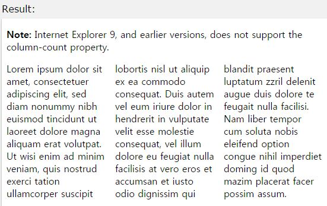
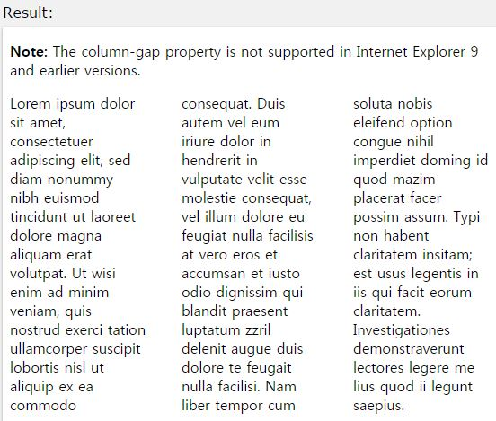

# CSS3 Reference

## column-count

작성자 : 김동일

작성일 : 2015-09-14

css 레퍼런스 설명: 
 - column-count : div 내 텍스트를 분할한다.

 - syntax : 
```sh 
column-count: length|auto|initial|inherit;
```

length:column 개수를 명시한다.

auto:기본 값, column-width에 따라 컬럼 수가 결정된다.

initial:기본 값으로 set되어 있는 값을 불러온다.

inherit:부모 element에 설정되어 있는 값을 상속 받는다.

sample code : 
```sh
<!DOCTYPE html>
<html>
<head>
<style> 
.newspaper {
    -webkit-column-count: 3; /* Chrome, Safari, Opera에서 사용하는 css (반드시 앞에 -webkit-을 붙여야함)*/
    -moz-column-count: 3; /* Firefox에서 사용하는 css (반드시 앞에 -moz-을 붙여야함)*/
    column-count: 3; /*IE 10.0 이후 에서 사용하는 css (이전 버전은 지원 안함)*/
}
</style>
</head>
<body>

<p><strong>Note:</strong> The column-count property is not supported in Internet Explorer 9 and earlier versions.</p>

<div class="newspaper">
Lorem ipsum dolor sit amet, consectetuer adipiscing elit, sed diam nonummy nibh euismod tincidunt ut laoreet dolore magna aliquam erat volutpat. Ut wisi enim ad minim veniam, quis nostrud exerci tation ullamcorper suscipit lobortis nisl ut aliquip ex ea commodo consequat. Duis autem vel eum iriure dolor in hendrerit in vulputate velit esse molestie consequat, vel illum dolore eu feugiat nulla facilisis at vero eros et accumsan et iusto odio dignissim qui blandit praesent luptatum zzril delenit augue duis dolore te feugait nulla facilisi. Nam liber tempor cum soluta nobis eleifend option congue nihil imperdiet doming id quod mazim placerat facer possim assum. Typi non habent claritatem insitam; est usus legentis in iis qui facit eorum claritatem. Investigationes demonstraverunt lectores legere me lius quod ii legunt saepius.
</div>

</body>
</html>
```

결과 




## column-gap

작성자 : 김동일

작성일 : 2015-09-14

css 레퍼런스 설명: 
 - column-gap : column으로 분할된 텍스트 사이의 간격을 설정한다.
 
 - syntax : 
```sh 
column-gap: length|normal|initial|inherit;
```

length:column 크기를 명시한다.(px,em 등)

normal:기본 값, W3C에서는 1em의 값을 추천한다. 

initial:기본 값으로 set되어 있는 값을 불러온다.

inherit:부모 element에 설정되어 있는 값을 상속 받는다.

sample code : 
```sh
<!DOCTYPE html>
<html>
<head>
<style> 
.newspaper {
    -webkit-column-count: 3; /* Chrome, Safari, Opera에서 사용하는 css (반드시 앞에 -webkit-을 붙여야함)*/
    -moz-column-count: 3; /* Firefox에서 사용하는 css (반드시 앞에 -moz-을 붙여야함)*/
    column-count: 3; /*IE 10.0 이후 에서 사용하는 css (이전 버전은 지원 안함)*/

    -webkit-column-gap: 40px; /* Chrome, Safari, Opera에서 사용하는 css (반드시 앞에 -webkit-을 붙여야함)*/
    -moz-column-gap: 40px; /* Firefox 에서 사용하는 css (반드시 앞에 -moz-을 붙여야함)*/
    column-gap: 40px; /*IE 10.0 이후 에서 사용하는 css (이전 버전은 지원 안함)*/
}
</style>
</head>
<body>

<p><strong>Note:</strong> The column-count property is not supported in Internet Explorer 9 and earlier versions.</p>

<div class="newspaper">
Lorem ipsum dolor sit amet, consectetuer adipiscing elit, sed diam nonummy nibh euismod tincidunt ut laoreet dolore magna aliquam erat volutpat. Ut wisi enim ad minim veniam, quis nostrud exerci tation ullamcorper suscipit lobortis nisl ut aliquip ex ea commodo consequat. Duis autem vel eum iriure dolor in hendrerit in vulputate velit esse molestie consequat, vel illum dolore eu feugiat nulla facilisis at vero eros et accumsan et iusto odio dignissim qui blandit praesent luptatum zzril delenit augue duis dolore te feugait nulla facilisi. Nam liber tempor cum soluta nobis eleifend option congue nihil imperdiet doming id quod mazim placerat facer possim assum. Typi non habent claritatem insitam; est usus legentis in iis qui facit eorum claritatem. Investigationes demonstraverunt lectores legere me lius quod ii legunt saepius.
</div>

</body>
</html>
```

결과 



## column-rule

작성자 : 김동일

작성일 : 2015-09-14

css 레퍼런스 설명: 
 - column-rule : column간의 width, style 등을 명시 한다.
 
 - syntax : 
```sh 
column-rule: column-rule-width column-rule-style column-rule-color|initial|inherit;
```

column-rule-width column-rule-style column-rule-color : column의 width, 스타일, 컬러를 명시한다.

initial:기본 값으로 set되어 있는 값을 불러온다.

inherit:부모 element에 설정되어 있는 값을 상속 받는다.

sample code : 
```sh
<!DOCTYPE html>
<html>
<head>
<style> 
.newspaper {
    -webkit-column-count: 3; /* Chrome, Safari, Opera에서 사용하는 css (반드시 앞에 -webkit-을 붙여야함)*/
    -moz-column-count: 3; /* Firefox에서 사용하는 css (반드시 앞에 -moz-을 붙여야함)*/
    column-count: 3; /*IE 10.0 이후 에서 사용하는 css (이전 버전은 지원 안함)*/

    -webkit-column-gap: 40px; /* Chrome, Safari, Opera에서 사용하는 css (반드시 앞에 -webkit-을 붙여야함)*/
    -moz-column-gap: 40px; /* Firefox 에서 사용하는 css (반드시 앞에 -moz-을 붙여야함)*/
    column-gap: 40px; /*IE 10.0 이후 에서 사용하는 css (이전 버전은 지원 안함)*/

    -webkit-column-rule: 4px outset #ff00ff; /* Chrome, Safari, Opera 에서 사용하는 css (반드시 앞에 -webkit-을 붙여야함)*/
    -moz-column-rule: 4px outset #ff00ff; /* Firefox css 에서 사용하는 css (반드시 앞에 -moz-을 붙여야함)*/
    column-rule: 4px outset #ff00ff; /*IE 10.0 이후 에서 사용하는 css (이전 버전은 지원 안함)*/
}
</style>
</head>
<body>

<p><strong>Note:</strong> The column-count property is not supported in Internet Explorer 9 and earlier versions.</p>

<div class="newspaper">
Lorem ipsum dolor sit amet, consectetuer adipiscing elit, sed diam nonummy nibh euismod tincidunt ut laoreet dolore magna aliquam erat volutpat. Ut wisi enim ad minim veniam, quis nostrud exerci tation ullamcorper suscipit lobortis nisl ut aliquip ex ea commodo consequat. Duis autem vel eum iriure dolor in hendrerit in vulputate velit esse molestie consequat, vel illum dolore eu feugiat nulla facilisis at vero eros et accumsan et iusto odio dignissim qui blandit praesent luptatum zzril delenit augue duis dolore te feugait nulla facilisi. Nam liber tempor cum soluta nobis eleifend option congue nihil imperdiet doming id quod mazim placerat facer possim assum. Typi non habent claritatem insitam; est usus legentis in iis qui facit eorum claritatem. Investigationes demonstraverunt lectores legere me lius quod ii legunt saepius.
</div>

</body>
</html>
```

결과 


