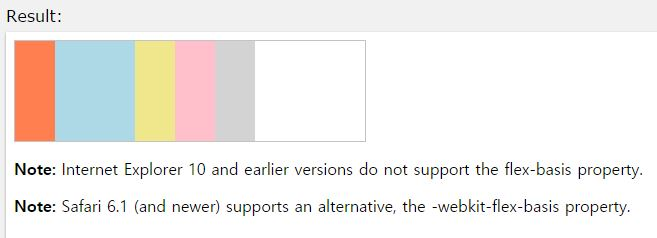

## flex-basis

작성자 : 김동일

작성일 : 2015-10-30

css 레퍼런스 설명:
 - flex-basis : div 영역 내 flex item 의 크기를 설정한다.

 - syntax :
```sh
flex-basis: number|auto|initial|inherit;
```

number : 영역 내 flex item 크기를 정의 한다. (auto, inherit, %, px, em 등)

auto : 기본 값, div 영역 내에 flex item의 개수 만큼 크기를 같게 나눈다.

initial:기본 값으로 set되어 있는 값을 불러온다.

inherit:부모 element에 설정되어 있는 값을 상속 받는다.

sample code :
```html
<!DOCTYPE html>
<html>
<head>
<style>
#main {
    width: 350px;
    height: 100px;
    border: 1px solid #c3c3c3;
    display: -webkit-flex; /* Safari */
    display: flex;
}

#main div {
    -webkit-flex-grow: 0; /* Safari 6.1+ */
    -webkit-flex-shrink: 0; /* Safari 6.1+ */
    -webkit-flex-basis: 40px; /* Safari 6.1+ */
    flex-grow: 0;
    flex-shrink: 0;
    flex-basis: 40px;
}

#main div:nth-of-type(2) {
    -webkit-flex-basis: 80px; /* Safari 6.1+ */
    flex-basis: 80px;
}
</style>
</head>
<body>

<div id="main">
  <div style="background-color:coral;"></div>
  <div style="background-color:lightblue;"></div>
  <div style="background-color:khaki;"></div>
  <div style="background-color:pink;"></div>
  <div style="background-color:lightgrey;"></div>
</div>

<p><b>Note:</b> Internet Explorer 10 and earlier versions do not support the flex-basis property.</p>

<p><b>Note:</b> Safari 6.1 (and newer) supports an alternative, the -webkit-flex-basis property.</p>

</body>
</html>
```

결과




-----

* [CSS3 README](../README.md)

* [flex](flex.md)
* [flex-basis](flex-basis.md)
* [flex-direction](flex-direction.md)
* [flex-flow](flex-flow.md)
* [flex-grow](flex-grow.md)
* [flex-shrink](flex-shrink.md)
* [flex-wrap](flex-wrap.md)
