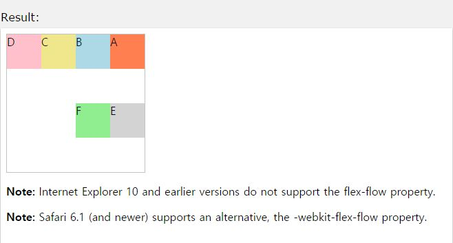

## flex-flow

작성자 : 김동일

작성일 : 2015-10-30

css 레퍼런스 설명:
 - flex-flow : div 영역 내 flex item 의 표시 방식을 설정한다.

 - syntax :
```sh
flex-flow: flex-direction flex-wrap|initial|inherit;
```

flex-direction :영역 내 flex item들의 방향을 설정한다.(기본값 : row)

flex-wrap : 영역 내 flex item들의 표시 방식을 설정한다. (nowrap(기본 값) | wrap | wrap-reverse | initial | inherit)

initial:기본 값으로 set되어 있는 값을 불러온다.

inherit:부모 element에 설정되어 있는 값을 상속 받는다.

sample code :
```html
<!DOCTYPE html>
<html>
<head>
<style>
#main {
    width: 200px;
    height: 200px;
    border: 1px solid #c3c3c3;
    display: -webkit-flex; /* Safari */
    -webkit-flex-flow: row-reverse wrap; /* Safari 6.1+ */
    display: flex;
    flex-flow: row-reverse wrap;
}

#main div {
    width: 50px;
    height: 50px;
}
</style>
</head>
<body>

<div id="main">
  <div style="background-color:coral;">A</div>
  <div style="background-color:lightblue;">B</div>
  <div style="background-color:khaki;">C</div>
  <div style="background-color:pink;">D</div>
  <div style="background-color:lightgrey;">E</div>
  <div style="background-color:lightgreen;">F</div>
</div>

<p><b>Note:</b> Internet Explorer 10 and earlier versions do not support the flex-flow property.</p>

<p><b>Note:</b> Safari 6.1 (and newer) supports an alternative, the -webkit-flex-flow property.</p>

</body>
</html>
```

결과




-----

* [CSS3 README](../README.md)

* [flex](flex.md)
* [flex-basis](flex-basis.md)
* [flex-direction](flex-direction.md)
* [flex-flow](flex-flow.md)
* [flex-grow](flex-grow.md)
* [flex-shrink](flex-shrink.md)
* [flex-wrap](flex-wrap.md)
