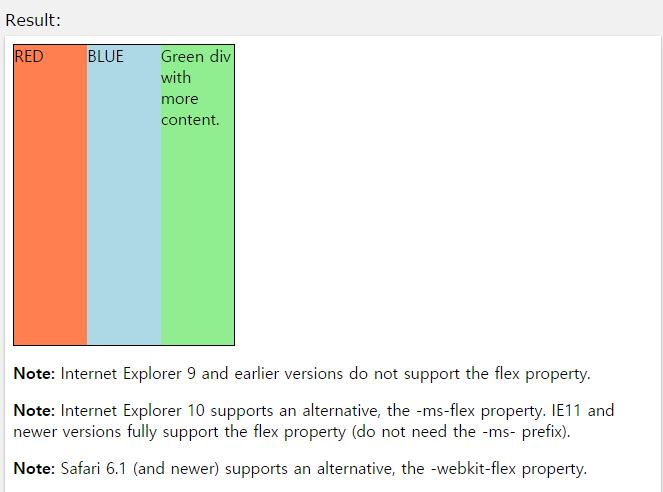

## flex

작성자 : 김동일

작성일 : 2015-10-27

css 레퍼런스 설명:
 - flex : div 영역 내 모든 div tag를 같은 크기로 융통성있게 구분한다.

 - syntax :
```sh
flex: flex-grow flex-shrink flex-basis|auto|initial|inherit;
```

flex-grow : div로 구분되어 있는 항목 중 나머지 항목에 대하여 얼마나 늘릴 것인지 명시한다.

flex-shrink : div로 구분되어 있는 항목 중 나머지 항목에 대하여 얼마나 줄일 것인지 명시한다.

flex-basis : 영역 내 flex item 크기를 정의 한다. (auto, inherit, %, px, em 등)

auto : 기본 값인 1로 처리한다.

initial:기본 값으로 set되어 있는 값을 불러온다.(1)

none : 0으로 처리한다.

inherit:부모 element에 설정되어 있는 값을 상속 받는다.

sample code :
```html
<!DOCTYPE html>
<html>
<head>
<style>
#main {
    width: 220px;
    height: 300px;
    border: 1px solid black;
    display: -webkit-flex; /* Safari */
    display: flex;
}

#main div {
    -webkit-flex: 1;  /* Safari 6.1+ */
    -ms-flex: 1;  /* IE 10 */    
    flex: 1;
}
</style>
</head>
<body>

<div id="main">
  <div style="background-color:coral;">RED</div>
  <div style="background-color:lightblue;">BLUE</div>  
  <div style="background-color:lightgreen;">Green div with more content.</div>
</div>

<p><b>Note:</b> Internet Explorer 9 and earlier versions do not support the flex property.</p>

<p><b>Note:</b> Internet Explorer 10 supports an alternative, the -ms-flex property. IE11 and newer versions fully support the flex property (do not need the -ms- prefix).</p>

<p><b>Note:</b> Safari 6.1 (and newer) supports an alternative, the -webkit-flex property.</p>

</body>
</html>
```

결과




-----

* [CSS3 README](../README.md)

* [flex](flex.md)
* [flex-basis](flex-basis.md)
* [flex-direction](flex-direction.md)
* [flex-flow](flex-flow.md)
* [flex-grow](flex-grow.md)
* [flex-shrink](flex-shrink.md)
* [flex-wrap](flex-wrap.md)
