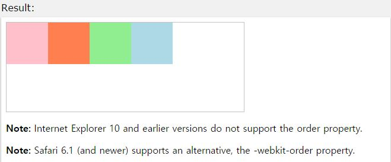

## order

작성자 : 김동일

작성일 : 2015-10-30

css 레퍼런스 설명:
 - order : 정의된 div 의 표시 순서를 설정한다.

 - syntax :
```sh
order: number|initial|inherit;
```

number : 정의된 div의 순서를 정의한다. (기본값 : 0)

initial:기본 값으로 set되어 있는 값을 불러온다.

inherit:부모 element에 설정되어 있는 값을 상속 받는다.

sample code :
```html
<!DOCTYPE html>
<html>
<head>
<style>
#main {
    width: 400px;
    height: 150px;
    border: 1px solid #c3c3c3;
    display: -webkit-flex; /* Safari */
    display: flex;
}

#main div {
    width: 70px;
    height: 70px;
}

/* Safari 6.1+ */
div#myRedDIV   {-webkit-order: 2;}
div#myBlueDIV  {-webkit-order: 4;}
div#myGreenDIV {-webkit-order: 3;}
div#myPinkDIV  {-webkit-order: 1;}

/* Standard syntax */
div#myRedDIV   {order: 2;}
div#myBlueDIV  {order: 4;}
div#myGreenDIV {order: 3;}
div#myPinkDIV  {order: 1;}
</style>
</head>
<body>

<div id="main">
  <div style="background-color:coral;" id="myRedDIV"></div>
  <div style="background-color:lightblue;" id="myBlueDIV"></div>
  <div style="background-color:lightgreen;" id="myGreenDIV"></div>
  <div style="background-color:pink;" id="myPinkDIV"></div>
</div>

<p><b>Note:</b> Internet Explorer 10 and earlier versions do not support the order property.</p>

<p><b>Note:</b> Safari 6.1 (and newer) supports an alternative, the -webkit-order property.</p>

</body>
</html>
```

결과




-----

* [CSS3 README](../README.md)
