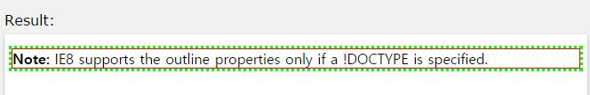

## outline-color

작성자 : 김동일

작성일 : 2015-10-30

css 레퍼런스 설명:
 - outline-color: 외각선의 색깔을 정의한다.

 - syntax :
```sh
outline-color: invert|color|initial|inherit;
```

invert : 외각선 색깔을 반전한다.(white)

color : 외각선 색깔을 정의한다.

initial:기본 값으로 set되어 있는 값을 불러온다.

inherit:부모 element에 설정되어 있는 값을 상속 받는다.

sample code :
```html
<!DOCTYPE html>
<html>
<head>
<style>
p {
    border: 1px solid red;
    outline-style: dotted;
    outline-color: #00ff00;
}
</style>
</head>
<body>

<p><b>Note:</b> IE8 supports the outline properties only if a !DOCTYPE is specified.</p>

</body>
</html>

```

결과




-----

* [CSS3 README](../README.md)

* [outline-color](outline-color.md)
* [outline-offset](outline-offset.md)
* [outline](outline.md)
