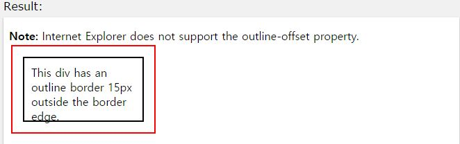

## outline-offset

작성자 : 김동일

작성일 : 2015-10-30

css 레퍼런스 설명:
 - outline-offset: 외각선의 오프셋 크기를 정의한다.

 - syntax :
```sh
outline-offset: length|initial|inherit;
```

length : 외각선 오프셋의 크기를 정의한다.

initial:기본 값으로 set되어 있는 값을 불러온다.

inherit:부모 element에 설정되어 있는 값을 상속 받는다.

sample code :
```html
<!DOCTYPE html>
<html>
<head>
<style>
div {
    margin: 20px;
    width: 150px;
    padding: 10px;
    height: 70px;
    border: 2px solid black;
    outline: 2px solid red;
    outline-offset: 15px;
}
</style>
</head>
<body>

<p><b>Note:</b> Internet Explorer does not support the outline-offset property.</p>

<div>This div has an outline border 15px outside the border edge.</div>

</body>
</html>

```

결과




-----

* [CSS3 README](../README.md)

* [outline-color](outline-color.md)
* [outline-offset](outline-offset.md)
* [outline](outline.md)
