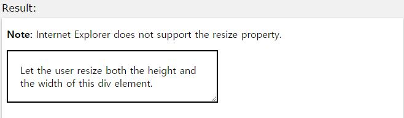

## resize

작성자 : 김동일

작성일 : 2015-10-30

css 레퍼런스 설명:
 - resize: div 영역의 resize를 정의한다.

 - syntax :
```sh
resize: none|both|horizontal|vertical|initial|inherit;
```

none : 기본값, resize하지 않는다.

both : 가로 / 세로의 resize를 할 수 있다.

horizontal : 가로의 resize만 할 수 있다.

vertical : 세로의 resize만 할 수 있다.

initial:기본 값으로 set되어 있는 값을 불러온다.

inherit:부모 element에 설정되어 있는 값을 상속 받는다.

sample code :
```html
<!DOCTYPE html>
<html>
<head>
<style>
div {
    border: 2px solid;
    padding: 20px;
    width: 300px;
    resize: both;
    overflow: auto;
}
</style>
</head>
<body>

<p><b>Note:</b> Internet Explorer does not support the resize property.</p>

<div>Let the user resize both the height and the width of this div element.</div>

</body>
</html>
```

결과



IE에서는 지원하지 않음


-----

* [CSS3 README](../README.md)

* [resize](resize.md)
* [tab-size](tab-size.md)
