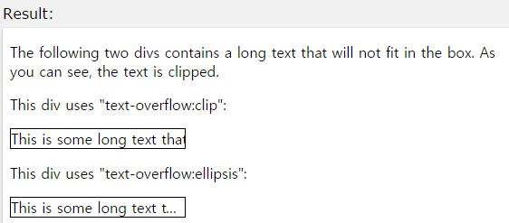

## text-shadow

작성자 : 김동일

작성일 : 2015-11-04

css 레퍼런스 설명:
 - text-shadow : text에 그림자를 설정한다.

 - syntax :
```sh
text-shadow: h-shadow v-shadow blur-radius color|none|initial|inherit;
```

h-shadow : 가로 그림자의 값을 설정(필수)

v-shadow : 세로 그림자의 값을 설정(필수)

blur-radius : 그림자의 흐림도 값 설정(옵션)

color : 그림자의 색을 설정(옵션)

initial:기본 값으로 set되어 있는 값을 불러온다.

inherit:부모 element에 설정되어 있는 값을 상속 받는다.

sample code :
```html
<!DOCTYPE html>
<html>
<head>
<style>
h1 {
    text-shadow: 2px 2px #FF0000;
}
</style>
</head>
<body>

<h1>Text-shadow effect</h1>

<p><b>Note:</b> Internet Explorer 9 and earlier do not support the text-shadow property.</p>

</body>
</html>
```

결과




-----

* [CSS3 README](../README.md)

* [text-align-last](text-align-last.md)
* [text-overflow](text-overflow.md)
* [text-shadow](text-shadow.md)
