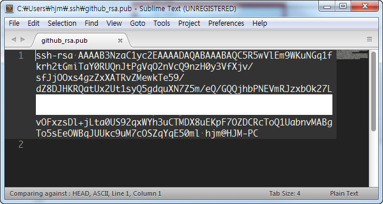
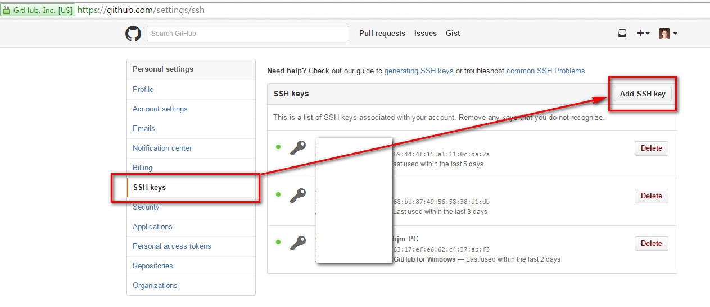
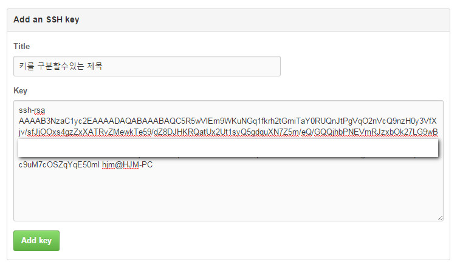

# 03-ssh-keygen-등록

github 과 본인의 컴퓨터와 연결을 할려면 ssh 키를 깃허브사이트에 등록을 해야한다.

처음 사용자라면 ssh키가 없기때문에 먼저 생성해야 한다.

glt을 먼저 설치하길 권장합니다.

[01_git_설치 보기](01_git_설치.md)

#### 1.`Git Bash` 를 실행한다. [01_git_설치](01_git_설치.md)했다면 탐색기에서 마우스 우측버튼을 눌러 `Git Bash` 를 실행한다.


#### 2.`Git Bash` 명령창에서 `ssh-keygen` 을 입력하고 엔터

```sh
ssh-keygen
Generating public/private rsa key pair.
Enter file in which to save the key (/Users/사용자이름/.ssh/id_rsa):
Enter passphrase (empty for no passphrase):
Enter same passphrase again:
Your identification has been saved in /Users/schacon/.ssh/id_rsa.
Your public key has been saved in /Users/schacon/.ssh/id_rsa.pub.
The key fingerprint is:
43:c5:5b:5f:b1:f1:50:43:ad:20:a6:92:6a:1f:9a:3a schacon@agadorlaptop.local
```

먼저 키를 어디에 저장할지 경로를(.ssh/id_rsa) 입력하고 암호를 두 번 입력한다. 이때 암호를 비워두면 키를 사용할 때 암호를 묻지 않는다. 비워두길 권장한다. 안그러면 매번 비밀번호를 입력해야 한다.


#### 4.키젠은 윈도우7의 경우 `C:\Users\사용자명\.ssh` 폴더에있다.

* 사용자이름이 한글인경우
* 윈도우 10 처럼 보안에 걸려 폴더를 만들지 못하는경우

위의 경우는 다른곳에 키젠을 만들어서 `C:\Users\사용자명\.ssh` 폴더에 넣어두면 된다.


#### 5.`C:\Users\사용자명\.ssh` 폴더에서 `github_rsa.pub` 파일을 메모장이나 에디터로 열어서 코드를 복사한다.



#### 6.깃허브사이트에 접속해서 로그인하고 `settings - ssh` 에 간다. `Add SSH key` 를 클릭한다.



#### 7.아래에 등록할수 있는 창이 생기는데 제목에는 이 키를 구분할 수 있는 제목을 넣으면 되고, 아래에는 복사한 ssh 를 붙여넣으면 된다.



#### 8.하단에 `Add key` 를 누르면 끝이다.

이제 로컬컴퓨터와 깃허브사이트는 연결이 됐다.

----

* [Github 목록으로 돌아가기](../README.md)
* [01-git-설치](01-git-설치.md)
* [02-github-회원가입](02-github-회원가입.md)
* [03-ssh-keygen-등록](03-ssh-keygen-등록.md)
* [04-저장소-만들기](04-저장소-만들기.md)
* [05-순환구조](05-순환구조.md)
* [06-add-commit-pull-push](06-add-commit-pull-push.md)
* [07-협업하기](07-협업하기.md)
* [08-git-명령어](08-git-명령어.md)
* [09-GitHub-for-Windows](09-GitHub-for-Windows.md)

----