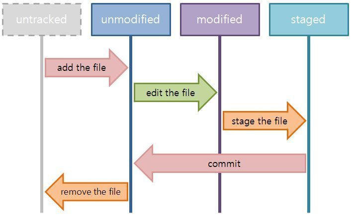

# 05-순환구조

## 파일 순환 구조

## 저장소 순환구조

----

* [Github 목록으로 돌아가기](../README.md)
* [01-git-설치](01-git-설치.md)
* [02-github-회원가입](02-github-회원가입.md)
* [03-ssh-keygen-등록](03-ssh-keygen-등록.md)
* [04-저장소-만들기](04-저장소-만들기.md)
* [05-로컬저장소-원격저장소-동기화시키기](05-로컬저장소와-원격저장소-동기화시키기.md)
* [06-add-commit-pull-push](06-add-commit-pull-push.md)
* [07-프로젝트로-참여하기](07-프로젝트로-참여하기.md)

----