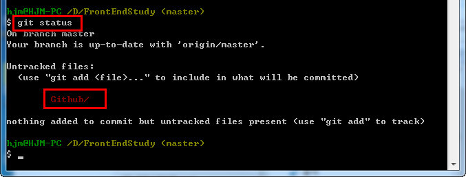

# 06-add-commit-pull-push

깃허브에서 가장 많이 사용하는 명령어는 5가지 입니다.

```sh
git status // 수정했는지 않했는지 등의 현재 상태를 보여줍니다.
git add    // 수정했을때 add 를 해야합니다.
git commit // add 한다음 깃허브에 수정된 내용을 알려줍니다.
git pull   // commit 후 원격저장소에서 자료를 가져와 로컬과 비교해서 병합합니다.
git push   // pull 한후
```

## status
수정사항이 있는지 확인해볼때 사용하는 명령어로써 현재 상태를 보여줍니다.

Github 폴더를 만들고 `git status` 명령어를 쳐봤습니다.



다음 명령어로 `git add` 를 사용하라고 깃허브가 알려줍니다.


### add

수정사항이 있을때 `add` 를 해야하며, `staging area` 상태가 됩니다.

```sh
git add 파일명
// or
git add --all
```

`--all` 은 수정된 모든 파일을 뜻합니다.


### commit

`add` 한후 `commit` 를 해야 로컬저장소에 등록이 되며 다시 `unmodified` 상태가 된다.

`-m` 옵션을 사용하여 메모를 할 수 있다.


### pull

`pull` 명령어는 원격저장소에서 자료를 가져와 로컬저장소와 비교해서 병합합니다.

`fetch` 명령어는 원격저장소에서 자료를 가져오고 병합하지는 않습니다.

```sh
git push [원격 저장소 이름] [브렌치 이름]
git pull origin master
// 또는
git pull
```


origin 은 원격저장소의 단축이름이다. 이것은 자동으로 지정이 되며 변경이 가능하다.
master 는 브렌치의 이름이다.


### push

`push` 명령어는 로컬저장소의 자료를 원격저장소로 올립니다.
이로써 로컬과 원격이 동기화가 됩니다.


```sh
git push
```

----

* [Github 목록으로 돌아가기](../README.md)
* [01-git-설치](01-git-설치.md)
* [02-github-회원가입](02-github-회원가입.md)
* [03-ssh-keygen-등록](03-ssh-keygen-등록.md)
* [04-저장소-만들기](04-저장소-만들기.md)
* [05-순환구조](05-순환구조.md)
* [06-add-commit-pull-push](06-add-commit-pull-push.md)
* [07-협업하기](07-협업하기.md)
* [08-git-명령어](08-git-명령어.md)

----