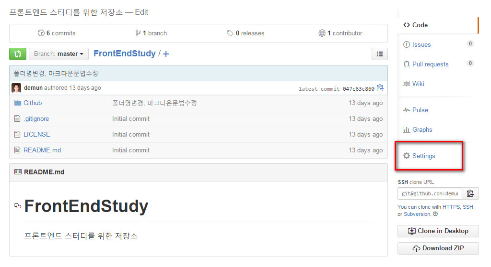
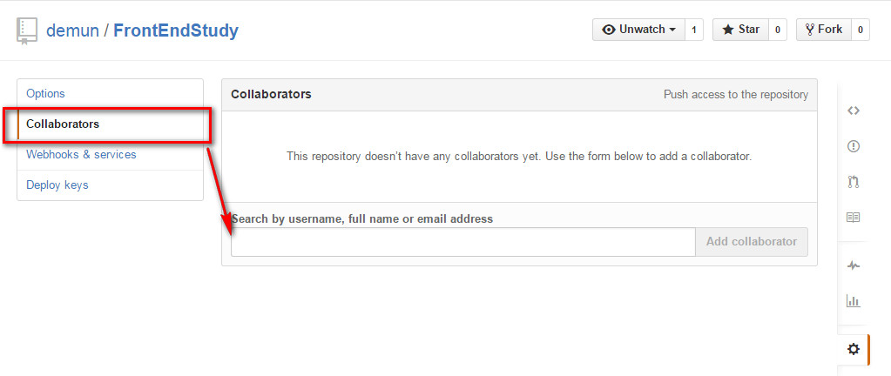
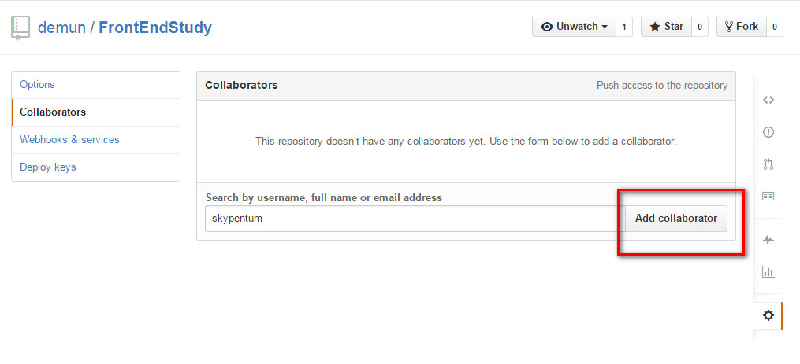
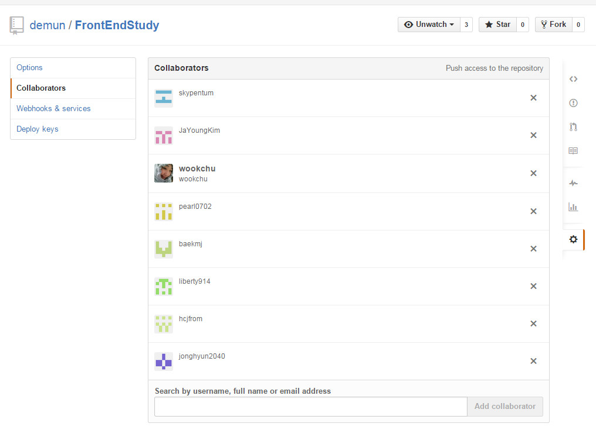

# 07-협업하기

## 내 저장소에 다른 사람을 협업으로 등록하기

원격저장소에서 Settings 를 클릭한다.




`Collaborators` 에서 협업할 사람의 아이디이나 이메일을 적으면 된다.



아이디나 이메일을 적으면 깃허브에서 검색해서 보여주고, 이름을 클릭하면 우측의 `Add collaborator` 이 활성화가 된다.




이렇게 협업할 사람들의 아이디를 모두 선택해주면 된다.




# 브렌치만들기

깃허브는 일반적으로 지정하지 않으면 `master` 라는 브렌치를 자동으로 생성한다.


```sh
# 브렌치 이름보기
git branch

# 브렌치 만들기
git branch BranchName

# 브렌치 이름변경
git branch -m oldBranch newBranch

# 브렌치 삭제
git branch -d branchName

# 브렌치 전환
git checkout branchName

# 브렌치 병합
git marge branchName
```

[누구나 쉽게 이해할수 있는 Git 입문 브렌치 조작](http://backlogtool.com/git-guide/kr/reference/branch.html)


----

* [Github 목록으로 돌아가기](../README.md)
* [01-git-설치](01-git-설치.md)
* [02-github-회원가입](02-github-회원가입.md)
* [03-ssh-keygen-등록](03-ssh-keygen-등록.md)
* [04-저장소-만들기](04-저장소-만들기.md)
* [05-순환구조](05-순환구조.md)
* [06-add-commit-pull-push](06-add-commit-pull-push.md)
* [07-협업하기](07-협업하기.md)
* [08-git-명령어](08-git-명령어.md)
* [09-GitHub-for-Windows](09-GitHub-for-Windows.md)

----