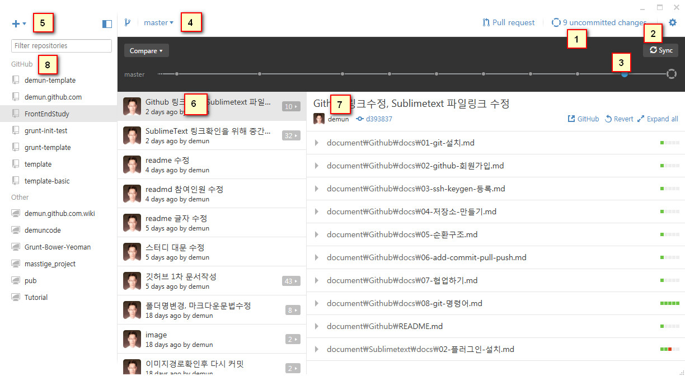
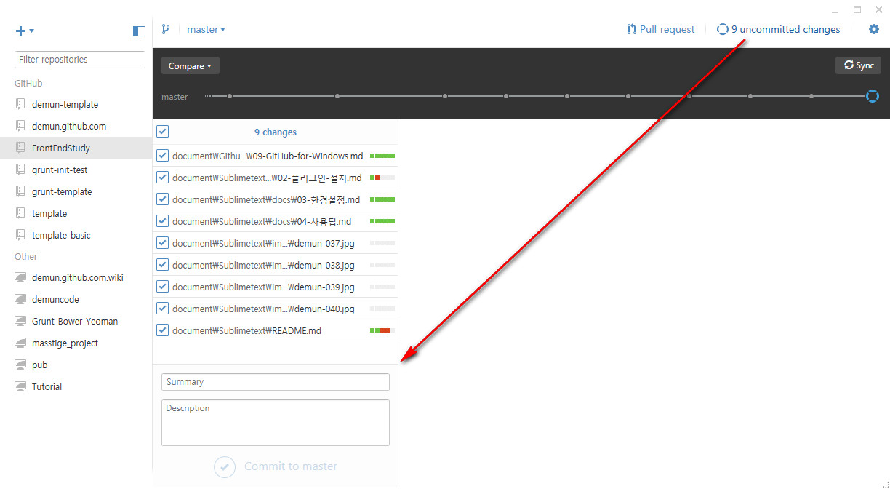
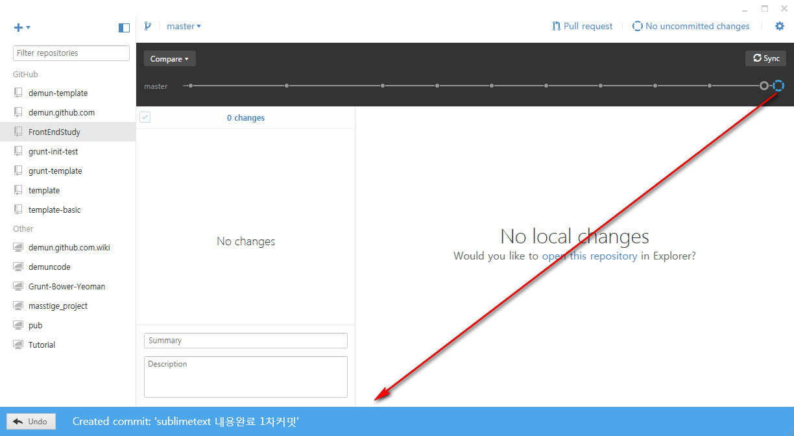
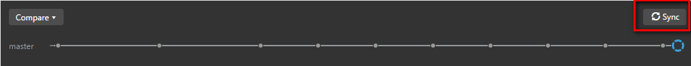
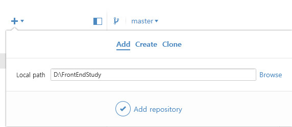
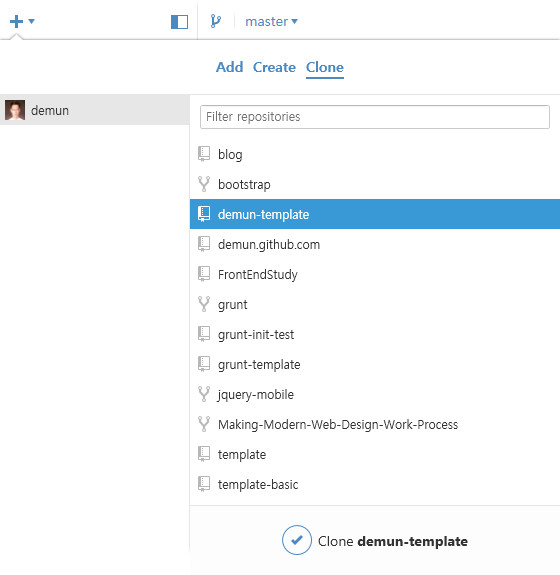
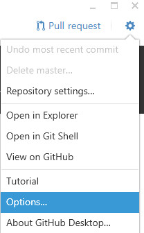
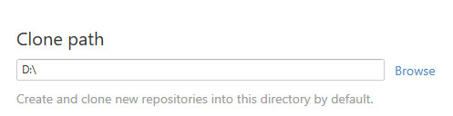

# 09-GitHub-for-Windows

### GitHub for Windows 에 GitHub 연결하기

깃허브에 로그인하는 이름과 이메일을 입력하면 된다.

[GitHub for Windows](https://desktop.github.com/) 는 윈도우용 깃허브입니다. 이번에 업데이트가 되면서 이름도 변경되고 외모도 변했습니다.

일일이 명령어를 입력하지 않아도 손쉽게 사용할 수 있으며 윈도우7이상에서 이용이 가능합니다.

아래 버튼의 내용입니다.      
* 1번: 수정된 파일이 9개 남았습니다.
* 2번: 동기화를 진행합니다. Sync 버튼을 클릭해서 최신상태를 볼 수 있습니다.
* 3번: 뒤로 돌아가거나 이전 커밋을 볼 수 있습니다.
* 4번: 브렌치를 분기할 수 있습니다.
* 5번: 저장소를 복제하거나 만들수 있습니다.
* 6번: 이전 커밋에 대한 내용을 볼 수 있습니다.
* 7번: 이전 커밋에 대한 내용을 상세하게 볼 수 있습니다.
* 8번: GitHub for Windows에서 사용하는 저장소 목록을 볼수 있습니다.

uncommitted changes 를 클릭하면 커밋을 할 수 있으며 커밋내용을 적을 수 있습니다.

커밋내용을 작성하면 `Commit to master` 버튼이 활성화되고 버튼을 클릭하면 커밋완료 메시지가 나타나고, 되돌리기 기능이 살아납니다.
현재까지는 원격저장소에 `push` 가 된상태가 아닙니다.

상단에 `Sync` 버튼을 클릭하면 원격저장소에 `push` 가 되고 저장소에 올리기 작업이 완료가 됩니다.

### 로컬저장소 추가하기

로컬저장소를 `Github for Windows` 에 추가하는 방법입니다.     
왼쪽 상단에 `+` 버튼을 클릭해서 `Add` 를 클릭합니다.

이미지에 보이는것처럼 `Browse` 를 클릭해서 로컬컴퓨터에 있는 저장소의 위치를 지정해주면 됩니다.
`Add repository` 를 클릭하면 `Github for Windows` 에 로컬저장소가 추가됩니다.

> 또다른 간단한 방법은 로컬저장소를 마우스로 드레그해서 `Github for Windows` 에 놓기만하면 됩니다.

### 원격저장소 복제하기

원격저장소가 있다면 왼쪽 상단에 `+` 버튼을 클릭해서 `Clone` 을 선택하면 만들어놓은 저장소가 보입니다. 
이미지처럼 원하는 저장소를 클릭하기만하면 활성화되고 저장소를 복제합니다.

# 옵션

* 기본저장소 위치 변경

저장소를 추가, 복제, 생성할때 매번 경로를 지정해줘야 합니다. 만약 경로가 길다면 매우 번거롭습니다.
그래서 기본경로를 지정해주면 간단이 사용할 수 있습니다.

우측 상단에 설정버튼을 클릭하면 `options` 으로 들어갈수 있습니다.
기본적인 설정은 여기서 지정하면 됩니다.

`Browse` 를 클릭해서 경로를 `D` 드라이브로 지정한 경우입니다.

### 한가지 주의사항

`GitHub for Windows` 는 사용법이 무척 간단합니다. 하지만 `push` 할때 충돌이 나거나하면 내용을 일일이 수정하고 다시 커밋작업을 해야합니다.

하지만 커밋이 안될때가 종종있고, 그때는 수정후 `Git Bash` 를 열어 명령어를 입력해야 합니다. 그래서 [06-add-commit-pull-push](06-add-commit-pull-push.md) 을 먼저 알아야하고 때로는 [08-git-명령어](08-git-명령어.md) 도 알아야 합니다.

즉 깃허브를 사용할때 프로그램에만 의존하지 말고 반드시 명령어를 익혀두길 권장합니다. 명령어로 인한 작동방법은 운영체제가 달라도, 프로그램이 달라도 사용방법은 비슷하기 때문입니다.

----

* [Github 목록으로 돌아가기](../README.md)
* [01-git-설치](01-git-설치.md)
* [02-github-회원가입](02-github-회원가입.md)
* [03-ssh-keygen-등록](03-ssh-keygen-등록.md)
* [04-저장소-만들기](04-저장소-만들기.md)
* [05-순환구조](05-순환구조.md)
* [06-add-commit-pull-push](06-add-commit-pull-push.md)
* [07-협업하기](07-협업하기.md)
* [08-git-명령어](08-git-명령어.md)
* [09-GitHub-for-Windows](09-GitHub-for-Windows.md)

----