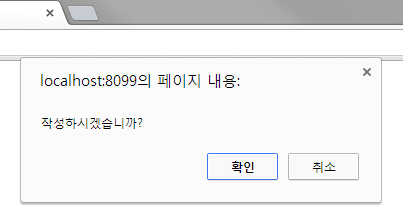
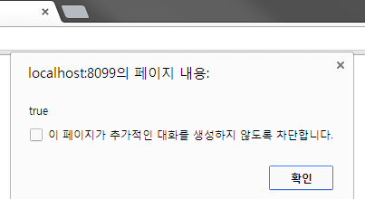
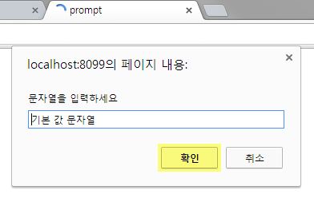
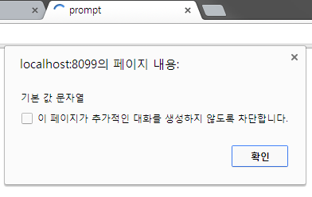

#기타 함수 

###typeof()
**typeof() 함수**는 자료형을 확인할 때 주로 사용하는 함수입니다.

###예시

```javascript
<script>
  alert(typeof ('http://gangzzang.tistory.com')); // 문자열 String
  alert(typeof (450)); // 숫자 number
  alert(typeof (true)); // 불린 boolean
  alert(typeof (function() {})); // 함수 function
  alert(typeof ({})); // 객체 object
  alert(typeof (Gz)); // 정의하지않은 자료형 undefined
</script>```

###confirm(String)
**confirm(String) 함수**는 불린 값을 입력 받을 때 사용하는 함수입니다. <br>확인을 누르면 true를 리턴 / 취소를 누르면 false를 리턴합니다.

###예시

```javascript
<script>
  var input = confirm('작성하시겠습니까?');
  alert(input);
</script>
```
위 예시를 실행하면 '작성하시겠습니까?'에 대한 "확인", "취소" 알림창이 뜹니다.<br/>
이때 확인을 누르면 true를 리턴하고, 취소를 누르면 false를 리턴합니다. 

```java
var input = confirm('작성하시겠습니까?');
  alert(input);
```
   
   

---


###prompt(String)
**prompt(String) 함수**는 문자열을 입력할 때 사용하는 함수입니다..<br/>
숫자를 입력 받아야 하는 경우는 문자열로 입력 받은 뒤 변환합니다.<br/>
첫번째 매개변수는 입력 창에서 띄워줄 메시지고, 두번째 매개변수는 입력 부분의 기본 값입니다.
###예시

```javascript
<script>
  var inputString = prompt('문자열을 입력하세요', '기본 값 문자열');
  alert(inputString);
</script>
```
위 예시를 실행하면 '기본 값 문자열'의 기본 입력 값을 가진 '문자열을 입력하세요'에 대한 "확인", "취소" 알림창이 뜹니다.<br/>
이때 바로 확인을 누르면 기본 입력값을 리턴하고, 다른 값을 입력하면 입력한 값을 리턴하고, 취소를 누르면 null을 리턴합니다. 
**typeof 연산자 : 자료형 검사**
```java
alert(typeof ('http://gangzzang.tistory.com')); // 문자열 String
alert(typeof (450)); // 숫자 number
alert(typeof (true)); // 불린 boolean
alert(typeof (function() {})); // 함수 function
alert(typeof ({})); // 객체 object
alert(typeof (Gz)); // 정의하지않은 자료형 undefined
```
```java
var inputString = prompt('문자열을 입력하세요', '기본 값 문자열');
alert(inputString);
```
   



##바로가기
* [김자영_숫자확인함수&기타함수](https://github.com/demun/FrontEndStudy/blob/master/document/Javascript/docs/Team/03_%EC%88%AB%EC%9E%90%ED%99%95%EC%9D%B8%ED%95%A8%EC%88%98%26%EA%B8%B0%ED%83%80%ED%95%A8%EC%88%98/%EA%B9%80%EC%9E%90%EC%98%81_%EC%88%AB%EC%9E%90%ED%99%95%EC%9D%B8%ED%95%A8%EC%88%98%26%EA%B8%B0%ED%83%80%ED%95%A8%EC%88%98.md)
* [박훈의-숫자확인함수&기타함수](https://github.com/demun/FrontEndStudy/blob/master/document/Javascript/docs/Team/03_%EC%88%AB%EC%9E%90%ED%99%95%EC%9D%B8%ED%95%A8%EC%88%98%26%EA%B8%B0%ED%83%80%ED%95%A8%EC%88%98/%EB%B0%95%ED%9B%88%EC%9D%98_%EC%88%AB%EC%9E%90%ED%99%95%EC%9D%B8%ED%95%A8%EC%88%98%26%EA%B8%B0%ED%83%80%ED%95%A8%EC%88%98.md)
* [임성은-숫자확인함수&기타함수](https://github.com/demun/FrontEndStudy/blob/master/document/Javascript/docs/Team/03_%EC%88%AB%EC%9E%90%ED%99%95%EC%9D%B8%ED%95%A8%EC%88%98%26%EA%B8%B0%ED%83%80%ED%95%A8%EC%88%98/%EC%9E%84%EC%84%B1%EC%9D%80_%EC%88%AB%EC%9E%90%ED%99%95%EC%9D%B8%ED%95%A8%EC%88%98%26%EA%B8%B0%ED%83%80%ED%95%A8%EC%88%98.md)
* [진민영-숫자확인함수&기타함수](https://github.com/demun/FrontEndStudy/blob/master/document/Javascript/docs/Team/03_%EC%88%AB%EC%9E%90%ED%99%95%EC%9D%B8%ED%95%A8%EC%88%98%26%EA%B8%B0%ED%83%80%ED%95%A8%EC%88%98/%EC%A7%84%EB%AF%BC%EC%98%81_%EC%88%AB%EC%9E%90%ED%99%95%EC%9D%B8%ED%95%A8%EC%88%98%26%EA%B8%B0%ED%83%80%ED%95%A8%EC%88%98.md)
