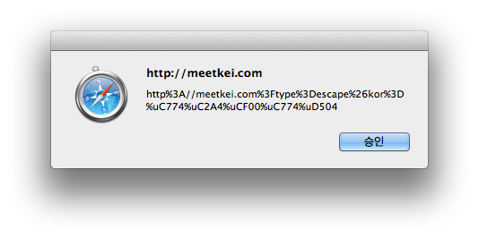
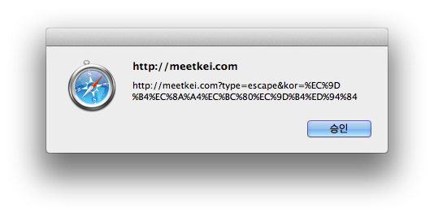
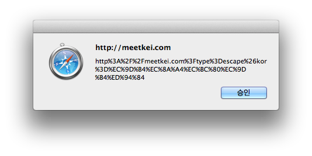

#실무에 자주 쓰이는 함수2

* **인코딩/디코딩 함수**
    - escape() / unescape()
    - encodeURI(url) / decodeURI(encodeURI)
    - encodeURIComponent(uriComponent) / decodeURIComponent(encodedURI)

##인코딩/디코딩 함수

웹에서는 유니코드 문자를 그대로 사용할 경우 문제가 발생할 수 있으므로 적절히 인코딩해 주어야 한다.<br/>
이러한 인코딩 방식을 퍼센트 인코딩(percent-encoding)이라고 한다.<br/>
자바스크립트에서는 인코딩과 디코딩을 위한 내장함수를 제공한다.

###escape() / unescape()
escape() 함수는 영문, 숫자, 특수문자(@, *, -, _, +, ., /) 외의 모든 문자에 인코딩을 적용한다.<br/>
unescape() 함수는 escape()로 인코딩된 문자를 원래 문자로 디코딩한다.

###예시

```javascript
<script>
	var URL = "http://meetkei.com?type=escape&kor=이스케이프";
	var encodedURL = escape(URL);
	alert(encodedURL);
</script>
```
“http://meetkei.com?type=escape&kor=이스케이프” 라는 URL을 escape() 함수로 인코딩하면 다음 그림과 같이 출력된다.



###encodeURI() & decodeURI()
encodeURI() 함수는 escape()와 유사하지만 URL에서 사용하는 특수문자(:, ;, /, =, ?, &)를 변환하지 않는다.<br/>
decodeURI() 함수는 이렇게 인코딩된 문자를 원래 문자로 디코딩한다.

###예시

```javascript
<script>
	var URL = "http://meetkei.com?type=escape&kor=이스케이프";
	var encodedURL = encodeURI(URL);
	alert(encodedURL);
</script>
```
실행결과는 다음과 같다.<br/>
escape() 실행결과와 달리 http 다음의 : 문자와 .com 다음의 ? 문자가 그대로 출력되는 것을 확인할 수 있다.



###encodeURIComponent() & decodeURIComponent()
encodeURIComponent() 함수는 영문자와 숫자를 제외한 모든 문자을 인코딩한다.<br/>
이 방식은 UTF-8 인코딩과 동일하다.

###예시

```javascript
<script>
	var URL = "http://meetkei.com?type=escape&kor=이스케이프";
	var encodedURL = encodeURIComponent(URL);
	alert(encodedURL);
</script>
```
“http://meetkei.com?type=escape&kor=이스케이프” 라는 URL을 encodeURIComponent() 함수로 인코딩하면 다음 그림과 같이 출력된다.




##참고
[인코딩/디코딩 함수- http://meetkei.com/?p=2887][인코딩/디코딩 함수]
[인코딩/디코딩 함수]:http://meetkei.com/?p=2887

#실무에 자주 쓰이는 함수3

* **코드 실행 함수**
    - eval(string)

##코드 실행 함수

**eval() 함수**는 문자열을 자바스크립트 코드로 변환해 실행하는 자바스크립트의 기본 내장 함수이다.<br/>
반복문과 함께 사용하는 함수 중 하나이다. 

###예시1

```javascript
<script>
	//  eval() 함수에 사용할 문자열을 만듭니다.
	var willEval = '';
	willEval += 'var number = 10;';
	willEval += 'alert(number);';
	
	// eval() 함수를 사용합니다.
	eval(willEval);
</script>
```
위 예시의 결과는 10을 출력합니다. eval() 함수는 문자열을 자바스크립트 코드로 실행하는 함수이므로 함수 eval()을 통해 실행된 코드에서 정의한 변수도 사용할 수 있습니다.

###예시2

```javascript
<script>
	//  eval() 함수에 사용할 문자열을 만듭니다.
	var willEval = '';
	willEval += 'var number = 10;';
	willEval += 'alert(number);';
	
	// eval() 함수를 사용합니다.
	eval(willEval);
	alert(number); // eval() 함수를 통해 실행된 코드에서 정의한 변수
</script>
```
위 예시의 결과는 10을 두 번 출력한다.

[모던 웹을 위한 JavaScript jQuery 입문/윤인성 지음/한빛미디어 출판]

